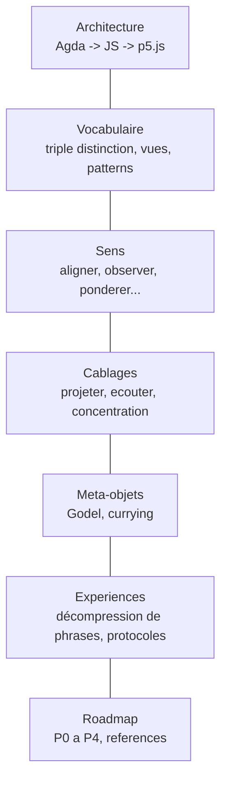
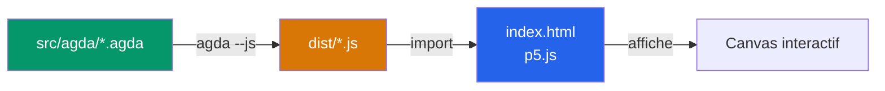

# Visual Proof Assistant

> L'objet est ses contrats. L'acte de construire visuellement est l'acte mathematique lui-meme.

Visualiseur interactif ou les objets mathematiques s'assemblent par leurs **contrats**, pas leur implementation.

---

## Sommaire



| Document | Description |
|----------|-------------|
| [Architecture](docs/architecture.md) | Stack technique, pipeline Agda --js, separation backend/frontend |
| [Vocabulaire](docs/vocabulaire/) | Triple distinction sens/contrat/cablage, trois vues, patterns |
| -- [Triple distinction](docs/vocabulaire/triple-distinction.md) | Sens, contrat, cablage -- les trois dimensions d'un objet |
| -- [Trois vues](docs/vocabulaire/trois-vues.md) | Trois boutons permanents par objet |
| -- [Patterns](docs/vocabulaire/patterns.md) | Reconnaitre des structures dans un assemblage |
| [Sens](docs/sens/) | Blocs atomiques |
| -- [Aligner](docs/sens/aligner.md) | `E x E -> R`, combien deux vecteurs s'alignent |
| -- [Observer](docs/sens/observer.md) | `E* x E -> R`, combien phi voit v |
| -- [Ponderer](docs/sens/ponderer.md) | `R x R -> R`, ponderer une grandeur par une autre |
| -- [Attirer](docs/sens/attirer.md) | `E x E -> R`, combien une position attire une autre |
| -- [Deplacer](docs/sens/deplacer.md) | `R^3 x (Omega x R) -> (Omega x R)`, deplacer la sphere |
| -- [Concentrer](docs/sens/concentrer.md) | `R_+ x X x (X -> R) -> R`, du global au local |
| -- [Espaces](docs/sens/espaces.md) | `E`, `E*`, `R`, `Omega` et incompatibilites |
| [Cablages](docs/cablages/) | Circuits qui assemblent des sens |
| -- [Projeter](docs/cablages/projeter.md) | Circuit : observer + ponderer + deplacer |
| -- [Ecouter](docs/cablages/ecouter.md) | Circuit : concentrer + ponderer + observer |
| -- [Concentration](docs/cablages/concentration.md) | 5 exemples concrets de concentrer |
| [Meta-objets](docs/meta-objets/) | Operent sur les objets eux-memes |
| -- [Godel](docs/meta-objets/README.md) | Encoder un circuit comme un nombre |
| -- [Encodage](docs/meta-objets/encodage.md) | Encodage concret du catalogue |
| -- [Currying](docs/meta-objets/currying.md) | Fixer une entree pour produire un bloc |
| [Expériences](docs/experience/) | Déploiement rigoureux d'intuitions mathématiques |
| -- [Décompression de phrase](docs/experience/decompress-phrase/) | Solidité via zêta arithmétique et encodage de Gödel |
| [Feuille de route](docs/roadmap.md) | Phases P0 a P4, references theoriques |

---

## Vue d'ensemble

### Les objets ont trois dimensions

```
sens     →  ce qu'ils sont
contrat  →  ce qu'ils garantissent
cablage  →  ce qu'ils font
```

### Le cablage determine deux choses simultanement

```
cablage  →  cout d'evaluation
         →  topologie des ports (forme, ouverture, direction)
```

Une lecture du cablage donne la performance, l'autre donne la connectabilite.

### Les ports peuvent etre

```
ouverts          →  laissent passer le sens
fermes           →  bloquent
demi-ouverts     →  acceptent partiellement (filtre, projection, poids)
```

L'ouverture est continue, pas binaire.

### Les meta-sens agissent sur les objets

Plusieurs niveaux :

```
mesure d'invariance   →  identifie les transformations qui preservent un sens
mesure de cyclicite   →  detecte l'auto-reference dans un cablage
extraction de cycle   →  cristallise un cycle en nouveau bloc, reduit la cyclicite totale
modification de contrat →  redessine la carte des compatibilites
frontiere de constructibilite →  revele les invariances structurelles vs accidentelles
```

Les meta-sens peuvent etre **passifs** (mesurer) ou **actifs** (transformer).

### La compatibilite entre objets

```
incompatibles  →  les ports ne matchent pas
compatibles    →  les ports matchent par adaptation
                  par modification de contrat
                  par dezoom vers un parent commun
```

Trois manieres de resoudre une incompatibilite, chacune avec son cout.

### Le mouvement zoom / dezoom

```
zoom    →  voir le cablage interne d'un bloc
dezoom  →  encapsuler un assemblage en nouveau bloc
           cristalliser un sens
           cacher la cyclicite dans le contrat
```

Le dezoom convertit topologie complexe en semantique -- un cycle dans le cablage devient un nom dans le contrat.

### Les invariants scalaires

```
ouverture totale   →  conductance du cablage
cyclicite          →  signature de l'auto-reference
mesure d'invariance →  groupe de symetries du sens
```

Chaque invariant cristallise un aspect du cablage en un seul nombre -- comparable, transmissible.

### La limite Godel

```
certains cycles sont irreductibles
   →  ils ne peuvent pas etre extraits
   →  ils definissent l'identite du systeme
   →  ils sont la signature de ce que le systeme ne peut pas dire de lui-meme
```

Le meta-sens capture beaucoup, jamais tout. C'est structurel.

### Le mouvement central

```
construire un objet  →  assembler des sens existants
mesurer un objet     →  appliquer un meta-sens
modifier un objet    →  agir sur sens, contrat ou cablage
extraire un sens     →  cristalliser un cycle en nouveau bloc
```

Tout l'outil se resume a ces quatre gestes appliques recursivement.

### La phrase cle

Un objet est ses contrats. Un meta-objet est ce qui modifie ces contrats. Un meta-meta-objet est ce qui modifie les meta-objets. Cette tour n'a pas de sommet -- Godel garantit qu'il existera toujours un niveau au-dessus du systeme courant. L'outil n'est pas une carte complete, c'est un explorateur qui rend visible le mouvement entre les niveaux.

---

## En bref

L'exemple central : **calculer l'ombre et l'intensite d'une sphere projetee** ([voir le circuit](docs/cablages/projeter.md)). Chaque concept est illustre par cet exemple.



- **[Agda](docs/architecture.md#backend--agda)** = source de verite. Types dependants, preuves, contrats.
- **[p5.js](docs/architecture.md#frontend--p5js)** = affichage pur. Aucune logique metier.
- **[Triple distinction](docs/vocabulaire/triple-distinction.md)** = chaque objet a un sens, un contrat, un cablage.
- **[Trois vues](docs/vocabulaire/trois-vues.md)** = trois boutons permanents par objet.
