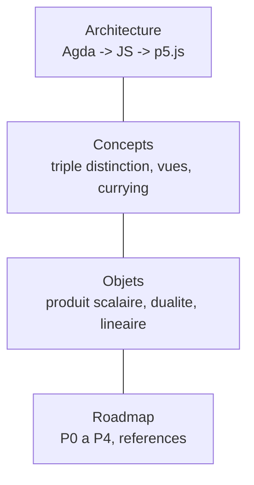
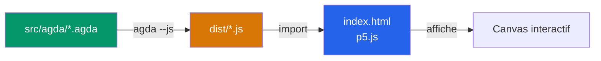

# Visual Proof Assistant

> L'objet est ses contrats. L'acte de construire visuellement est l'acte mathematique lui-meme.

Visualiseur interactif ou les objets mathematiques s'assemblent par leurs **contrats**, pas leur implementation.

---

## Sommaire

| Document | Description |
|----------|-------------|
| [Architecture](docs/architecture.md) | Stack technique, pipeline Agda --js, separation backend/frontend |
| [Concepts](docs/concepts.md) | Triple distinction sens/contrat/cablage, trois vues, currying |
| [Objets mathematiques](docs/objets.md) | Produit scalaire, produit de dualite, produit lineaire, projection de sphere |
| [Feuille de route](docs/roadmap.md) | Phases P0 a P4, references theoriques |

---

## En bref

L'exemple central : **calculer l'ombre et l'intensite d'une sphere projetee** ([voir le circuit](docs/objets.md#exemple--ombre-et-intensite-dune-sphere)). Chaque concept est illustre par cet exemple.

- **[Agda](docs/architecture.md#backend--agda)** = source de verite. Types dependants, preuves, contrats.
- **[p5.js](docs/architecture.md#frontend--p5js)** = affichage pur. Aucune logique metier.
- **[Triple distinction](docs/concepts.md#triple-distinction)** = chaque objet a un sens, un contrat, un cablage.
- **[Trois vues](docs/concepts.md#trois-vues)** = trois boutons permanents par objet.
