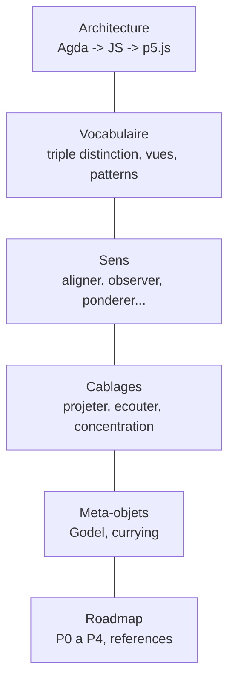
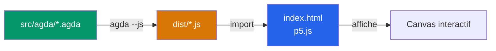

# Visual Proof Assistant

> L'objet est ses contrats. L'acte de construire visuellement est l'acte mathematique lui-meme.

Visualiseur interactif ou les objets mathematiques s'assemblent par leurs **contrats**, pas leur implementation.

---

## Sommaire

| Document | Description |
|----------|-------------|
| [Architecture](docs/architecture.md) | Stack technique, pipeline Agda --js, separation backend/frontend |
| [Vocabulaire](docs/vocabulaire/) | Triple distinction sens/contrat/cablage, trois vues, patterns |
| -- [Triple distinction](docs/vocabulaire/triple-distinction.md) | Sens, contrat, cablage -- les trois dimensions d'un objet |
| -- [Trois vues](docs/vocabulaire/trois-vues.md) | Trois boutons permanents par objet |
| -- [Patterns](docs/vocabulaire/patterns.md) | Reconnaitre des structures dans un assemblage |
| [Sens](docs/sens/) | Blocs atomiques |
| -- [Aligner](docs/sens/aligner.md) | `E x E -> R`, combien deux vecteurs s'alignent |
| -- [Observer](docs/sens/observer.md) | `E* x E -> R`, combien phi voit v |
| -- [Ponderer](docs/sens/ponderer.md) | `R x R -> R`, ponderer une grandeur par une autre |
| -- [Attirer](docs/sens/attirer.md) | `E x E -> R`, combien une position attire une autre |
| -- [Deplacer](docs/sens/deplacer.md) | `R^3 x (Omega x R) -> (Omega x R)`, deplacer la sphere |
| -- [Concentrer](docs/sens/concentrer.md) | `R_+ x X x (X -> R) -> R`, du global au local |
| -- [Espaces](docs/sens/espaces.md) | `E`, `E*`, `R`, `Omega` et incompatibilites |
| [Cablages](docs/cablages/) | Circuits qui assemblent des sens |
| -- [Projeter](docs/cablages/projeter.md) | Circuit : observer + ponderer + deplacer |
| -- [Ecouter](docs/cablages/ecouter.md) | Circuit : concentrer + ponderer + observer |
| -- [Concentration](docs/cablages/concentration.md) | 5 exemples concrets de concentrer |
| [Meta-objets](docs/meta-objets/) | Operent sur les objets eux-memes |
| -- [Godel](docs/meta-objets/README.md) | Encoder un circuit comme un nombre |
| -- [Encodage](docs/meta-objets/encodage.md) | Encodage concret du catalogue |
| -- [Currying](docs/meta-objets/currying.md) | Fixer une entree pour produire un bloc |
| [Feuille de route](docs/roadmap.md) | Phases P0 a P4, references theoriques |

---

## En bref

L'exemple central : **calculer l'ombre et l'intensite d'une sphere projetee** ([voir le circuit](docs/cablages/projeter.md)). Chaque concept est illustre par cet exemple.

- **[Agda](docs/architecture.md#backend--agda)** = source de verite. Types dependants, preuves, contrats.
- **[p5.js](docs/architecture.md#frontend--p5js)** = affichage pur. Aucune logique metier.
- **[Triple distinction](docs/vocabulaire/triple-distinction.md)** = chaque objet a un sens, un contrat, un cablage.
- **[Trois vues](docs/vocabulaire/trois-vues.md)** = trois boutons permanents par objet.
