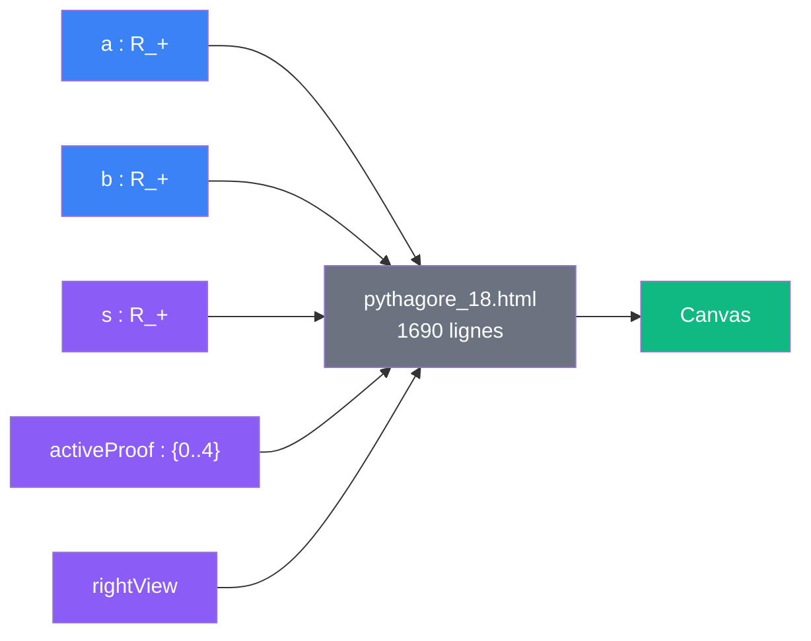
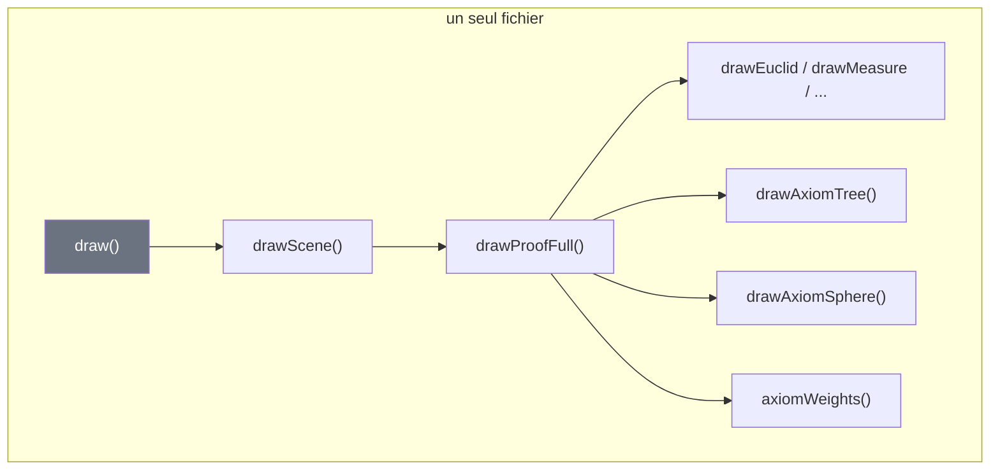

# V0 — Monolithe

> [Retour a l'index](../README.md)

`pythagore_18.html`

- **Sens** -- fichier unique qui montre 5 preuves du theoreme de Pythagore
- **Contrat** -- `(a, b, s) -> Canvas` (parametres slider vers pixels)
- **Ports** -- `a in R_+` , `b in R_+` , `s in R_+` , `activeProof in {0..4}` , `rightView in {anim, tree, sphere}` (entrees) ; `Canvas` (sortie)

## Circuit

## Comment ca marche

Tout est dans un seul fichier. HTML, CSS, donnees (`PROOFS[]`, ~195 lignes), logique metier (`axiomWeights()`, ~85 lignes), 7 fonctions de visualisation (~900 lignes), UI bindings et boucle p5 cohabitent dans le meme scope global.

Le contrat externe est correct : `(a, b) -> c = sqrt(a² + b²)` est calcule une seule fois et distribue aux 5 preuves. Mais les contrats internes sont invisibles — aucune frontiere entre donnees, calcul et rendu.

## Cablages internes (non separes)

Tout etant dans un seul scope, il n'y a pas de cablage au sens strict.
Les fonctions s'appellent directement sans interface :

## Problemes en termes sens / contrat / cablage

| Dimension | Etat |
|-----------|------|
| **Sens** | correct — 5 preuves du meme invariant `a² + b² = c²` |
| **Contrat** | externe correct, internes absents — pas de signature entre composants |
| **Cablage** | enchevetre — tout dans un scope, pas de ports visibles |

### Details

- **Fonctions dupliquees** — `drawArrow()` et `arrow()` font quasi la meme chose ; `wrapText()` et `wrapToLines()` aussi
- **Double systeme de poids** — `axiomsList[j][2]` (embarque dans chaque axiome) et `axiomWeights()` (gros switch) coexistent ; seul le second est utilise
- **Pas de ports** — les fonctions lisent des variables du scope parent sans les declarer en argument

## Chiffres

| Metrique | Valeur |
|----------|--------|
| Fichiers | 1 |
| Lignes | ~1690 |
| Fonctions de rendu | 7 |
| Imports explicites | 0 |
| Ports visibles dans les signatures | aucun |

---

[← Index](../README.md) | [V1 Modules →](../1_modules/)
