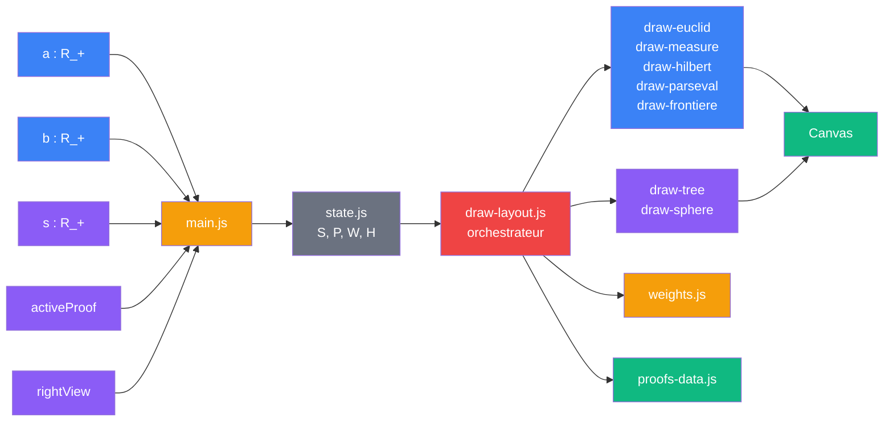
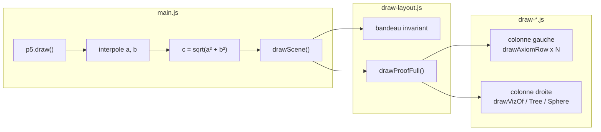
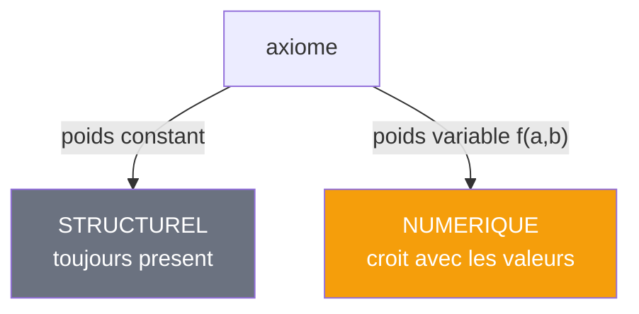
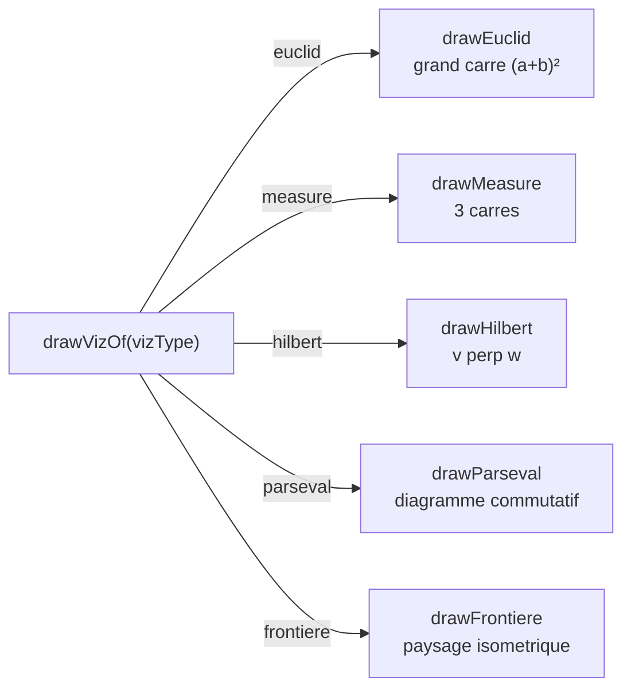

# V1 — Modules ES

> [Retour a l'index](../README.md)

`pythagore.html` + `js/*.js`

- **Sens** -- meme application que V0, decoupee en 13 modules a responsabilite unique
- **Contrat** -- `(a, b, s) -> Canvas` (inchange depuis V0)
- **Ports** -- `a in R_+` , `b in R_+` , `s in R_+` , `activeProof in {0..4}` , `rightView in {anim, tree, sphere}` (entrees) ; `Canvas` (sortie)

## Circuit

## Comment ca marche

Le fichier monolithique est decompose en 13 modules ES relies par `import`/`export`. Chaque module a un sens unique. Le comportement est identique a V0 — zero changement fonctionnel.

La boucle `p5.draw()` (60 fps) interpole `S.a` vers `S.aTarget`, calcule `c = sqrt(a² + b²)`, puis appelle `drawScene()` qui dispatche vers le module de rendu correspondant.

## Blocs (modules)

| Module | Sens | Contrat | Ports |
|--------|------|---------|-------|
| state.js | memoire partagee | `S : State` mutable, `P : p5`, `W, H : number` | ecriture : main.js ; lecture : tous |
| proofs-data.js | catalogue des 5 cablages | `PROOFS : Proof[]` (constant) | sortie : `PROOFS` |
| weights.js | cout d'evaluation des axiomes | `(vizType, a, b, c) -> {code: poids}` | `vizType`, `a`, `b`, `c` (entrees) ; `{code: R}` (sortie) |
| draw-utils.js | primitives visuelles | `drawArrow(x1,y1,x2,y2,color,lw,label?,side?) -> void` | geometrie + couleur (entrees) ; Canvas (sortie) |
| draw-layout.js | orchestrateur rendu | `drawScene() -> void` | lit S, P, W, H, PROOFS ; ecrit Canvas |
| draw-euclid.js | rendu preuve Euclide | `(x,y,w,h,a,b,c,color) -> void` | rectangle + triangle (entrees) ; Canvas |
| draw-measure.js | rendu preuve Mesure | `(x,y,w,h,a,b,c,color) -> void` | rectangle + triangle ; Canvas |
| draw-hilbert.js | rendu preuve Hilbert | `(x,y,w,h,a,b,c,color) -> void` | rectangle + triangle ; Canvas |
| draw-parseval.js | rendu preuve Parseval | `(x,y,w,h,a,b,c,color) -> void` | rectangle + triangle ; Canvas |
| draw-frontiere.js | rendu meta-sens Frontiere | `(x,y,w,h,a,b,c,color) -> void` | rectangle + triangle + **S.s** (cache) ; Canvas |
| draw-tree.js | rendu graphe axiomes → resultat | `(proof,x,y,w,h,classified,a,b,c) -> void` | proof + classified (entrees) ; Canvas |
| draw-sphere.js | rendu couverture axiomatique | `(proof,x,y,w,h,classified,a,b,c) -> void` | proof + classified ; Canvas |
| main.js | point d'entree, UI → boucle | `new p5(setup, draw, resize)` | DOM events (entrees) ; S mutations (sortie) |

## Cablages

### Boucle draw (60 fps)

### Classification structurel / numerique

La distinction est definie par la table `NUMERIC_CODES` dans draw-layout.js (cablage statique).

### Dispatch des visualisations

## Analyse sens / contrat / cablage

| Dimension | Etat V1 |
|-----------|---------|
| **Sens** | correct — chaque module a un role clair et unique |
| **Contrat** | partiel — les signatures disent `(a,b,c)` mais le corps appelle `P.rect()` via import implicite |
| **Cablage** | graphe etoile autour de draw-layout (hub a 10 imports) |

### Contrats faibles identifies

| Port cache | Ou | Consequence |
|------------|-----|-------------|
| `P` (instance p5) | 9 modules l'importent | la signature ment — dit `(a,b,c)`, utilise `P.rect()` |
| `S.s` | draw-frontiere lit `S.s` | 9e parametre invisible dans `(x,y,w,h,a,b,c,color)` |
| `W, H` | draw-layout lit en global | la scene ignore ses propres dimensions declarees |
| `NUMERIC_CODES` | table en dur dans draw-layout | duplique un savoir deductible des poids |
| `axiomsList[j][2]` | proofs-data | fonctions de poids jamais appelees (code mort) |

### Patterns partages entre modules

| Pattern | euclid | measure | hilbert | parseval | frontiere | tree | sphere | utils | layout |
|---------|:------:|:-------:|:-------:|:--------:|:---------:|:----:|:------:|:-----:|:------:|
| Signature VIZ | x | x | x | x | x | | | | |
| Noeud + halo | | | | x | | x | x | x | |
| Scale fitting | x | x | x | | x | | | | |
| Equation en bas | x | x | x | x | | | | | |
| Grille de fond | | | x | | x | | | | |
| drawArrow | | | x | x | | | | x | |
| Legende couleur | | | | | x | | x | | x |
| Lit S (hors P) | | | | | x | | | | x |

## Chiffres

| Metrique | V0 | V1 |
|----------|----|----|
| Fichiers | 1 | 14 |
| Plus gros fichier | 1690 l. | 276 l. |
| Imports explicites | 0 | ~30 |
| Ports caches | tous | 4 (P, W, H, S.s) |
| Code mort | oui | oui (poids proofs-data) |
| Fonctions dupliquees | oui | non |

## Proposition V2

Le document [proposals/v1-modules.md](../proposals/v1-modules.md) diagnostique les contrats faibles et propose une architecture a 7 modules ou tous les ports sont visibles dans les signatures (`Ctx` explicite, classification derivee, un seul systeme de poids).

---

[← V0 Monolithe](../0_monolithe/) | [Index](../README.md)
