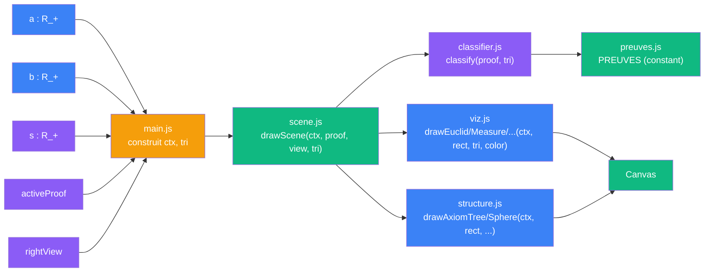
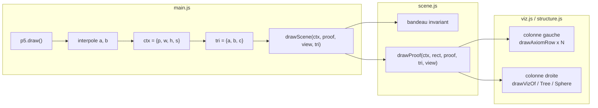
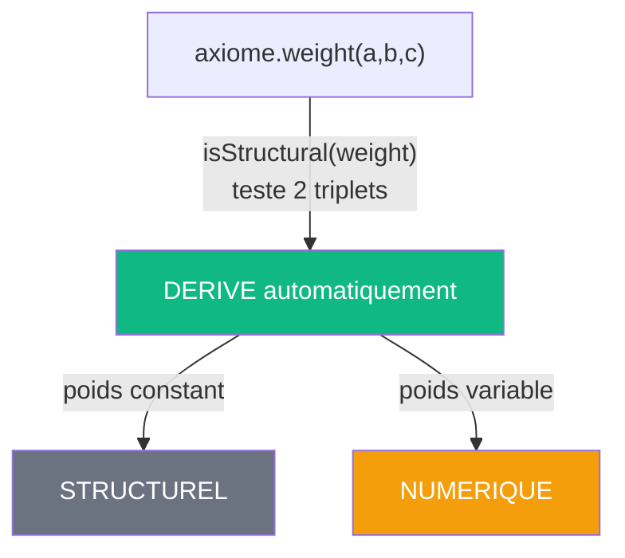
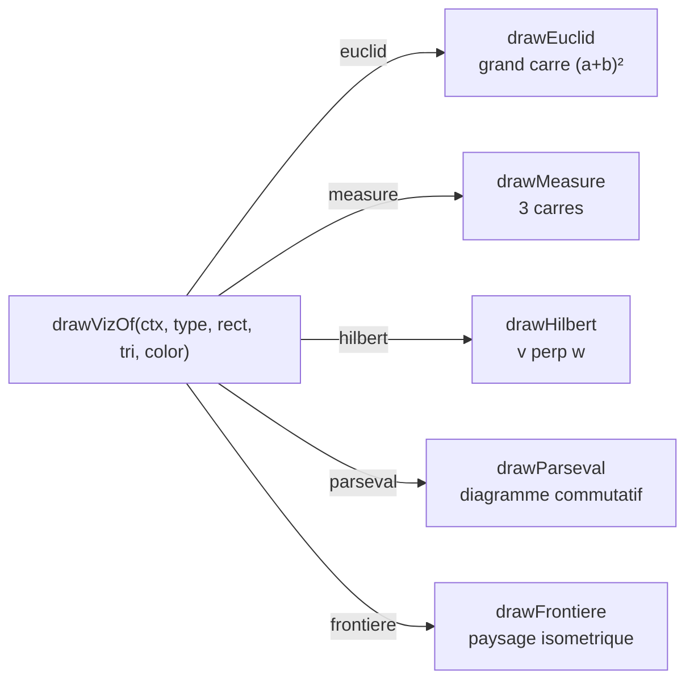
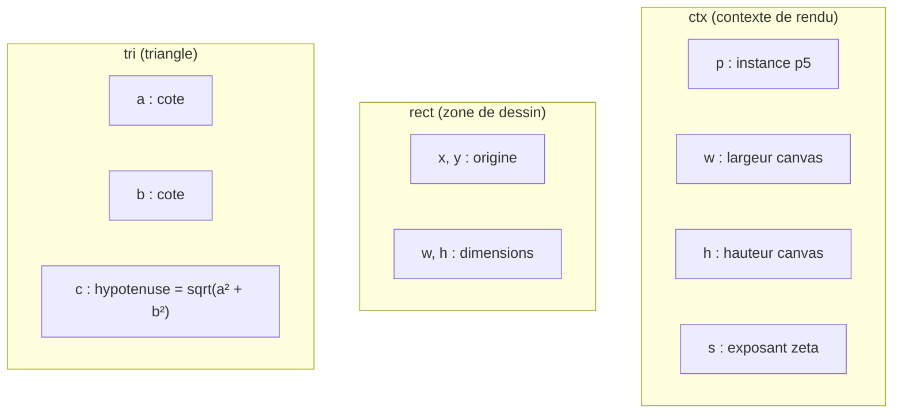

# V2 — Contrats forts

> [Retour a l'index](../README.md)

`pythagore.html` + `js/*.js`

- **Sens** -- meme application que V1, reorganisee en 3 couches (donnees / calcul / rendu) avec contrats explicites
- **Contrat** -- `(a, b, s) -> Canvas` (inchange depuis V0)
- **Ports** -- `a in R_+` , `b in R_+` , `s in R_+` , `activeProof in {0..4}` , `rightView in {anim, tree, sphere}` (entrees) ; `Canvas` (sortie)

## Circuit

## Comment ca marche

L'etat est local a `main.js` (objet `S`). A chaque frame, main.js construit deux objets de contrat :

- `ctx = { p, w, h, s }` — contexte de rendu (remplace P, W, H, S.s implicites de V1)
- `tri = { a, b, c }` — triangle courant (c = sqrt(a² + b²))

Ces objets sont passes en argument a `drawScene(ctx, activeProof, rightView, tri)` qui dispatche vers les modules de rendu. Plus aucune globale mutable n'est importee.

## Blocs (modules)

| Module | Sens | Contrat | Ports |
|--------|------|---------|-------|
| preuves.js | catalogue des 5 cablages + poids | `PREUVES : Preuve[]` (constant) | sortie : `PREUVES` |
| classifier.js | classification derivee des poids | `(proof, tri) -> classified[]` | proof + tri (entrees) ; classified (sortie) |
| viz.js | rendu des 5 visualisations | `(ctx, rect, tri, color) -> void` | ctx + rect + tri + color (entrees) ; Canvas (sortie) |
| structure.js | rendu arbre, cercle, ligne d'axiome | `(ctx, rect, proof, classified, tri) -> void` | ctx + rect + proof + classified + tri (entrees) ; Canvas (sortie) |
| scene.js | orchestrateur rendu | `(ctx, activeProof, rightView, tri) -> void` | ctx + activeProof + rightView + tri (entrees) ; Canvas (sortie) |
| main.js | point d'entree, UI, boucle p5 | `new p5(setup, draw, resize)` | DOM events (entrees) ; ctx + tri (sorties internes) |

## Cablages

### Boucle draw (60 fps)

### Classification structurel / numerique

La distinction n'est plus une table en dur (`NUMERIC_CODES` de V1) mais est **derivee** du poids : si `weight(3,4,5) == weight(5,12,13)` alors l'axiome est structurel.

### Dispatch des visualisations

## Analyse sens / contrat / cablage

| Dimension | Etat V2 |
|-----------|---------|
| **Sens** | explicite — 3 couches : donnees (preuves), calcul (classifier), rendu (viz + structure + scene) |
| **Contrat** | fort — tous les ports dans les signatures, aucun port cache |
| **Cablage** | compact — ctx passe de main -> scene -> viz/structure, 6 modules |

### Contrats forts : ce qui a change depuis V1

| Port cache V1 | Solution V2 |
|----------------|-------------|
| `P` (instance p5) importee par 9 modules | `ctx.p` passe en argument |
| `S.s` lu par draw-frontiere | `ctx.s` dans le contexte |
| `W, H` lus en global par draw-layout | `ctx.w`, `ctx.h` dans le contexte |
| `NUMERIC_CODES` table en dur | `isStructural()` derive du poids |
| `axiomsList[j][2]` code mort | fonctions `weight` actives, seule source de verite |

### Objets de contrat

## Chiffres

| Metrique | V0 | V1 | V2 |
|----------|----|----|-----|
| Fichiers JS | 1 | 13 | 6 |
| Plus gros fichier | 1690 l. | 276 l. | 305 l. (viz.js) |
| Ports caches | tous | 4 | 0 |
| Sources de poids | 1 (inline) | 2 (une morte) | 1 (integree) |
| Tables en dur | oui | 1 (NUMERIC_CODES) | 0 |
| Globales mutables importees | toutes | 4 (P, S, W, H) | 0 |

---

[← V1 Modules ES](../1_modules/) | [Index](../README.md)
