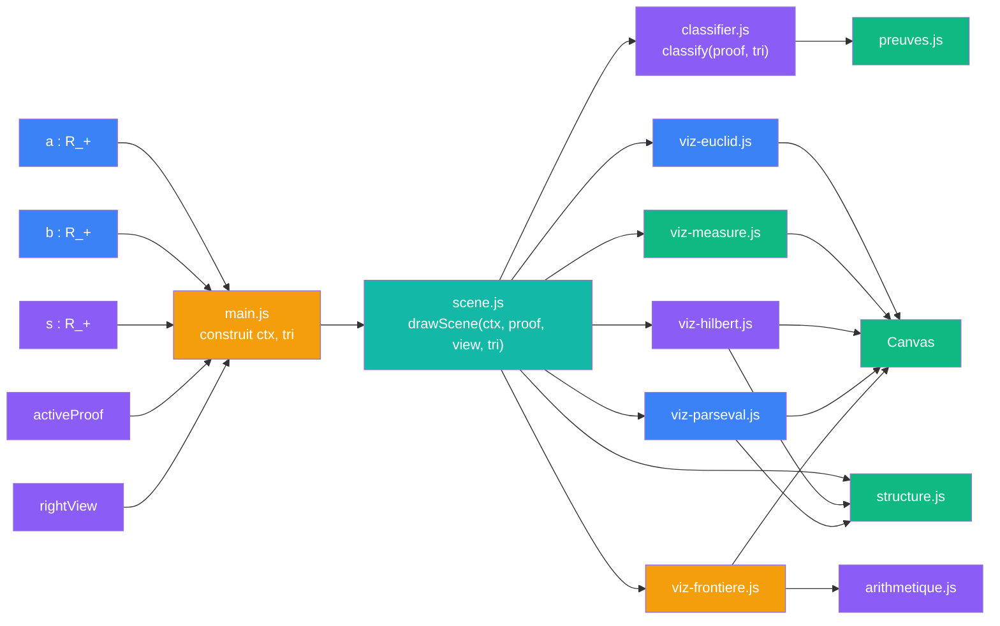
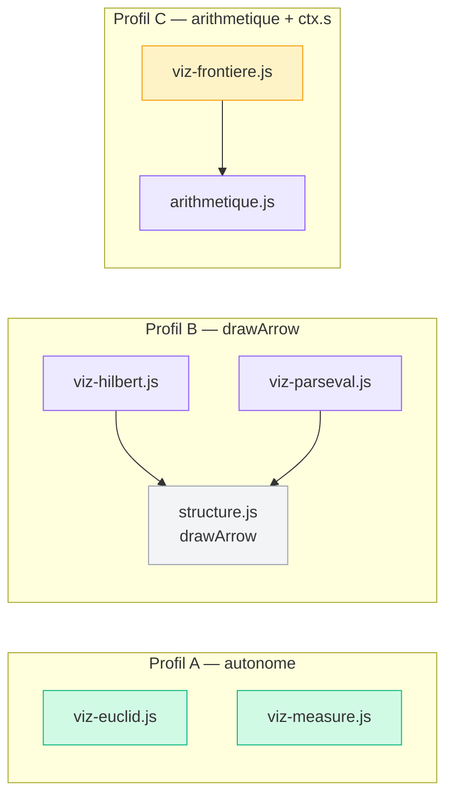
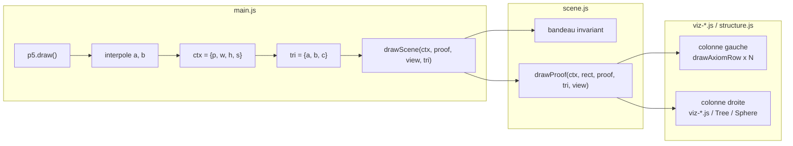
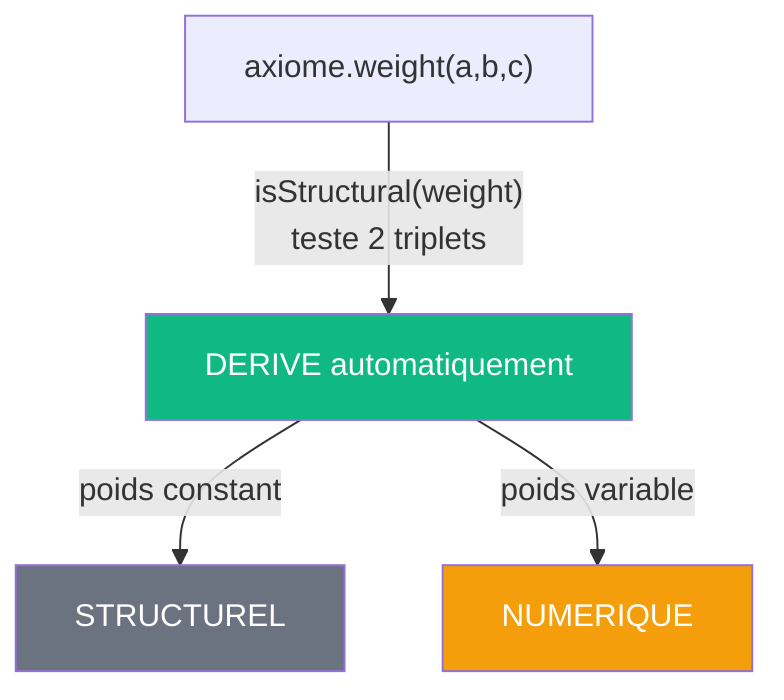
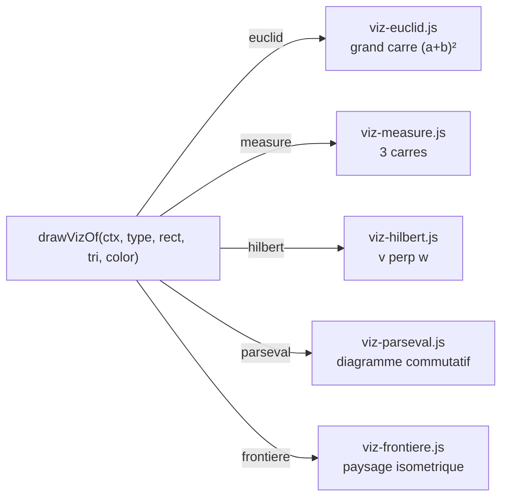
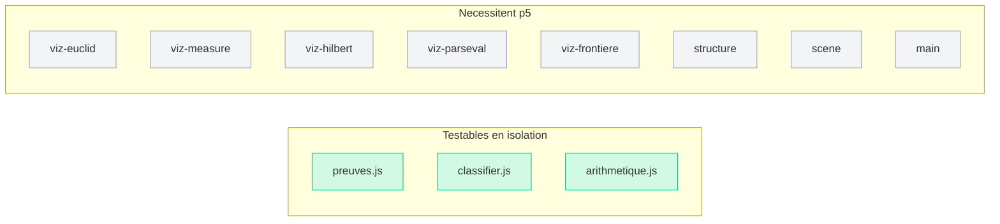

# V3 — Contraintes emergentes

> [Retour a l'index](../README.md)

`pythagore.html` + `js/*.js`

- **Sens** -- meme application que V2, reorganisee pour qu'un cablage = un fichier et que le calcul soit separe du rendu
- **Contrat** -- `(a, b, s) -> Canvas` (inchange depuis V0)
- **Ports** -- `a in R_+` , `b in R_+` , `s in R_+` , `activeProof in {0..4}` , `rightView in {anim, tree, sphere}` (entrees) ; `Canvas` (sortie)

## Circuit

## Comment ca marche

Comme V2, main.js construit `ctx = { p, w, h, s }` et `tri = { a, b, c }` a chaque frame et appelle `drawScene(ctx, activeProof, rightView, tri)`.

La difference avec V2 : chaque preuve a son propre fichier de rendu, et le calcul arithmetique (Jacobi, factorisation, chi4) est extrait dans un module pur `arithmetique.js` testable sans p5. Le fichier `viz.js` monolithique est supprime.

## Blocs (modules)

| Module | Sens | Contrat | Ports |
|--------|------|---------|-------|
| preuves.js | catalogue des 5 cablages + poids | `PREUVES : Preuve[]` (constant) | sortie : `PREUVES` |
| classifier.js | classification derivee des poids | `(proof, tri) -> classified[]` | proof + tri (entrees) ; classified (sortie) |
| arithmetique.js | theorie des nombres (Jacobi, chi4) | `(N) -> {d1, d3, r2}` et variantes | entiers (entrees) ; structures arithmetiques (sorties) |
| viz-euclid.js | rendu preuve Euclide | `(ctx, rect, tri, color) -> void` | ctx + rect + tri + color ; Canvas |
| viz-measure.js | rendu preuve Mesure | `(ctx, rect, tri, color) -> void` | ctx + rect + tri + color ; Canvas |
| viz-hilbert.js | rendu preuve Hilbert | `(ctx, rect, tri, color) -> void` | ctx + rect + tri + color ; Canvas. Importe drawArrow |
| viz-parseval.js | rendu preuve Parseval | `(ctx, rect, tri, color) -> void` | ctx + rect + tri + color ; Canvas. Importe drawArrow |
| viz-frontiere.js | rendu meta-preuve Frontiere | `(ctx, rect, tri, color) -> void` | ctx + rect + tri + color ; Canvas. Lit `ctx.s`, importe arithmetique |
| structure.js | rendu arbre, cercle, ligne d'axiome | `(ctx, rect, proof, classified, tri) -> void` | ctx + rect + proof + classified + tri ; Canvas |
| scene.js | orchestrateur rendu | `(ctx, activeProof, rightView, tri) -> void` | ctx + activeProof + rightView + tri ; Canvas |
| main.js | point d'entree, UI, boucle p5 | `new p5(setup, draw, resize)` | DOM events (entrees) ; ctx + tri (sorties internes) |

## Cablages

### Profils de dependance des visualisations

Ce que V2 cachait dans un seul fichier : les 5 fonctions ont 3 profils de dependance distincts.

| Profil | Fichiers | Dependances | `ctx.s` |
|--------|----------|-------------|---------|
| A — autonome | euclid, measure | aucune | non |
| B — fleche | hilbert, parseval | structure.js (drawArrow) | non |
| C — arithmetique | frontiere | arithmetique.js | **oui** |

### Boucle draw (60 fps)

> (inchangé depuis V2 — voir [2_contrats/README.md](../2_contrats/README.md))

### Classification structurel / numerique

> (inchangé depuis V2 — voir [2_contrats/README.md](../2_contrats/README.md))

### Dispatch des visualisations

> (inchangé depuis V2 — voir [2_contrats/README.md](../2_contrats/README.md))

## Analyse sens / contrat / cablage

| Dimension | Etat V3 |
|-----------|---------|
| **Sens** | simple — 1 cablage = 1 fichier, calcul separe du rendu |
| **Contrat** | fort — tous les ports dans les signatures, `ctx.s` isole dans viz-frontiere |
| **Cablage** | explicite — 3 profils de dependance lisibles dans le graphe d'import |

### Ce qui a change depuis V2

| Contrainte V2 | Solution V3 |
|----------------|-------------|
| viz.js melange 5 cablages independants | 1 preuve = 1 fichier (viz-euclid, viz-measure, viz-hilbert, viz-parseval, viz-frontiere) |
| 80 lignes de calcul arithmetique dans un fichier de rendu | arithmetique.js — module CALCUL pur, testable sans p5 |
| `ctx.s` cache dans le contrat partage des 5 viz | isole dans viz-frontiere.js, seul fichier qui le lit |
| drawArrow importe pour 2 fonctions sur 5 | dependance visible par fichier (hilbert et parseval seulement) |
| plus gros fichier : 514 lignes | plus gros fichier : ~160 lignes (viz-frontiere) |

### Modules testables sans p5

V2 avait 2 modules testables (preuves, classifier). V3 en a 3 (+ arithmetique).

## Chiffres

| Metrique | V0 | V1 | V2 | V3 |
|----------|----|----|-----|-----|
| Fichiers JS | 1 | 13 | 6 | 11 |
| Plus gros fichier | 1690 l. | 276 l. | 514 l. | ~160 l. |
| Sens melange | oui | non | 1 (viz.js) | 0 |
| Calcul dans rendu | oui | non | oui (5 helpers) | non |
| Contrats faibles | tous | 4 (P, S, W, H) | 0 | 0 |
| `ctx.s` visible | cache (S.s) | cache (S.s) | cache dans contrat partage | isole (viz-frontiere) |
| Modules testables sans p5 | 0 | 0 | 2 | 3 |

---

[← V2 Contrats forts](../2_contrats/) | [Index](../README.md)
