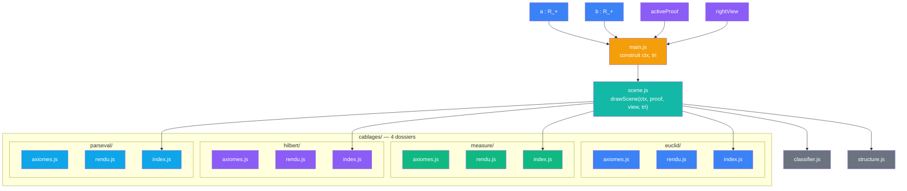
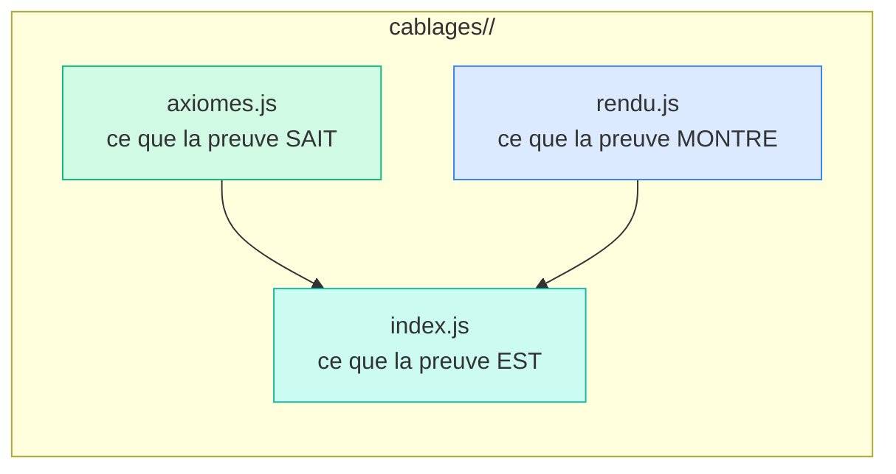
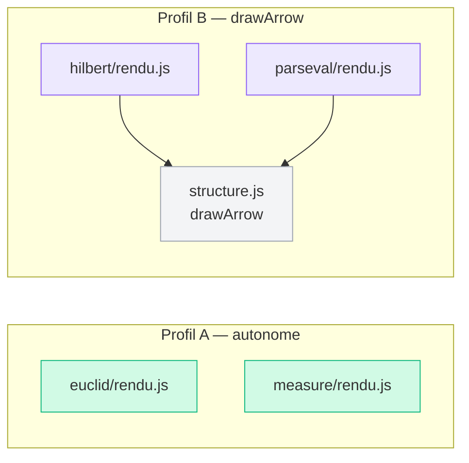
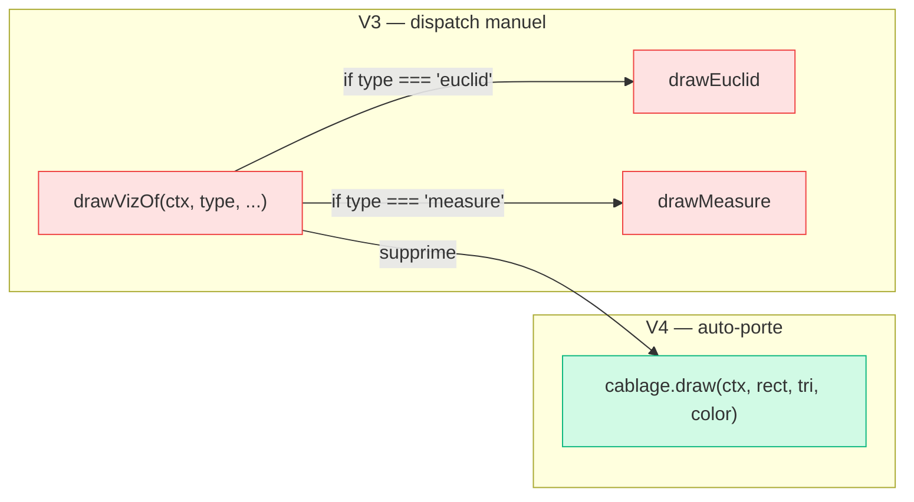
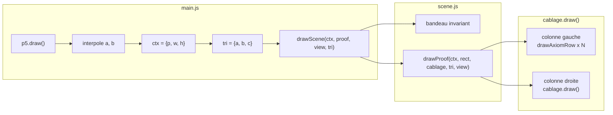
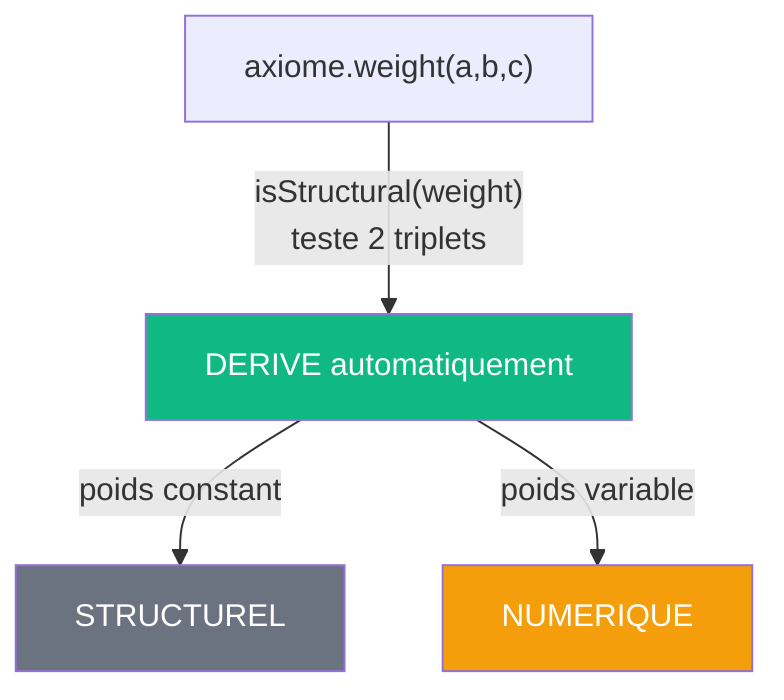
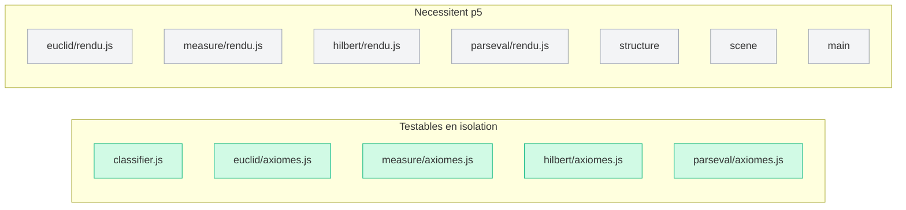

# V4 — Sens commun emergent

> [Retour a l'index](../README.md)

`pythagore.html` + `js/cablages/<nom>/`

- **Sens** -- meme application que V3, reorganisee pour qu'un cablage = un dossier et que le sens commun emerge de la forme repetee. Seules les 4 preuves classiques participent — la meta-preuve Frontiere reste dans V3 (son sens est trop eloigne du sens commun).
- **Contrat** -- `(a, b) -> Canvas` (simplifie : plus de parametre s)
- **Ports** -- `a in R_+` , `b in R_+` , `activeProof in {0..3}` , `rightView in {anim, tree, sphere}` (entrees) ; `Canvas` (sortie)

## Circuit

## Comment ca marche

Comme V3, main.js construit `ctx = { p, w, h }` et `tri = { a, b, c }` a chaque frame et appelle `drawScene(ctx, activeProof, rightView, tri)`.

La difference avec V3 : chaque cablage co-localise ses axiomes et son rendu dans un meme dossier. La table de dispatch `drawVizOf` disparait — scene.js appelle `cablage.draw(ctx, rect, tri, cablage.color)`. Le sens commun emerge de la forme repetee des 4 dossiers.

## Blocs (modules)

| Module | Sens | Contrat | Ports |
|--------|------|---------|-------|
| cablages/euclid/ | preuve Euclide — axiomes + rendu co-localises | `{ id, axioms, draw, format, ... }` | exporte un cablage complet |
| cablages/measure/ | preuve Mesure — axiomes + rendu co-localises | `{ id, axioms, draw, format, ... }` | exporte un cablage complet |
| cablages/hilbert/ | preuve Hilbert — axiomes + rendu co-localises | `{ id, axioms, draw, format, ... }` | exporte un cablage complet. rendu.js importe drawArrow |
| cablages/parseval/ | preuve Parseval — axiomes + rendu co-localises | `{ id, axioms, draw, format, ... }` | exporte un cablage complet. rendu.js importe drawArrow |
| classifier.js | classification derivee des poids | `(proof, tri) -> classified[]` | proof + tri (entrees) ; classified (sortie) |
| structure.js | rendu arbre, cercle, ligne d'axiome | `(ctx, rect, proof, classified, tri) -> void` | ctx + rect + proof + classified + tri ; Canvas |
| scene.js | orchestrateur rendu | `(ctx, activeProof, rightView, tri) -> void` | ctx + activeProof + rightView + tri ; Canvas |
| main.js | point d'entree, UI, boucle p5 | `new p5(setup, draw, resize)` | DOM events (entrees) ; ctx + tri (sorties internes) |

## Cablages

### Forme commune : 1 cablage = 1 dossier

Cette forme repetee 4 fois EST le sens commun. On ne l'a pas code — on l'a fait emerger par la structure du projet.

### Profils de dependance des rendus

### Dispatch supprime

### Boucle draw (60 fps)

### Classification structurel / numerique

> (inchangé depuis V2 — voir [2_contrats/README.md](../2_contrats/README.md))

## Analyse sens / contrat / cablage

| Dimension | Etat V4 |
|-----------|---------|
| **Sens** | **reuni** — chaque cablage co-localise ce qu'il sait (axiomes) et ce qu'il montre (rendu) |
| **Contrat** | fort et **auto-porte** — le cablage porte son propre `draw`, plus de dispatch externe |
| **Cablage** | forme commune **emerge** de la structure repetee des 4 dossiers |

### Ce qui a change depuis V3

| Contrainte V3 | Solution V4 |
|----------------|-------------|
| Lien axiomes <-> rendu implicite (preuves.js <-> viz-*.js) | **explicite** — meme dossier |
| preuves.js monolithe (5 preuves) | eclate en 4 `axiomes.js` (frontiere exclue — sens trop eloigne) |
| dispatch manuel drawVizOf (switch sur type) | supprime — `cablage.draw()` |
| sens commun invisible | **emerge** de la forme repetee axiomes.js + rendu.js + index.js |

### Pourquoi frontiere est exclue

La meta-preuve Frontiere (convergence de zeta d'Epstein) a un sens trop eloigne des 4 preuves classiques pour participer a la forme commune. Ses specificites :

- `ctx.s` — seul cablage qui lit un parametre supplementaire
- `arithmetique.js` — module de calcul prive sans equivalent chez les autres
- `isMeta: true` — se declare elle-meme hors du sens commun

Elle reste dans V3 et pourra rejoindre V4 quand son sens sera clarifie.

### Modules testables sans p5

V3 avait 3 modules testables (preuves, classifier, arithmetique). V4 en a 5 (4 axiomes + classifier).

## Chiffres

| Metrique | V0 | V1 | V2 | V3 | V4 |
|----------|----|----|-----|-----|-----|
| Fichiers JS | 1 | 13 | 6 | 11 | 16 (4 dossiers x 3 + 4 modules) |
| Plus gros fichier | 1690 l. | 276 l. | 514 l. | ~160 l. | ~160 l. (scene.js) |
| Sens melange | oui | non | 1 (viz.js) | 0 | 0 |
| Lien axiomes <-> rendu | implicite | implicite | implicite | implicite | **explicite** (meme dossier) |
| Dispatch viz | switch | switch | switch | switch | **supprime** (cablage.draw) |
| Modifier une preuve | 2+ fichiers | 2+ fichiers | 2 fichiers | 2 fichiers | **1 dossier** |
| Sens commun | invisible | invisible | invisible | invisible | **emerge** de la forme repetee |
| Modules testables sans p5 | 0 | 0 | 2 | 3 | 5 |

---

[<- V3 Contraintes](../3_contraintes/) | [Index](../README.md)
