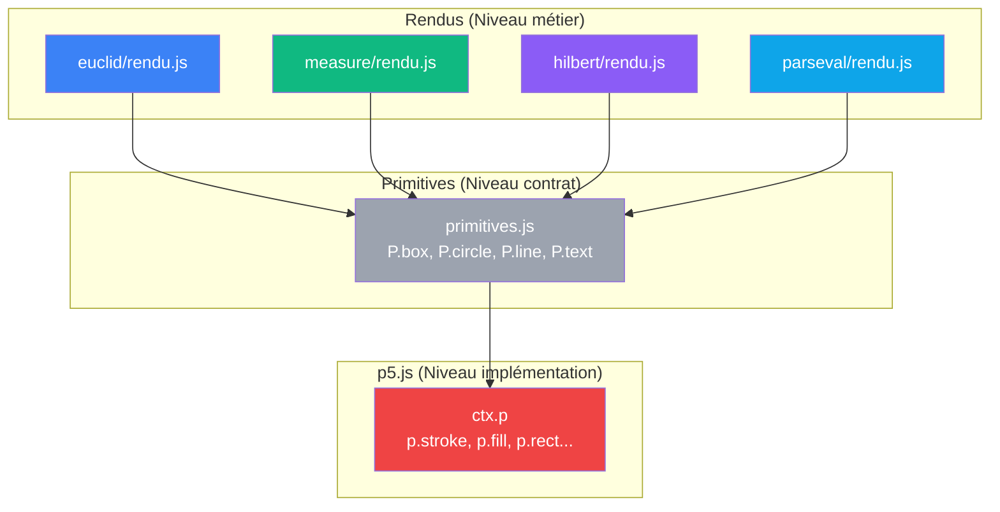

# V5 — Primitives graphiques abstraites

> [Retour a l'index](../README.md)

`pythagore.html` + `js/primitives.js` + `js/cablages/<nom>/`

- **Sens** -- meme application que V4, mais p5.js encapsulé dans une couche de primitives
- **Contrat** -- rendus n'appellent jamais `p.stroke()`, `p.fill()`, etc. directement ; tout via `Primitives.box()`, `Primitives.circle()`, etc.
- **Ports** -- primitives.js encapsule p5.js, rendus ne connaissent pas p5.js

## Circuit



## Blocs

| Module | Sens | Contrat | Ports |
|--------|------|---------|-------|
| primitives.js | **encapsule p5.js** — styles, géométrie, texte | `{ setStroke, setFill, box, circle, line, text, ... }` | `ctx.p` (entree) ; rien d'autre |
| cablages/euclid/rendu.js | dessine carrés (géométrie euclidienne) | `draw(ctx, rect, tri, color)` ; appelle P.* seulement | primitives.js |
| cablages/measure/rendu.js | dessine barres (théorie mesure) | `draw(ctx, rect, tri, color)` ; appelle P.* seulement | primitives.js |
| cablages/hilbert/rendu.js | dessine vecteurs (espace préhilbertien) | `draw(ctx, rect, tri, color)` ; importe drawArrow | primitives.js + structure.js |
| cablages/parseval/rendu.js | dessine diagramme commutatif (Parseval) | `draw(ctx, rect, tri, color)` ; importe drawArrow | primitives.js + structure.js |

## Primitives

13 primitives couvrent 100% des besoins :

### Styles
```js
P.setStroke(ctx, color, weight)
P.setFill(ctx, color)
P.noStroke(ctx)
P.noFill(ctx)
P.setDashedLine(ctx, pattern)  // p.drawingContext.setLineDash
P.clearDashedLine(ctx)
```

### Géométrie
```js
P.box(ctx, x, y, w, h, style)    // rectangle
P.circle(ctx, x, y, r, style)    // cercle
P.line(ctx, x1, y1, x2, y2, style)
P.polygon(ctx, points, style)    // [x,y] → beginShape/vertex/endShape
P.arc(ctx, x, y, w, h, a0, a1, style)
```

### Texte
```js
P.text(ctx, str, x, y, style)    // size, color, align
```

### État graphique
```js
P.push(ctx), P.pop(ctx)
P.translate(ctx, x, y)
P.rotate(ctx, angle)
```

### Helpers (purs calculs)
```js
P.tint(color, alpha)    // "3B82F6" + "40" → "3B82F640"
P.center(w, itemW)      // (w - itemW) / 2
```

## Analyse sens / contrat / cablage

| Dimension | Etat V5 |
|-----------|---------|
| **Sens** | **inchangé** — axiomes → formes géométriques (métier) |
| **Contrat** | **fort et stratifié** — rendus ↔ primitives ↔ p5.js (3 couches) |
| **Cablage** | **inversé** — p5.js dépend de primitives, pas l'inverse |

## Fichiers

```
app/5_abstraites/
  pythagore.html                       (copie V4)
  PROPOSAL.md                          (lire avant d'implementer)
  js/
    primitives.js                      ← NOUVEAU
      • 13 primitives graphiques
      • Encapsule p5.js
    cablages/
      euclid/
        axiomes.js                     (copie V4)
        rendu.js                       ← Adapté pour primitives
        index.js                       (copie V4)
      measure/
        axiomes.js                     (copie V4)
        rendu.js                       ← Adapté pour primitives
        index.js                       (copie V4)
      hilbert/
        axiomes.js                     (copie V4)
        rendu.js                       ← Adapté pour primitives
        index.js                       (copie V4)
      parseval/
        axiomes.js                     (copie V4)
        rendu.js                       ← Adapté pour primitives
        index.js                       (copie V4)
    classifier.js                      (copie V4)
    structure.js                       (copie V4)
    scene.js                           (copie V4)
    main.js                            (copie V4)
```

> [Lire la proposition V5 →](../proposals/v5-abstraites.md)

### Améliorations depuis V4

| Contrainte V4 | Solution V5 |
|----------------|-------------|
| p5.js enchâssé dans rendus | encapsulé dans `primitives.js` |
| Impossible de tester rendus (p5 obligatoire) | **testable avec mock de ctx.p** |
| Swap impossible (p5 vs Canvas/SVG) | **1 fichier à rewrite** (primitives.js) |
| API p5 dupliquée dans 4 rendus | centralisée dans 1 module |
| Pas de contract visuel | **interface explicite** (P.box, P.circle, P.text) |

### Cas d'usage futur

Implémenter Canvas sans toucher aux rendus :

```js
// js/primitives-canvas.js
export const Primitives = {
  box(ctx, x, y, w, h, style = {}) {
    const canvas = ctx.canvas;
    const c2d = canvas.getContext('2d');
    // Implémentation Canvas
  },
  // ... mêmes 13 fonctions
};
```

Puis dans `scene.js` :
```js
import { Primitives } from './primitives-canvas.js';
```

Les 4 rendus ne changent pas.

## Fichiers

```
app/5_abstraites/
  pythagore.html                       (copie V4)
  PROPOSAL.md                          (lire avant d'implementer)
  js/
    primitives.js                      ← NOUVEAU
      • 13 primitives graphiques
      • Encapsule p5.js
    cablages/
      euclid/
        axiomes.js                     (copie V4)
        rendu.js                       ← Adapté pour primitives
        index.js                       (copie V4)
      measure/
        axiomes.js                     (copie V4)
        rendu.js                       ← Adapté pour primitives
        index.js                       (copie V4)
      hilbert/
        axiomes.js                     (copie V4)
        rendu.js                       ← Adapté pour primitives
        index.js                       (copie V4)
      parseval/
        axiomes.js                     (copie V4)
        rendu.js                       ← Adapté pour primitives
        index.js                       (copie V4)
    classifier.js                      (copie V4)
    structure.js                       (copie V4)
    scene.js                           (copie V4)
    main.js                            (copie V4)
```

## Chiffres

| Metrique | V4 | V5 |
|----------|----|----|
| Fichiers JS | 16 | **17** (+primitives.js) |
| Couplage p5.js | direct dans 4 rendus | **centralisé dans 1 module** |
| Modules testables sans p5 | 5 | **9** (5 axiomes + classifier + 3 modules helpers) |
| Swap graphique | réécrire 4 rendus | **réécrire 1 fichier** (primitives.js) |

---

[← V4 Sens commun](../4_sens/) | [Index](../README.md)
