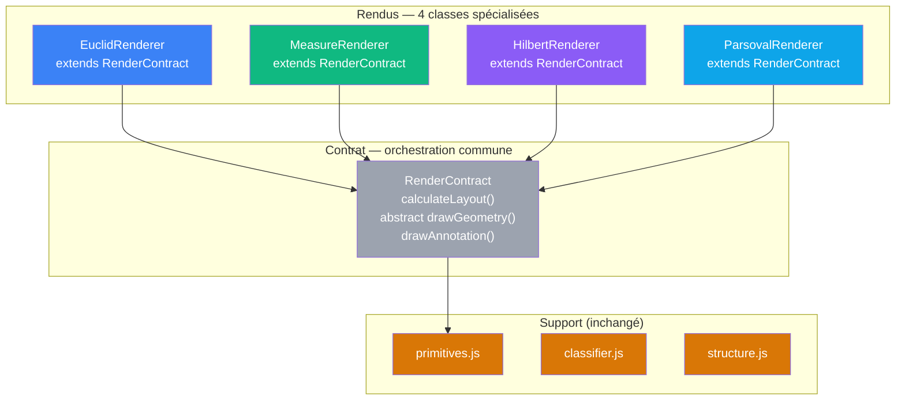
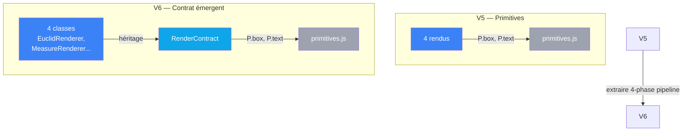

# V6 — Contrat de rendu émergent

> [Retour a l'index](../README.md)

`pythagore.html` + `js/render-contract.js` + `js/cablages/<nom>/rendu.js`

- **Sens** -- meme application que V5, mais la structure commune des 4 rendus (layout → geometry → annotation) est extraite dans une classe abstraite `RenderContract`
- **Contrat** -- les 4 rendus héritent de `RenderContract` qui orchestre les 4 phases via template method. Seule `drawGeometry()` est polymorphe ; layout et annotation sont partagés
- **Ports** -- `RenderContract.draw(ctx, rect, tri, color)` encapsule l'orchestration ; chaque rendu spécialise `drawGeometry(layout)` pour sa géométrie

## Circuit



## Blocs (modules)

| Module | Sens | Contrat | Ports |
|--------|------|---------|-------|
| render-contract.js | **formalise le pipeline** — 4 phases invariantes chez tous les rendus | `calculateLayout()` (avec hooks), `abstract drawGeometry(layout)`, `drawAnnotation()`, `draw()` | `ctx, rect, tri, color` (entrees) ; `void` (sortie) |
| cablages/euclid/rendu.js | classe `EuclidRenderer` — spécialise layout et géométrie euclidienne | `extends RenderContract` ; `drawGeometry(layout)` dessine carrés | hérité de RenderContract |
| cablages/measure/rendu.js | classe `MeasureRenderer` — spécialise layout et barres de mesure | `extends RenderContract` ; `drawGeometry(layout)` dessine barres | hérité de RenderContract |
| cablages/hilbert/rendu.js | classe `HilbertRenderer` — spécialise layout et vecteurs | `extends RenderContract` ; `drawGeometry(layout)` dessine grille + flèches | hérité de RenderContract |
| cablages/parseval/rendu.js | classe `ParsovalRenderer` — spécialise layout et diagramme commutatif | `extends RenderContract` ; `drawGeometry(layout)` dessine nœuds + flèches | hérité de RenderContract |
| classifier.js, structure.js, primitives.js | inchangés | idem V5 | idem V5 |

## Comment ca marche

Comme V5, les 4 rendus héritent d'une classe abstraite `RenderContract` qui encapsule la structure commune.

Le **template method pattern** définit un squelette invariant :

```js
draw() {
  const layout = this.calculateLayout();  // Phase 2 : layout commun
  this.drawGeometry(layout);              // Phase 3 : géométrie polymorphe
  this.drawAnnotation(formula, layout);   // Phase 4 : annotation commune
}
```

Chaque classe surcharge :
- `getPadding()`, `getVerticalPadding()`, `calculateScale()` — customisation du layout
- `drawGeometry(layout)` — la géométrie spécifique

### Le saut : RenderContract IS le contrat émergent

En V5, le contrat était *implicite* : "les 4 rendus appellent P.box, P.circle, P.text".

En V6, le contrat est *explicite* : la classe `RenderContract` EST le contrat. Ses méthodes et hooks définissent exactement ce qui est commun vs. ce qui est spécifique.

## Analyse sens / contrat / cablage

| Dimension | V5 | V6 |
|-----------|-----|--------|
| **Sens** | axiomes → formes (4 preuves indépendantes) | **axiomes → formes via structure commune** |
| **Contrat** | 3 couches : rendus ↔ primitives ↔ p5.js | **4 couches** : rendus → RenderContract → primitives → p5.js |
| **Cablage** | 4 fonctions `draw()` procédurales | **4 classes héritant de RenderContract** |

### Bénéfices par rapport à V5

| Contrainte V5 | Solution V6 |
|---|---|
| `calculateLayout` dupliqué dans 4 rendus | **centralisé dans RenderContract** |
| Pas visible que les 4 rendus font la même chose | **héritage rend la structure explicite** |
| Ajouter une phase → refactorer 4 rendus | **ajouter 1 méthode dans RenderContract** (auto-héritée) |
| Rendu = procédure linéaire sans structure | **rendu = classe avec responsabilités claires** |

## Fichiers

```
app/6_contrats/
  pythagore.html                       (copie V5)
  ../proposals/v6-contrats.md          (lire avant : V6 design)
  js/
    render-contract.js                 ← NOUVEAU (classe abstraite)
    primitives.js                      (copie V5)
    classifier.js                      (copie V5)
    structure.js                       (copie V5)
    scene.js                           (copie V5)
    main.js                            (copie V5)
    cablages/
      euclid/
        axiomes.js                     (copie V5)
        rendu.js                       ← Refactorisé (classe EuclidRenderer)
        index.js                       (copie V5)
      measure/
        axiomes.js                     (copie V5)
        rendu.js                       ← Refactorisé (classe MeasureRenderer)
        index.js                       (copie V5)
      hilbert/
        axiomes.js                     (copie V5)
        rendu.js                       ← Refactorisé (classe HilbertRenderer)
        index.js                       (copie V5)
      parseval/
        axiomes.js                     (copie V5)
        rendu.js                       ← Refactorisé (classe ParsovalRenderer)
        index.js                       (copie V5)
```

## Comparaison V5 → V6



| Métrique | V5 | V6 |
|----------|----|----|
| Fichiers JS | 17 | **18** (+render-contract.js) |
| Couches | 3 | **4** (rendus → RenderContract → primitives → p5) |
| Rendus testables isolément | 4 | **4** (mêmes, mais avec RenderContract injectable) |
| Code partagé (layout) | copié 4 fois | **hérité via RenderContract** |

---

[← V5 Primitives](../5_abstraites/) | [Index](../README.md)
