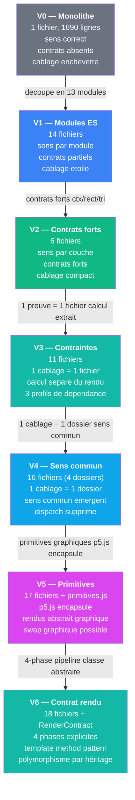
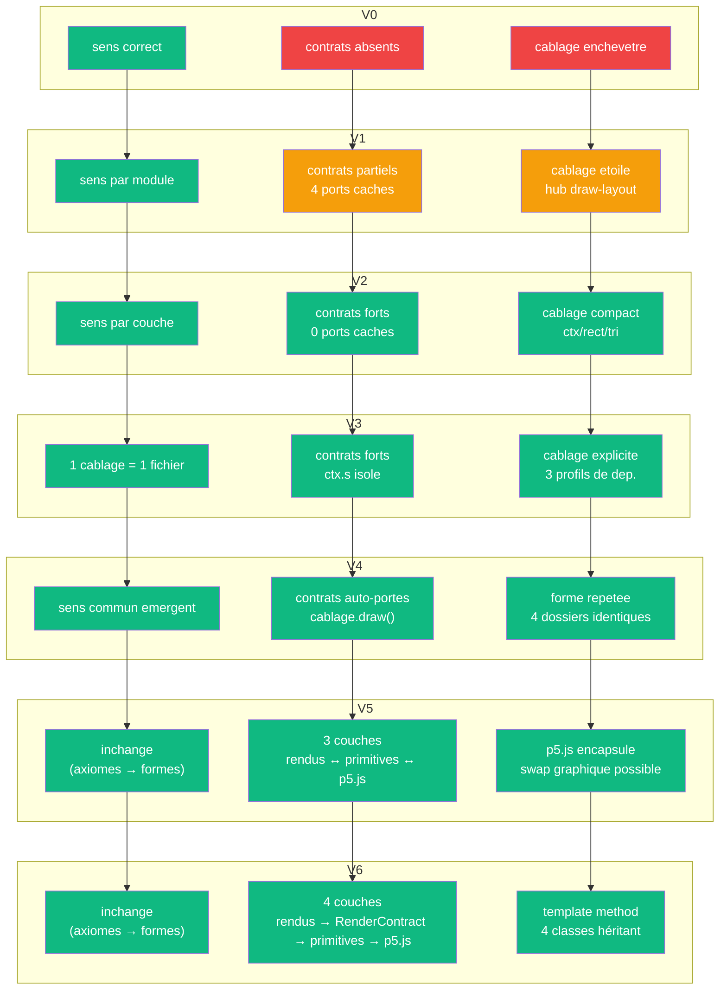

# Pythagore — journal de restructuration

> [Retour au projet](../README.md) | [Vocabulaire](../docs/vocabulaire/) | [Sens](../docs/sens/)

`app/`

- **Sens** -- montrer le theoreme de Pythagore sous 4 eclairages, restructurer le code pour rendre les contrats visibles
- **Contrat** -- `(a, b) -> Canvas` (inchange a travers les versions, s retire en V4)
- **Ports** -- `a in R_+` , `b in R_+` , `s in R_+` , `activeProof in {0..4}` , `rightView in {anim, tree, sphere}` (entrees) ; `Canvas` (sortie)

## Propositions d'architecture

Chaque version a une **proposition** qui diagnostique la version précédente et propose une vision pour la suivante.

→ **[Lire toutes les propositions](proposals/)** (7 propositions, V1-V7)

---

## Circuit : progression des versions

## Versions

| Version | Sens | Contrat | Cablage |
|---------|------|---------|---------|
| [V0 — Monolithe](0_monolithe/) | correct (5 preuves, 1 invariant) | externe correct, internes absents | enchevetre (1 scope) |
| [V1 — Modules ES](1_modules/) | clair par module | partiels (P, W, H, S.s caches) | etoile autour de draw-layout |
| [V2 — Contrats forts](2_contrats/) | explicite (3 couches) | forts (ctx/rect/tri, 0 ports caches) | compact (6 modules, pas de globale) |
| [V3 — Contraintes](3_contraintes/) | simple (1 cablage = 1 fichier) | forts + ctx.s isole | explicite (3 profils, calcul separe) |
| [V4 — Sens commun](4_sens/) | reuni (1 cablage = 1 dossier) | forts + auto-porte (cablage.draw) | forme commune emergente (4 dossiers, frontiere exclue) |
| [V5 — Primitives](5_abstraites/) | inchange (axiomes → formes) | 3 couches (rendus ↔ primitives ↔ p5.js) | p5.js encapsule, swap possible |
| [V6 — Contrat rendu](6_contrats/) | inchange (axiomes → formes) | **4 couches** (rendus → RenderContract → primitives → p5.js) | **template method** (RenderContract orchestre, rendus héritent) |

## Invariant a travers les versions

Le **sens mathematique** ne change jamais :

> `a² + b² = c²` — l'hypotenuse se deduit des deux cotes

Cinq axiomatiques independantes (Euclide, Mesure, Hilbert, Parseval, Frontiere) produisent le meme scalaire. Le sens est ce qui reste quand on change de cablage — dans le code comme en mathematiques.

## Ce qui evolue

Seul le **cablage du code** change d'une version a l'autre. La restructuration rend progressivement les **contrats** explicites : les ports caches deviennent des arguments visibles dans les signatures.

---

[← Projet](../README.md)
