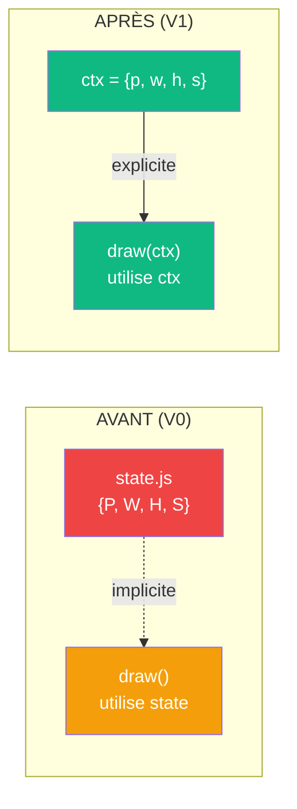
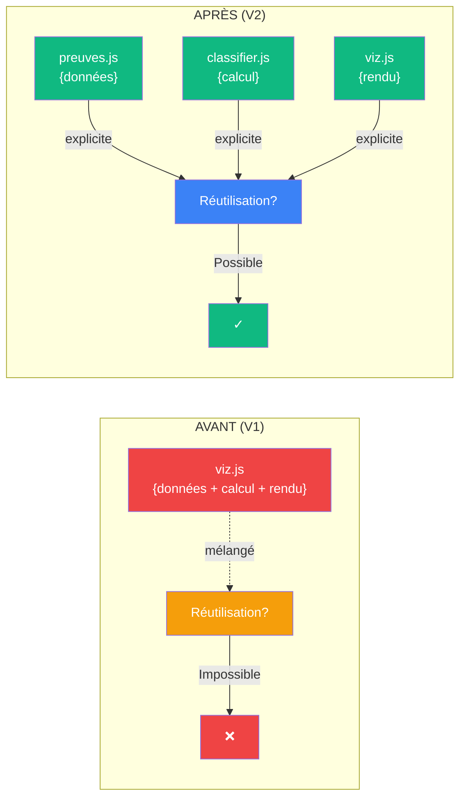
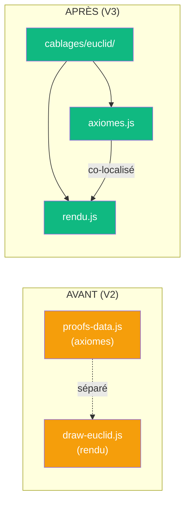
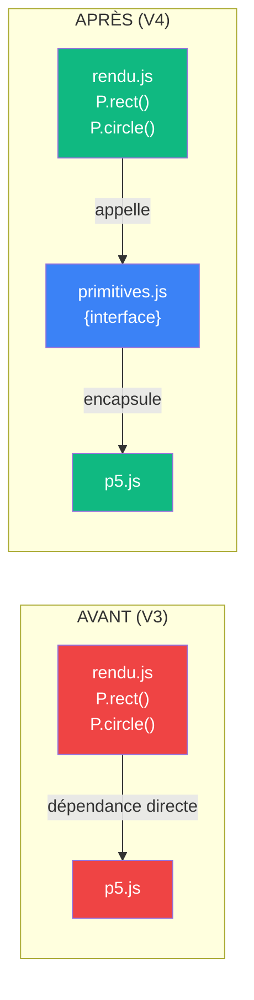
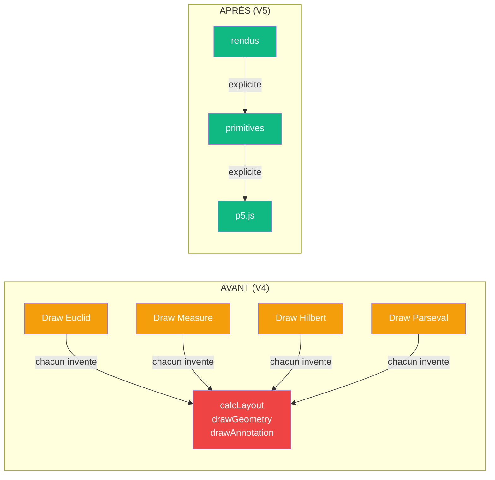
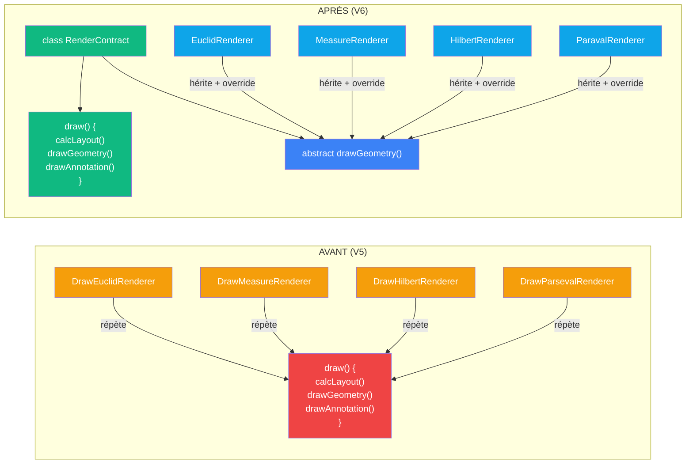
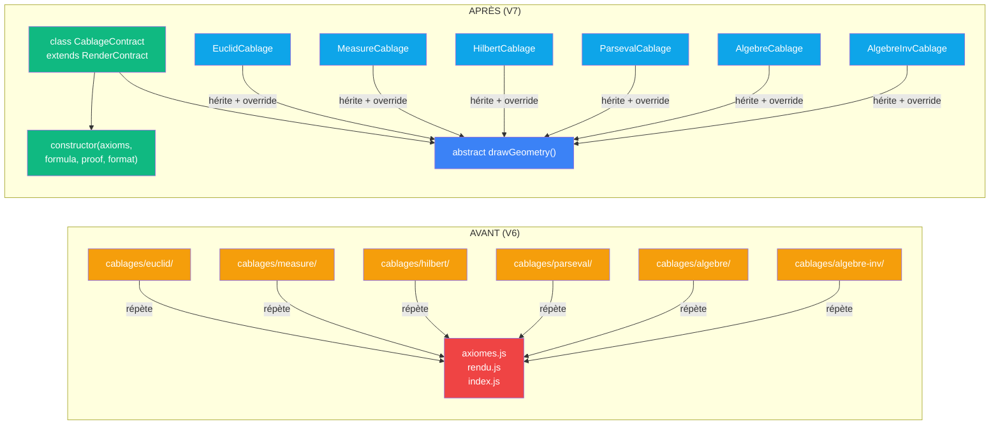

# Le mouvement des versions — rendre explicite l'implicite

> [Index des propositions](README.md)

## En une phrase

Le projet évolue en **progressivement externalisant et formalisant** ce qui est implicite, caché, dupliqué ou enchevêtré — rendant visible la structure mathématique du code.

---

## Le mouvement central

```
IMPLICITE  →  EXPLICITE
CACHÉ      →  VISIBLE
DUPLIQUÉ   →  CENTRALISÉ
ENCHEVÊTRÉ →  STRUCTURÉ
PROCÉDURAL →  DÉCLARATIF / OOP
```

Chaque version **expose un niveau de structure** que la version précédente laissait implicite.

---

## Les sept étapes du mouvement

### Étape 1 (V1) — Rendre les ports explicites

**Problème** : Les contrats sont menteurs. La signature dit `(a, b, c)` mais le code utilise `P`, `W`, `H`, `S.s` cachés dans `state.js`.

**Mouvement** : `P`, `W`, `H` deviennent des propriétés de `ctx`. `S.s` devient `ctx.s`.

**Résultat** : Les signatures expriment la vérité. Zéro port caché.

**Cablage avant/après** :



**Implicite→Explicite** :
```
state.js {P, W, H, S}  ←── IMPLICITE
              ↓
ctx = {p, w, h, s}  ←── EXPLICITE
```

---

### Étape 2 (V2) — Séparer les couches de calcul et rendu

**Problème** : `viz.js` mélange le **calcul** (poids des axiomes) et le **rendu** (dessiner les formes). Impossible de réutiliser les poids sans rendu.

**Mouvement** : Extraire `preuves.js` (données pures) et `classifier.js` (calcul) de `viz.js` (rendu seul).

**Résultat** : Trois fichiers avec responsabilités claires.

**Cablage avant/après** :



**Implicite→Explicite** :
```
viz.js {données + calcul + rendu}  ←── IMPLICITE
              ↓
preuves.js {données}
classifier.js {calcul}
viz.js {rendu seul}  ←── EXPLICITE
```

---

### Étape 3 (V3) — Co-localiser les entités logiques

**Problème** : `draw-euclid.js` est dans `js/`. Les axiomes d'Euclide sont dans `proofs-data.js`. Logiquement ensemble, physiquement séparés.

**Mouvement** : Créer `cablages/euclid/` avec axiomes + rendu co-localisés. Le **sens commun émerge de la forme répétée**.

**Résultat** : Un dossier = un cablage = axiomes + rendu + index.

**Cablage avant/après** :



**Implicite→Explicite** :
```
js/
  draw-euclid.js         ←── IMPLICITE (où sont les axiomes ?)
  proofs-data.js         ←── IMPLICITE (où est le rendu ?)
              ↓
cablages/euclid/
  axiomes.js
  rendu.js
  index.js  ←── EXPLICITE (cablage = dossier complet)
```

---

### Étape 4 (V4) — Abstraire les dépendances externes

**Problème** : Chaque rendu appelle `P.rect()`, `P.circle()`, etc. — dépendance directe à p5.js. Impossible de changer la lib graphique sans revoir tous les rendus.

**Mouvement** : Créer `primitives.js` qui encapsule p5.js. Les rendus appellent `P.rect()`, qui appelle `ctx.p.rect()`.

**Résultat** : Rendus indépendants de la lib graphique. Swap possible.

**Cablage avant/après** :



**Implicite→Explicite** :
```
rendu.js {P.rect = ctx.p.rect}  ←── IMPLICITE (p5.js partout)
              ↓
primitives.js {interface abstraite}
rendu.js {P.rect = primitives.rect()}  ←── EXPLICITE (lib swappable)
```

---

### Étape 5 (V5) — Formaliser la structure commune

**Problème** : Les 4 rendus exécutent la même séquence invisible : `calculateLayout()` → `drawGeometry()` → `drawAnnotation()`. Chacun le réinvente.

**Mouvement** : Bien définir les 3 couches (rendus ↔ primitives ↔ p5.js). Consolider les primitives.

**Résultat** : Structure explicite, prête à être formalisée.

**Cablage avant/après** :



**Implicite→Explicite** :
```
draw-euclid { calcLayout, drawGeom, drawAnnot }  ←── IMPLICITE (incontournable)
draw-measure { calcLayout, drawGeom, drawAnnot }  ←── IMPLICITE (incontournable)
... (x4 rendus)
              ↓
Chaque rendu formule son 3-couches explicitement  ←── EXPLICITE (visible)
```

---

### Étape 6 (V6) — Formaliser le pipeline en classe abstraite

**Problème** : Le pipeline `calculateLayout() → drawGeometry() → drawAnnotation()` est **un motif structurel implicite**. Changer l'ordre = refactorer 4 rendus.

**Mouvement** : Créer `RenderContract` (classe abstraite) qui **orchestre le pipeline**. Chaque rendu hérite et surcharge seulement `drawGeometry()`.

**Résultat** : Le pipeline est **une structure de code**, pas une convention.

**Cablage avant/après** :



**Implicite→Explicite** :
```
4 rendus qui répètent le même motif  ←── IMPLICITE (convention)
              ↓
class RenderContract {
  draw() {
    const layout = this.calculateLayout();
    this.drawGeometry(layout);
    this.drawAnnotation(...);
  }
  abstract drawGeometry(layout);
}
4 rendus héritent et surchargent seulement drawGeometry()  ←── EXPLICITE (OOP)
```

---

### Étape 7 (V7) — Formaliser la structure des cablages

**Problème** : Les 6 cablages (euclid, measure, hilbert, parseval, algebre, algebre-inversion) répètent la même structure : `axiomes.js` + `rendu.js` + `index.js` fusion.

**Mouvement** : Créer `CablageContract` (classe abstraite) qui hérite de `RenderContract` et orchestre axiomes + metadata + rendu.

**Résultat** : Chaque cablage devient une classe qui hérite CablageContract et surcharge seulement `drawGeometry()`.

**Cablage avant/après** :



**Implicite→Explicite** :
```
cablages/*/index.js qui fusionne axiomes+rendu  ←── IMPLICITE (convention)
              ↓
class CablageContract extends RenderContract {
  constructor(axioms, formula, proof, format);
  abstract drawGeometry();
}
Chaque cablage hérite et surcharge seulement drawGeometry()  ←── EXPLICITE (OOP)
```

---

## La logique derrière le mouvement

### En triple distinction

Chaque version **rend une dimension plus explicite** :

| Version | Dimension rendue explicite | Avant | Après |
|---------|---------------------------|--------|--------|
| **V1** | **Contrat** : ports d'entrée | Cachés en state.js | Visibles dans ctx |
| **V2** | **Sens** : séparation responsabilité | Mélangé dans viz.js | Trois fichiers distincts |
| **V3** | **Sens** : co-localisation logique | Éparpillé en fichiers | Un dossier par cablage |
| **V4** | **Cablage** : indépendance de lib | Dépendance directe p5.js | Primitives abstraites |
| **V5** | **Cablage** : structure commune | Implicite dans chaque rendu | 3 couches formalisées |
| **V6** | **Cablage** : motif de code (rendu) | Répété x4 rendus | Classe abstraite RenderContract |
| **V7** | **Cablage** : motif de code (cablage) | Répété x6 cablages | Classe abstraite CablageContract |

### Le principe : encapsulation progressive

```
Ce qui était IMPLICITE DANS LE CODE
              ↓
Devient EXPLICITE DANS LA STRUCTURE
              ↓
Devient RÉUTILISABLE ET MAINTENABLE
```

**Exemple** : Le pipeline `calcLayout → drawGeom → drawAnnot` :
- V5 : implicite dans chaque rendu (répété x4)
- V6 : explicite dans RenderContract (écrit une fois, hérité x4)

---

## Ce qui ne change JAMAIS

À travers toutes les versions, trois choses restent **invariantes** :

### 1. Le sens mathématique

```
a² + b² = c²
```

Aucune version ne change cela. Seul le **cablage du code** évolue.

### 2. Le contrat externe

```
(a, b) ∈ R₊²  →  Canvas
```

L'interface reste constante. Seule l'**organisation interne** se raffine.

### 3. L'invariant VPA

```
Sens : correct (axiomes → formes)
Contrat : de plus en plus explicite (V1 → V6)
Cablage : de plus en plus formalisé (V1 → V6)
```

Le **sens ne change jamais**. Seuls le contrat et le cablage se clarifiient.

---

## Le motif général

### 1. Identifier l'implicite

Quelque chose qui *doit se passer* mais n'est pas **formellement décrit**.

**Exemples** :
- V1 : ports doivent être passés, mais sont en global
- V3 : axiomes et rendu doivent être ensemble, mais sont séparés
- V6 : pipeline doit être exécuté, mais est répété x4

### 2. Formaliser l'implicite

Créer une structure de code qui **rend l'implicite explicite**.

**Exemples** :
- V1 : `ctx` dans la signature
- V3 : dossiers `cablages/<nom>/`
- V6 : classe `RenderContract`

### 3. Hériter / Réutiliser

La formalisation permet la **réutilisation sans répétition**.

**Exemples** :
- V1 : tous les modules reçoivent `ctx`
- V3 : tous les cablages suivent le même layout
- V6 : tous les rendus héritent du pipeline

---

## Sens du mouvement en une formule

```
STRUCTURE IMPLICITE
       ↓
FORMALISÉE EN CODE
       ↓
RÉUTILISABLE SANS RÉPÉTITION
       ↓
MATHÉMATIQUEMENT RIGOUREUX
```

Le projet tend vers un état où **chaque structure est une classe**, **chaque motif est hérité**, **chaque contrat est visible**.

C'est la limite : un code qui dit tout ce qu'il fait, sans rien d'implicite.

---

## Et après V7 ?

Si le mouvement continue, V8 pourrait :

**V8 — Contrats de visualisation d'axiomes**

**Problème** : drawAxiomTree et drawAxiomSphere répètent un motif : prendre les axiomes classifiés et les visualiser dans deux formes.

**Mouvement** : Créer `AxiomVisualizationContract` (classe abstraite) que tree et sphere héritent.

**Résultat** : Ajouter une vue d'axiomes = une classe, pas un fichier draw-tree/draw-sphere complet.

Ce mouvement **n'a pas de fin** — Gödel garantit qu'il existera toujours une structure implicite au niveau suivant.

---

## Triple distinction du mouvement lui-même

| Dimension | Contenu |
|-----------|---------|
| **Sens** | Progressivement rendre explicite la structure mathématique du code |
| **Contrat** | Version N+1 accepte ce que Version N laissait implicite |
| **Cablage** | Identifier implicite → formaliser → héritage / polymorphisme |

---

[Index des propositions →](README.md)
