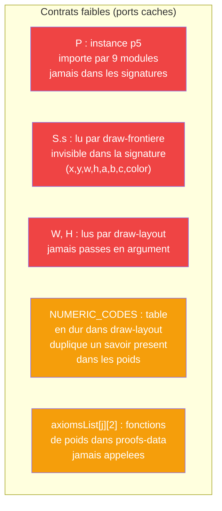
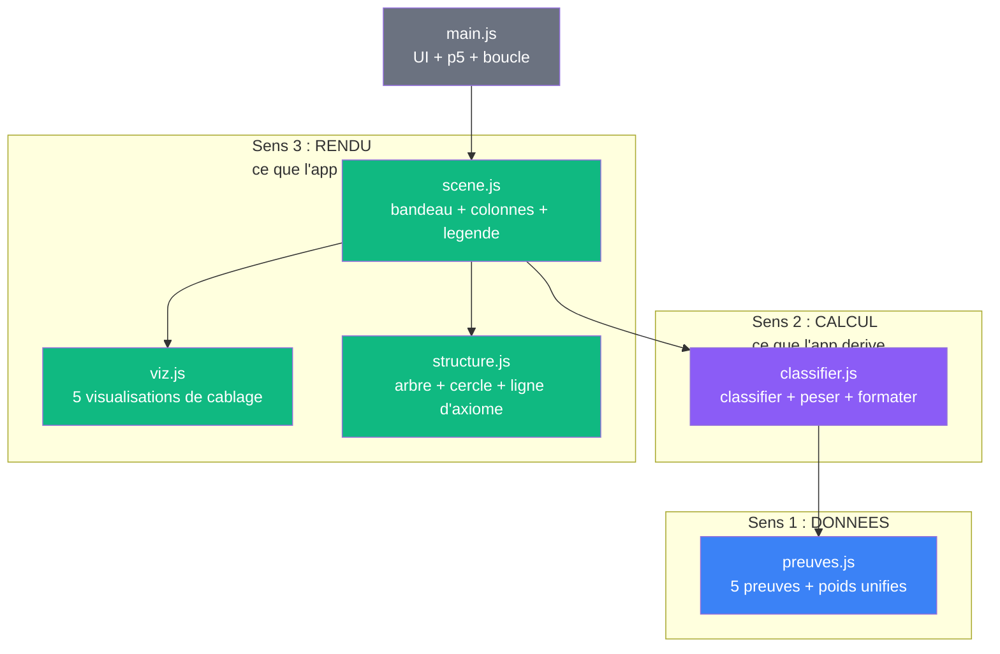
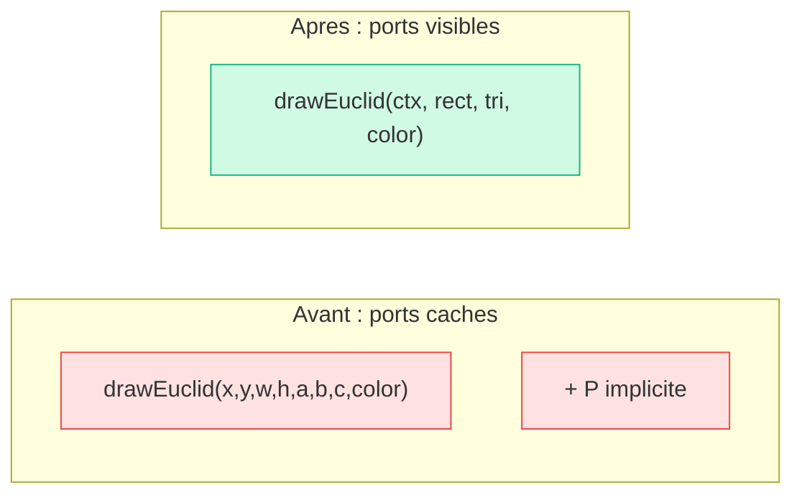
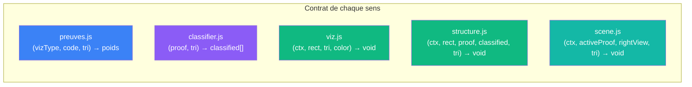
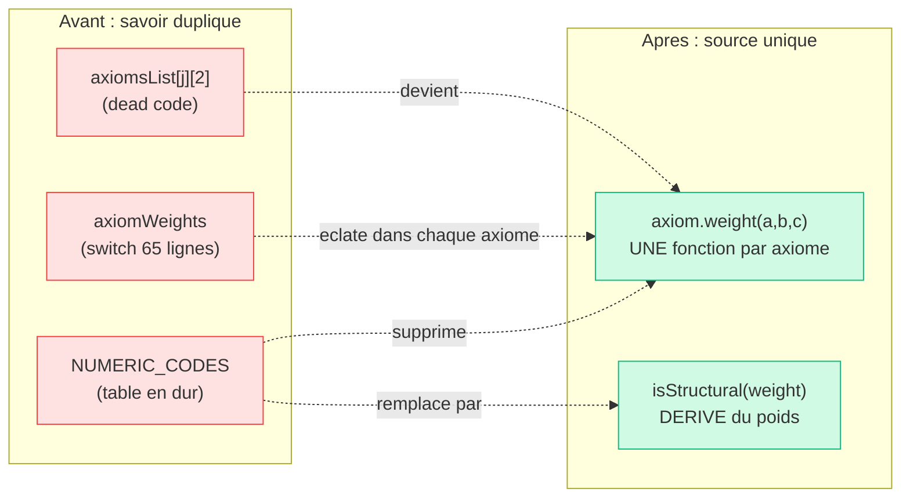
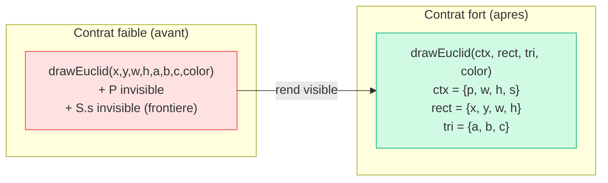

# Proposition : cablage compact a contrats forts

> Ce document propose une refonte de `app/js/` qui remplace
> 13 modules a contrats implicites par 7 modules organises par **sens**,
> avec des contrats ou chaque port est visible.

## Diagnostic de l'architecture actuelle

### Contrats faibles identifies



| Probleme | Ou | Consequence |
|----------|-----|-------------|
| `P` implicite | 9 modules importent `P` depuis state.js | le contrat ment — la signature dit `(a,b,c)` mais le corps appelle `P.rect()` |
| `S.s` port fantome | draw-frontiere lit `S.s` | la signature `(x,y,w,h,a,b,c,color)` cache un 9e parametre |
| `W, H` implicites | draw-layout lit `W, H` globaux | la scene ignore ses propres dimensions declarees |
| `NUMERIC_CODES` en dur | draw-layout l.118-124 | savoir duplique — les fonctions de poids le contiennent deja |
| Poids morts | proofs-data `axiomsList[j][2]` | fonctions jamais appelees, deuxieme systeme de poids inutile |
| draw-layout hub total | importe 10 modules | un seul fichier connait tout le systeme |

### Ce que le code actuel dit en termes VPA

En [triple distinction](../docs/vocabulaire/triple-distinction.md) :

| | Actuel |
|---|---|
| **Sens** | correct — chaque module a un role clair |
| **Contrat** | **faible** — ports caches (P, S, W, H), dead code, duplication |
| **Cablage** | **etale** — 13 fichiers, beaucoup de fils qui traversent state.js en souterrain |

---

## Architecture proposee : 7 modules, 3 sens

### Principe

Organiser par **sens** (ce que le module EST), pas par fichier de dessin.
Rendre tous les ports **visibles** dans les signatures.
Deriver ce qui peut l'etre au lieu de le coder en dur.

### Les 3 sens du code



### Inventaire des fichiers

```
app/
  pythagore.html        <- inchange
  js/
    preuves.js          <- DONNEES   (proofs-data + weights fusionnes, dead code elimine)
    classifier.js       <- CALCUL    (classification derivee des poids, plus de NUMERIC_CODES)
    viz.js              <- RENDU-viz (5 fonctions de visualisation)
    structure.js        <- RENDU-str (arbre + cercle + drawAxiomRow + drawArrow)
    scene.js            <- RENDU-scene (bandeau + drawProof + legende)
    main.js             <- BOOTSTRAP (UI bindings + boucle p5)
```

7 fichiers au lieu de 13. Pas de `state.js` — l'etat est un objet passe en argument.

---

## Contrats forts : chaque port est visible

### Le contexte de rendu : `Ctx`

Le probleme central est `P` implicite. La solution : un objet **contexte**
passe en premier argument de toute fonction de rendu.

```js
// construit dans main.js a chaque frame
const ctx = { p, w, h, s };
//            │  │  │  └─ exposant zeta (seul param global restant)
//            │  │  └──── hauteur canvas
//            │  └─────── largeur canvas
//            └────────── instance p5
```

Chaque fonction de rendu recoit `ctx` en premier argument.
Plus d'import de `P`, `S`, `W`, `H` depuis un module global.



### Le rectangle : `Rect`

Les 4 coordonnees `(x, y, w, h)` sont toujours passees ensemble.
On les regroupe dans un objet.

```js
const rect = { x, y, w, h };
```

### Le triangle : `Tri`

Les 3 valeurs `(a, b, c)` sont toujours passees ensemble.
`c` est toujours `sqrt(a² + b²)`, donc redondant — mais on le garde
pour eviter de le recalculer.

```js
const tri = { a, b, c };  // c = sqrt(a² + b²)
```

### Signatures proposees

| Module | Fonction | Signature (contrat fort) |
|--------|----------|--------------------------|
| **viz.js** | drawEuclid | `(ctx, rect, tri, color) → void` |
| | drawMeasure | `(ctx, rect, tri, color) → void` |
| | drawHilbert | `(ctx, rect, tri, color) → void` |
| | drawParseval | `(ctx, rect, tri, color) → void` |
| | drawFrontiere | `(ctx, rect, tri, color) → void` |
| **structure.js** | drawAxiomTree | `(ctx, rect, proof, classified, tri) → void` |
| | drawAxiomSphere | `(ctx, rect, proof, classified, tri) → void` |
| | drawAxiomRow | `(ctx, entry, lineY, tx, textW, color, maxR, maxNum) → void` |
| | drawArrow | `(ctx, x1, y1, x2, y2, color, lw, label?, side?) → void` |
| **classifier.js** | classify | `(proof, tri) → classified[]` |
| | applyNumerically | `(vizType, tri) → string` |
| **scene.js** | drawScene | `(ctx, activeProof, rightView, tri) → void` |
| **preuves.js** | PREUVES | `Array<Preuve>` (const) |
| | weightOf | `(vizType, code, tri) → nombre` |
| **main.js** | — | construit `ctx`, `tri`, appelle `drawScene` |

Toutes les dependances sont dans les arguments. Aucun import de globale mutable.



---

## Elimination du savoir duplique

### Poids : une seule source de verite

Actuellement il y a deux systemes de poids :
- `proofs-data.js` : `axiomsList[j][2]` = `(a,b,c) → nombre` (jamais appele)
- `weights.js` : `axiomWeights(vizType, a, b, c)` = `{ code: poids }` (seul utilise)

**Proposition** : fusionner dans `preuves.js`. Chaque axiome porte sa
propre fonction de poids. Plus de switch sur `vizType`.

```js
// preuves.js — chaque axiome porte son poids
{
  code: 'P4',
  label: 'tous les angles droits sont egaux',
  formula: '∀α ∀β  (D(α) ∧ D(β))  ⟹  α ≡ β',
  weight: (a, b, c) => 2 * a * b,   // ← SEULE source de verite
  role: 'produit les 4 triangles d\'aire ½ab'
}
```

Plus de `axiomWeights()` avec un switch de 65 lignes.
Plus de fonctions mortes dans `axiomsList[j][2]`.

### Classification : derivee, pas codee en dur

Actuellement `NUMERIC_CODES` est une table en dur dans draw-layout.
Mais le savoir est deja dans les fonctions de poids :
un axiome est **structurel** si son poids ne depend pas de `(a, b)`.

```js
// classifier.js
function isStructural(weightFn) {
  // teste avec 2 triplets differents — si le poids est le meme, c'est structurel
  const w1 = weightFn(3, 4, 5);
  const w2 = weightFn(5, 12, 13);
  return Math.abs(w1 - w2) < 0.001;
}
```

Plus de `NUMERIC_CODES`. La classification decoule du sens.



---

## Structure de `preuves.js`

```js
export const PREUVES = [
  {
    id: 'euclid',
    title: 'Preuve 1 — Geometrie euclidienne',
    color: '#3B82F6',
    formula: 'a² + b² = c²',
    axioms: [
      {
        code: 'P1',
        label: 'par 2 points distincts passe une unique droite',
        formal: '∀p₁ p₂  p₁≠p₂  ⟹  ∃!ℓ  (p₁∈ℓ ∧ p₂∈ℓ)',
        weight: () => 4,           // constant → structurel (derive)
        role: 'tracer les cotes du grand carre',
      },
      {
        code: 'P4',
        label: 'tous les angles droits sont egaux',
        formal: '∀α ∀β  (D(α) ∧ D(β))  ⟹  α ≡ β',
        weight: (a, b) => 2*a*b,   // variable → numerique (derive)
        role: 'produit les 4 triangles d\'aire ½ab',
      },
      // ...
    ],
    format: (tri) => {
      const { a, b, c } = tri;
      // retourne la string d'application numerique
      return `(${a.toFixed(1)}+${b.toFixed(1)})² = ...`;
    },
  },
  // ... 4 autres preuves
];
```

Chaque preuve est **auto-suffisante** : elle porte ses axiomes,
ses poids, son formattage. Plus de switch externe.

---

## Structure de `classifier.js`

```js
// classifier.js — derive, ne code rien en dur

export function classify(proof, tri) {
  return proof.axioms.map(ax => ({
    ax,
    code: ax.code,
    isStructural: isStructural(ax.weight),
    weight: ax.weight(tri.a, tri.b, tri.c),
  }));
}

function isStructural(weightFn) {
  const w1 = weightFn(3, 4, 5);
  const w2 = weightFn(5, 12, 13);
  return Math.abs(w1 - w2) < 0.001;
}

export function applyNumerically(proof, tri) {
  return proof.format(tri);
}
```

Deux fonctions. Pas de switch, pas de table, pas de duplication.

---

## Comparaison globale

```mermaid
graph TD
    subgraph AVANT["Avant — 13 modules, contrats faibles"]
        direction TB
        A_STATE["state.js<br/>P, S, W, H globaux"]:::red
        A_PROOFS["proofs-data.js<br/>+ fonctions mortes"]:::red
        A_WEIGHTS["weights.js<br/>switch 65 lignes"]:::red
        A_UTILS["draw-utils.js"]:::grey
        A_LAYOUT["draw-layout.js<br/>hub total, NUMERIC_CODES"]:::red
        A_E["draw-euclid"]:::grey
        A_M["draw-measure"]:::grey
        A_H["draw-hilbert"]:::grey
        A_P["draw-parseval"]:::grey
        A_F["draw-frontiere<br/>lit S.s en cache"]:::red
        A_T["draw-tree"]:::grey
        A_S["draw-sphere"]:::grey
        A_MAIN["main.js"]:::grey
    end

    subgraph APRES["Apres — 7 modules, contrats forts"]
        direction TB
        B_PREUVES["preuves.js<br/>donnees + poids unifies"]:::green
        B_CLASS["classifier.js<br/>derive du poids"]:::green
        B_VIZ["viz.js<br/>5 viz, contrat (ctx,rect,tri,color)"]:::green
        B_STRUCT["structure.js<br/>arbre+cercle+row+arrow"]:::green
        B_SCENE["scene.js<br/>orchestrateur mince"]:::green
        B_MAIN["main.js<br/>construit ctx, tri"]:::green
    end

    classDef red fill:#FEE2E2,stroke:#EF4444
    classDef green fill:#D1FAE5,stroke:#10B981
    classDef grey fill:#F3F4F6,stroke:#9CA3AF
```



| | Avant | Apres |
|---|---|---|
| Fichiers | 13 | 7 |
| Lignes (estimees) | ~1500 | ~1200 |
| Ports caches | 4 (P, S, W, H) | 0 |
| Sources de poids | 2 (une morte) | 1 |
| Tables en dur | 1 (NUMERIC_CODES) | 0 |
| Imports de state.js | 9 modules | 0 |
| Switches sur vizType | 3 (weights, applyNumerically, drawVizOf) | 1 (drawVizOf dans scene.js) |

---

## En termes VPA

| Dimension | Avant | Apres |
|-----------|-------|-------|
| **Sens** | correct mais noye dans 13 fichiers | explicite : 3 sens = donnees / calcul / rendu |
| **Contrat** | faible — P implicite, NUMERIC_CODES en dur, poids morts | fort — tous les ports dans les signatures, classification derivee |
| **Cablage** | etale — state.js irrigue tout en souterrain | compact — ctx passe de main → scene → viz/structure, pas de globale |



Le cablage du code reflète alors le cablage mathematique :
chaque visualisation recoit exactement ce dont elle a besoin,
rien de plus, rien de moins. Le contrat ne ment pas.

---

## Plan d'implementation

| Etape | Quoi | Depuis | Vers |
|-------|------|--------|------|
| 1 | Fusionner donnees + poids | proofs-data.js + weights.js | preuves.js |
| 2 | Creer classifier.js | NUMERIC_CODES de draw-layout + weightOfAxiom | classifier.js |
| 3 | Regrouper les 5 viz | draw-euclid/measure/hilbert/parseval/frontiere | viz.js |
| 4 | Regrouper structure | draw-tree + draw-sphere + draw-utils | structure.js |
| 5 | Extraire scene | draw-layout sans les imports massifs | scene.js |
| 6 | Passer ctx partout | supprimer state.js, passer (ctx, rect, tri) | tous |
| 7 | Supprimer les anciens fichiers | 13 fichiers | 7 fichiers |

Chaque etape est testable independamment : ouvrir `pythagore.html`,
verifier que les 5 onglets, les 3 vues, et les sliders fonctionnent.
