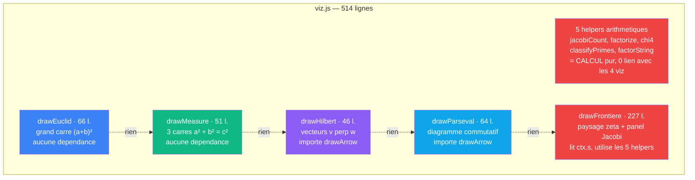
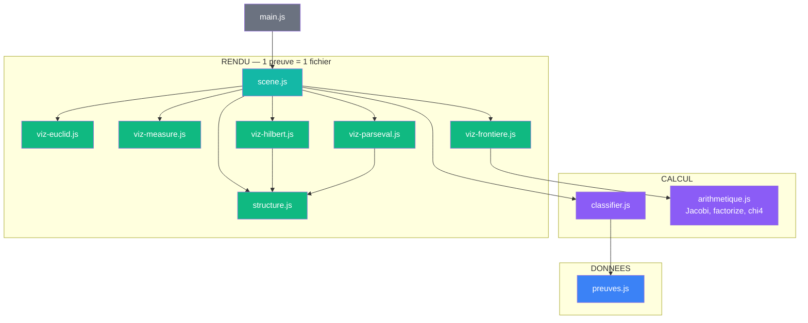
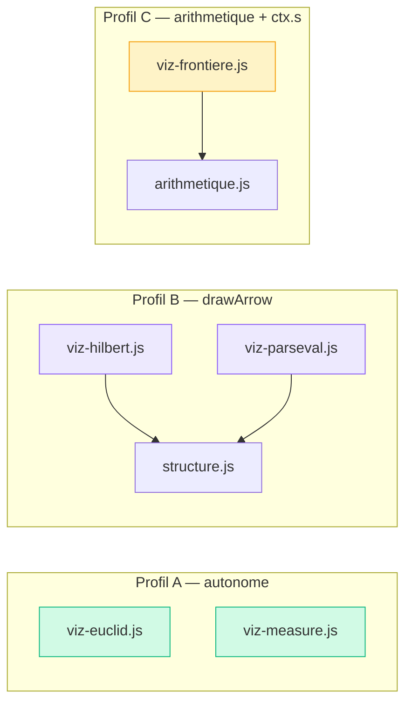

# Proposition V3 : un sens par fichier

> Ce document diagnostique les contraintes cachees dans `viz.js`
> et propose une architecture ou chaque preuve a son propre module.

## Diagnostic de viz.js

### Le probleme en une phrase

`viz.js` regroupe 5 cablages independants du meme invariant.
Ils ne partagent aucune logique interne — le fichier les colle
par role technique ("rendu"), pas par sens mathematique.

### Anatomie



Aucune fleche reelle entre les 5 fonctions. Les pointilles disent "rien" —
c'est le diagnostic : elles sont dans le meme fichier sans raison de sens.

### Contraintes identifiees

| Contrainte | Ou | Consequence |
|------------|-----|-------------|
| **Faux regroupement** | viz.js entier | 5 cablages independants colles par role technique, pas par sens |
| **Sens melange** | drawFrontiere | 80 lignes de CALCUL arithmetique dans un fichier de RENDU |
| **Contrat asymetrique** | drawFrontiere lit `ctx.s` | les 4 autres l'ignorent — le contrat partage cache un port |
| **Dependances heterogenes** | hilbert + parseval importent drawArrow | euclid + measure n'importent rien — le fichier a 3 profils de dependance differents |
| **Taille desequilibree** | frontiere 227 l. vs euclid 66 l. | ratio 3.4x entre fonctions du meme fichier |

### En termes VPA

Chaque preuve est un **cablage distinct** du meme invariant `a² + b² = c²`.
Les docs le montrent : chaque preuve a sa propre page. Mais le code les
colle dans un seul fichier, creant une fausse impression de partage.

| | viz.js actuel |
|---|---|
| **Sens** | **ecrase** — 5 sens distincts forces dans 1 fichier |
| **Contrat** | **asymetrique** — `ctx.s` fantome pour 4 fonctions sur 5, drawArrow pour 2 sur 5 |
| **Cablage** | **faux plat** — ressemble a un module uniforme, cache 3 profils de dependance |

---

## Architecture proposee

### Principe

Un cablage = un fichier. Chaque preuve porte son propre module.
Extraire le CALCUL arithmetique de frontiere dans un module dedie.

### Circuit complet



### Inventaire des fichiers

```
app/3_contraintes/
  pythagore.html            <- inchange
  js/
    preuves.js              <- DONNEES   (inchange)
    classifier.js           <- CALCUL    (inchange)
    arithmetique.js         <- CALCUL    NOUVEAU — helpers extraits de drawFrontiere
    viz-euclid.js           <- RENDU     drawEuclid(ctx, rect, tri, color)
    viz-measure.js          <- RENDU     drawMeasure(ctx, rect, tri, color)
    viz-hilbert.js          <- RENDU     drawHilbert(ctx, rect, tri, color) — importe drawArrow
    viz-parseval.js         <- RENDU     drawParseval(ctx, rect, tri, color) — importe drawArrow
    viz-frontiere.js        <- RENDU     drawFrontiere(ctx, rect, tri, color) — importe arithmetique
    structure.js            <- RENDU-str (inchange)
    scene.js                <- RENDU-sce (modifie : 5 imports au lieu de 1)
    main.js                 <- BOOTSTRAP (inchange)
```

11 fichiers. Meme nombre que V1 ? Non : V1 avait 13 fichiers avec
contrats faibles. V3 a 11 fichiers avec contrats forts et un sens
unique par fichier. Le nombre de fichiers n'est pas le probleme —
les contrats et le sens le sont.

---

## Transformations

### 1. Creer `arithmetique.js`

Extraire les 5 helpers prives de viz.js + la logique de decomposition :

```js
// arithmetique.js — CALCUL pur, aucune dependance de rendu
export function jacobiCount(N) { ... }
export function factorize(n) { ... }
export function chi4(p) { ... }
export function classifyPrimes(factors) { ... }
export function factorString(factors) { ... }
export function decompositions(cSq) {
  // retourne [[m, n]] tels que m² + n² = cSq, n >= m >= 0
}
```

Testable en isolation (node, navigateur, n'importe ou).

### 2. Eclater viz.js en 5 fichiers

Chaque fonction exportee devient un fichier :

```js
// viz-euclid.js — aucune dependance
export function drawEuclid(ctx, rect, tri, color) { ... }

// viz-measure.js — aucune dependance
export function drawMeasure(ctx, rect, tri, color) { ... }

// viz-hilbert.js — importe drawArrow
import { drawArrow } from './structure.js';
export function drawHilbert(ctx, rect, tri, color) { ... }

// viz-parseval.js — importe drawArrow
import { drawArrow } from './structure.js';
export function drawParseval(ctx, rect, tri, color) { ... }

// viz-frontiere.js — importe arithmetique
import { jacobiCount, factorize, ... } from './arithmetique.js';
export function drawFrontiere(ctx, rect, tri, color) { ... }
```

Les dependances sont maintenant visibles par fichier, pas noyees
dans un import agrege.

### 3. Modifier `scene.js`

```js
// scene.js — 5 imports explicites au lieu de 1
import { drawEuclid } from './viz-euclid.js';
import { drawMeasure } from './viz-measure.js';
import { drawHilbert } from './viz-hilbert.js';
import { drawParseval } from './viz-parseval.js';
import { drawFrontiere } from './viz-frontiere.js';
```

Le dispatch `drawVizOf` reste identique.

### 4. Supprimer `viz.js`

Plus de raison d'etre.

---

## Profils de dependance rendus visibles

Ce que viz.js cachait : les 5 fonctions ont 3 profils de dependance distincts.
L'eclatement les rend explicites.



| Profil | Fichiers | Dependances | `ctx.s` |
|--------|----------|-------------|---------|
| A — autonome | euclid, measure | aucune | non |
| B — fleche | hilbert, parseval | structure.js (drawArrow) | non |
| C — arithmetique | frontiere | arithmetique.js | **oui** |

---

## Comparaison

| | V1 | V2 | V3 |
|---|---|---|---|
| Fichiers JS | 13 | 6 | 11 |
| Plus gros fichier | 276 l. | 514 l. (viz.js) | ~160 l. (viz-frontiere) |
| Sens melange | non | 1 (viz.js) | 0 |
| Calcul dans rendu | non | oui (5 helpers) | non |
| Contrats faibles | 4 (P, S, W, H) | 0 | 0 |
| Code mort | oui | non | non |
| `ctx.s` visible | cache (S.s) | cache dans contrat partage | isole (viz-frontiere) |
| 1 preuve = 1 fichier | oui (contrats faibles) | non | oui (contrats forts) |

---

## En termes VPA

| Dimension | V2 | V3 |
|-----------|-----|-----|
| **Sens** | ecrase dans viz.js — 5 cablages dans 1 fichier | simple — 1 cablage = 1 fichier, calcul separe du rendu |
| **Contrat** | `ctx.s` cache dans le contrat partage, drawArrow invisible | `ctx.s` isole dans viz-frontiere, dependances visibles par fichier |
| **Cablage** | faux plat — 3 profils caches dans 1 module | explicite — 3 profils de dependance lisibles dans le graphe d'import |

Le cablage du code reflete le cablage mathematique :
chaque preuve est un chemin independant vers le meme invariant.
Le code le montre enfin.
