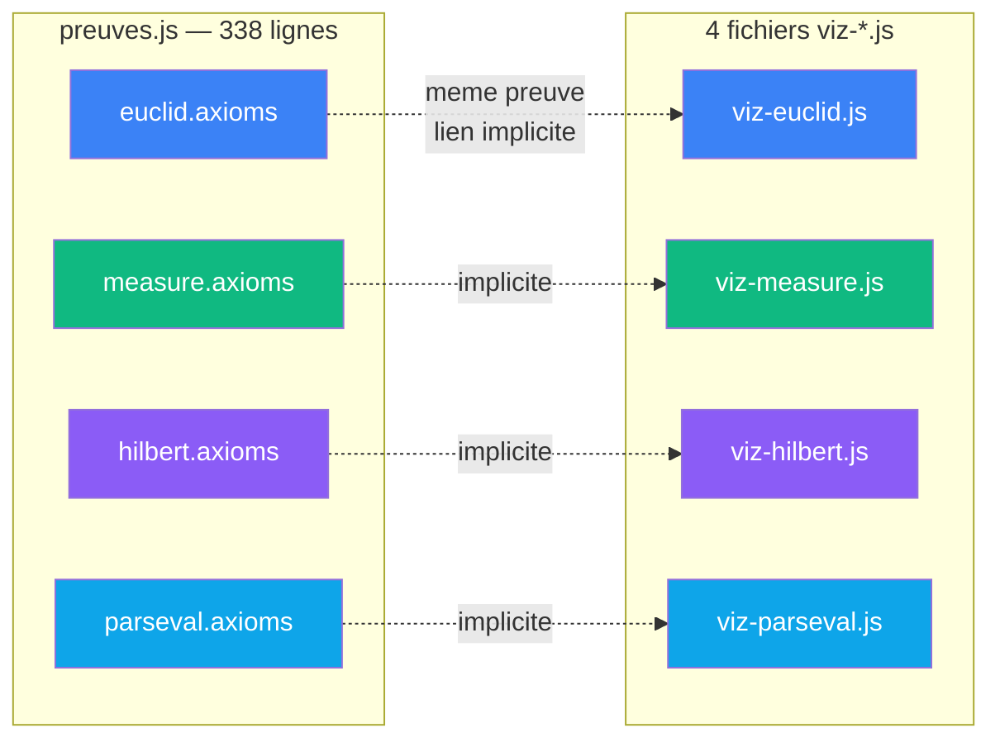
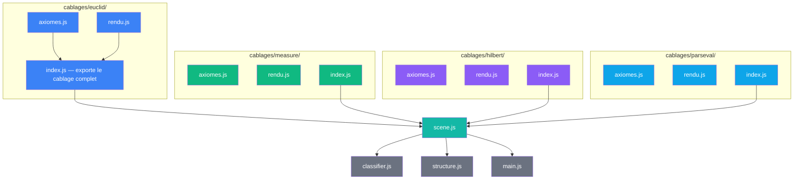
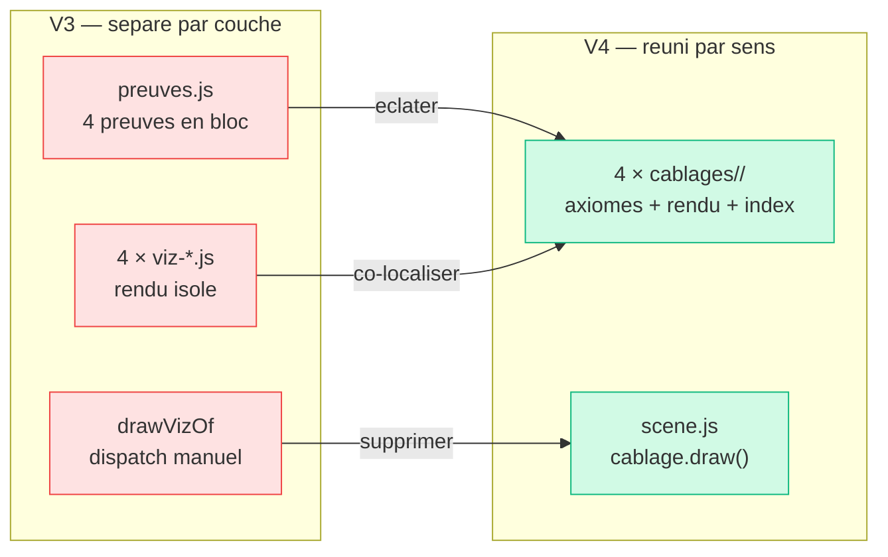

# Proposition V4 : un cablage = un dossier

> Ce document diagnostique la separation entre donnees et rendu
> dans V3 et propose une architecture ou chaque preuve co-localise
> ses axiomes et son rendu. Le sens commun emerge de la forme repetee.

## Diagnostic de V3

### Le probleme en une phrase

Les axiomes d'Euclide sont dans `preuves.js` (ligne 4) et leur rendu
dans `viz-euclid.js`. Meme preuve, deux endroits. Rien dans le code
ne dit qu'ils vont ensemble — c'est le programmeur qui le sait.

### Anatomie de la separation



Les pointilles sont le probleme : le lien entre axiomes et rendu
n'existe que dans la tete du programmeur et dans la table de dispatch
`drawVizOf` de scene.js.

### Contraintes identifiees

| Contrainte | Ou | Consequence |
|------------|-----|-------------|
| **Lien implicite** | preuves.js ↔ viz-*.js | rien dans le code ne dit que les axiomes d'Euclide et drawEuclid vont ensemble |
| **Monolithe donnees** | preuves.js | 4 preuves dans 1 fichier — modifier les axiomes d'Euclide oblige a ouvrir le fichier de toutes les preuves |
| **Dispatch manuel** | scene.js drawVizOf | table de dispatch `if (type === 'euclid') drawEuclid(...)` — cablage fait par l'orchestrateur au lieu du cablage lui-meme |
| **Sens commun invisible** | structure du projet | les 4 preuves partagent la meme forme (axiomes + poids + format + rendu) mais rien dans l'arborescence ne le montre |

### En termes VPA

| | V3 actuel |
|---|---|
| **Sens** | separe — les axiomes sont dans un fichier, le rendu dans un autre, le lien est implicite |
| **Contrat** | fort — mais le dispatch drawVizOf est un contrat d'orchestration, pas de sens |
| **Cablage** | explicite par fichier — mais la forme commune des 5 cablages est invisible |

---

## Architecture proposee

### Principe

Un cablage = un dossier. Chaque preuve co-localise ses axiomes et son
rendu dans un meme dossier. Le sens commun emerge de la forme repetee :
tous les dossiers ont la meme structure `axiomes.js` + `rendu.js` + `index.js`.

La table de dispatch disparait : chaque cablage porte sa propre
fonction `draw`, et scene.js appelle `cablage.draw(ctx, rect, tri)`.

### Circuit



### Inventaire des fichiers

```
app/4_sens/
  pythagore.html
  js/
    cablages/
      euclid/
        axiomes.js        <- axiomes, poids, format (extrait de preuves.js)
        rendu.js          <- drawEuclid (= viz-euclid.js)
        index.js          <- assemble { id, title, color, axioms, draw, ... }
      measure/
        axiomes.js
        rendu.js
        index.js
      hilbert/
        axiomes.js
        rendu.js
        index.js
      parseval/
        axiomes.js
        rendu.js
        index.js
    classifier.js         <- inchange
    structure.js          <- inchange
    scene.js              <- simplifie : importe les 4 index, plus de dispatch
    main.js               <- inchange
```

### Le sens commun emerge de la forme

Chaque dossier a exactement la meme forme :

```
cablages/<nom>/
  axiomes.js    ce que la preuve SAIT     (donnees)
  rendu.js      ce que la preuve MONTRE   (dessin)
  index.js      ce que la preuve EST      (cablage complet)
```

Cette forme repetee 4 fois EST le sens commun. On ne l'a pas code —
on l'a fait emerger par la structure du projet.

---

## Transformations

### 1. Eclater `preuves.js` en 4 `axiomes.js`

Chaque `axiomes.js` exporte les donnees d'une seule preuve :

```js
// cablages/euclid/axiomes.js
export const axioms = [
  { code: 'P1', label: '...', formal: '...', weight: (a,b,c) => 4, role: '...' },
  // ...
];
export const formula = 'a² + b² = c²';
export const proof = '(a+b)² = 4·(½ab) + c²  ⟹  a² + b² = c²';
export function format({ a, b, c }) { ... }
```

### 2. Renommer `viz-*.js` en `rendu.js`

Chaque `rendu.js` exporte une seule fonction `draw` :

```js
// cablages/euclid/rendu.js
export function draw(ctx, rect, tri, color) { ... }
```

Le nom `draw` est le meme pour les 4 — c'est le contrat commun.

### 3. Creer les 4 `index.js`

Chaque index assemble un cablage complet :

```js
// cablages/euclid/index.js
import { axioms, formula, proof, format } from './axiomes.js';
import { draw } from './rendu.js';

export default {
  id: 'euclid',
  title: 'Preuve 1 — Geometrie euclidienne',
  color: '#3B82F6',
  axioms,
  formula,
  proof,
  format,
  draw,
};
```

Le cablage sait se dessiner. Plus besoin de dispatch externe.

### 4. Simplifier `scene.js`

```js
// scene.js — plus de dispatch, plus d'import par nom
import euclid from './cablages/euclid/index.js';
import measure from './cablages/measure/index.js';
import hilbert from './cablages/hilbert/index.js';
import parseval from './cablages/parseval/index.js';

const CABLAGES = [euclid, measure, hilbert, parseval];

// dans drawProof :
cablage.draw(ctx, vizRect, tri, cablage.color);
// plus de drawVizOf, plus de switch sur proof.id
```

### 5. Supprimer `preuves.js`

Son contenu est eclate dans les 4 `axiomes.js`. Plus de monolithe donnees.

> **Note** : la meta-preuve Frontiere (convergence de zeta d'Epstein)
> reste dans V3. Son sens est trop eloigne du sens commun des 4 preuves
> classiques pour participer a la forme repetee. Elle pourra rejoindre
> V4 quand son sens sera clarifie.

---

## Comparaison



| | V2 | V3 | V4 |
|---|---|---|---|
| Organisation | par couche (donnees / calcul / rendu) | par couche + 1 preuve = 1 fichier | par sens (1 cablage = 1 dossier) |
| Lien axiomes ↔ rendu | implicite (meme `id`) | implicite (meme `id`) | **explicite** (meme dossier) |
| Dispatch viz | switch sur `proof.id` | switch sur `proof.id` | `cablage.draw()` — **pas de dispatch** |
| Modifier une preuve | 2 fichiers (preuves.js + viz-*.js) | 2 fichiers | **1 dossier** |
| Sens commun | invisible | invisible | **emerge de la forme repetee** |
| Fichiers JS | 6 | 11 | 16 (4 dossiers × 3 + 4 modules) |

---

## En termes VPA

| Dimension | V3 | V4 |
|-----------|-----|-----|
| **Sens** | separe par couche — axiomes loin de leur rendu | **reuni** — chaque cablage co-localise ce qu'il sait et ce qu'il montre |
| **Contrat** | fort mais dispatch externe (drawVizOf) | fort et **auto-porte** — le cablage porte son propre draw |
| **Cablage** | forme commune invisible | forme commune **emerge** de la structure repetee des dossiers |

Le sens commun n'est pas code dans une abstraction —
il emerge de la repetition de la meme forme :
`axiomes.js` + `rendu.js` + `index.js`, quatre fois.
Comme en mathematiques, l'invariant precede ses formalisations.
