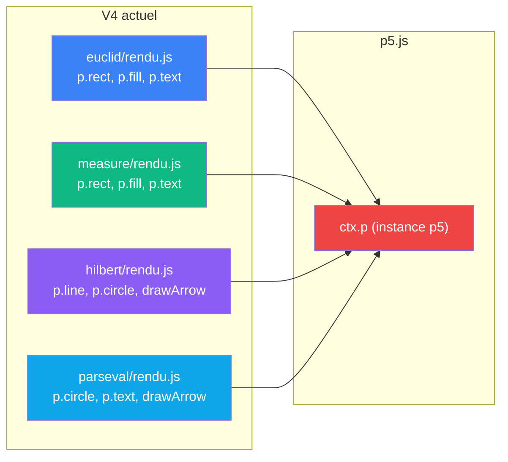
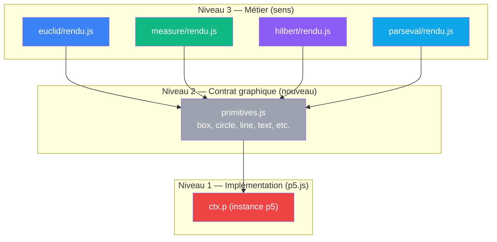
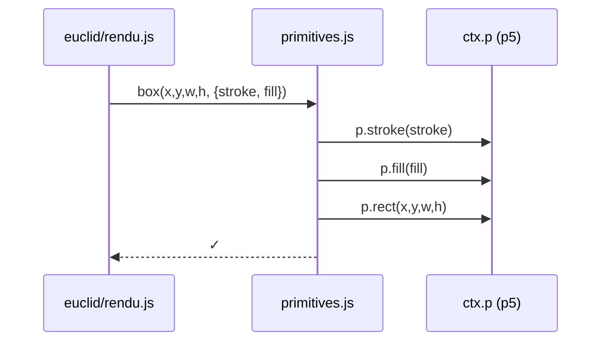
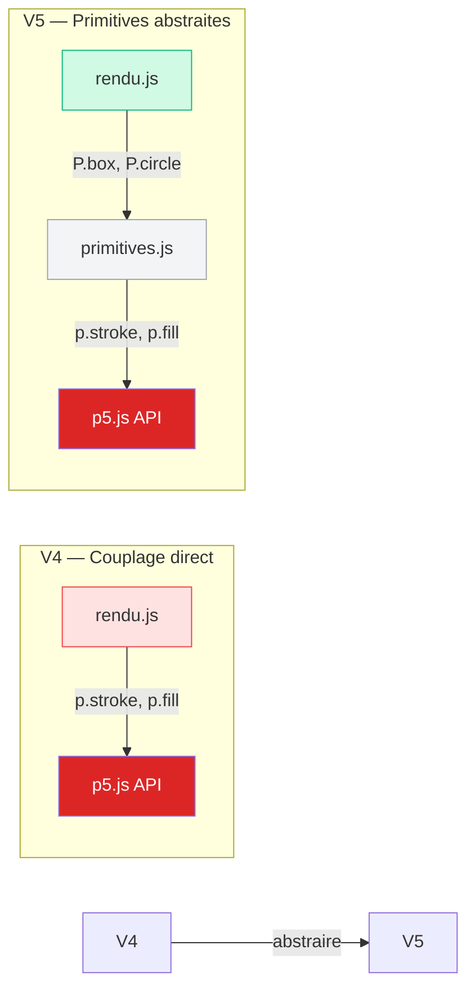

# Proposition V5 : primitives graphiques abstraites

> Ce document propose d'extraire les dépendances p5.js des blocs de rendu
> dans une couche de primitives graphiques réutilisables. Le sens reste
> dans le rendu ; l'implémentation graphique devient interchangeable.

## Diagnostic de V4

### Le problème en une phrase

Chaque `rendu.js` appelle directement `p.rect()`, `p.fill()`, `p.text()`.
p5.js est enchâssé dans le code métier du dessin. Impossible de swapper
p5.js vers Canvas/SVG sans réécrire les 4 rendus.

### Anatomie de la dépendance



Les flèches directes vers p5.js = couplage fort. Chaque rendu doit
connaître l'API p5 : `stroke()`, `fill()`, `textAlign()`, etc.

### Contraintes identifiées

| Contrainte | Où | Conséquence |
|------------|-----|-------------|
| **Couplage à p5.js** | chaque rendu.js | pas de séparation entre sens mathématique et implémentation graphique |
| **API p5 redupliquée** | 4 rendus | mêmes appels `stroke()`, `fill()`, `text()` répétés |
| **Impossible à tester** | structure.js, rendu.js | pas de mock/stub simple — obligé d'instancier p5 |
| **Swap impossible** | architecture | vouloir Canvas/SVG oblige à réécrire les 4 rendus |
| **Pas de contract visuel** | niveau graphique | pas d'interface commune pour "comment on dessine une forme" |

### En termes VPA

| | V4 actuel |
|---|---|
| **Sens** | dans le rendu (axiomes → formes géométriques) |
| **Contrat** | fort au niveau métier (cablage.draw) mais faible au niveau graphique (p5 inline) |
| **Câblage** | enchâssé — p5.js mélangé au code de dessin |

---

## Architecture proposée

### Principe

Créer une **couche de primitives graphiques** qui encapsule p5.js.
Les rendus n'appellent plus `p.rect()` mais `primitives.box()`.
L'implémentation (p5 vs Canvas vs SVG) se change dans primitives.js.

### 3 niveaux



Les rendus ne voient que le Niveau 2. p5.js reste caché au Niveau 1.

### Circuit des appels



Un seul site de modification pour toute abstraction graphique.

---

## Primitives communes identifiées

En analysant les 4 rendus, ces **13 primitives** couvrent 100% des besoins :

### Styles
```js
// Tous les rendus en ont besoin
setStroke(ctx, color, weight = 1)    // p.stroke + p.strokeWeight
setFill(ctx, color)                  // p.fill
noStroke(ctx)                        // p.noStroke
noFill(ctx)                          // p.noFill
setDashedLine(ctx, pattern)          // p.drawingContext.setLineDash
```

### Géométrie
```js
box(ctx, x, y, w, h, style)          // p.rect (+ stroke/fill optionnels)
circle(ctx, x, y, r, style)          // p.circle
line(ctx, x1, y1, x2, y2, style)     // p.line
triangle(ctx, points, style)         // p.triangle / p.beginShape
polygon(ctx, points, style)          // p.beginShape / p.vertex / p.endShape
arc(ctx, x, y, w, h, a0, a1)         // p.arc
```

### Texte
```js
text(ctx, str, x, y, style)          // p.text + p.textSize + p.textAlign
```

### Helpers (purs calculs, sans p5)
```js
tint(color, alpha)                   // color + alpha : "3B82F6" → "3B82F640"
center(w, itemW)                     // (w - itemW) / 2
```

---

## Inventaire des fichiers

```
app/4_sens/ → app/5_abstraites/
  pythagore.html                        (inchange)
  js/
    primitives.js                       ← NOUVEAU
      • Encapsule p5.js
      • Exporte box, circle, line, text, etc.
    cablages/
      euclid/
        axiomes.js                      (inchange)
        rendu.js                        ← Utilise primitives
        index.js                        (inchange)
      measure/
        axiomes.js                      (inchange)
        rendu.js                        ← Utilise primitives
        index.js                        (inchange)
      hilbert/
        axiomes.js                      (inchange)
        rendu.js                        ← Utilise primitives, importe drawArrow
        index.js                        (inchange)
      parseval/
        axiomes.js                      (inchange)
        rendu.js                        ← Utilise primitives, importe drawArrow
        index.js                        (inchange)
    classifier.js                       (inchange)
    structure.js                        (inchange)
    scene.js                            (inchange)
    main.js                             (inchange)
```

---

## Transformations

### 1. Créer `primitives.js`

```js
// js/primitives.js
'use strict';

export const Primitives = {
  // ===== Styles =====
  setStroke(ctx, color, weight = 1) {
    const p = ctx.p;
    p.stroke(color);
    p.strokeWeight(weight);
  },

  setFill(ctx, color) {
    ctx.p.fill(color);
  },

  noStroke(ctx) {
    ctx.p.noStroke();
  },

  noFill(ctx) {
    ctx.p.noFill();
  },

  // ===== Géométrie =====
  box(ctx, x, y, w, h, style = {}) {
    const p = ctx.p;
    if (style.stroke) this.setStroke(ctx, style.stroke, style.weight || 1);
    if (style.fill) this.setFill(ctx, style.fill);
    else this.noFill(ctx);
    p.rect(x, y, w, h);
  },

  circle(ctx, x, y, r, style = {}) {
    const p = ctx.p;
    if (style.stroke) this.setStroke(ctx, style.stroke, style.weight || 1);
    if (style.fill) this.setFill(ctx, style.fill);
    else this.noFill(ctx);
    p.circle(x, y, r);
  },

  line(ctx, x1, y1, x2, y2, style = {}) {
    const p = ctx.p;
    if (style.stroke) this.setStroke(ctx, style.stroke, style.weight || 1);
    p.line(x1, y1, x2, y2);
  },

  // ===== Texte =====
  text(ctx, str, x, y, style = {}) {
    const p = ctx.p;
    const size = style.size || 13;
    const color = style.color || '#000';
    const align = style.align || [p.LEFT, p.TOP];

    p.noStroke();
    p.fill(color);
    p.textSize(size);
    p.textAlign(...align);
    p.text(str, x, y);
  },

  // ===== Helpers (purs calculs) =====
  tint(color, alpha) {
    // "3B82F6" + "40" → "3B82F640"
    if (alpha.startsWith('#')) alpha = alpha.slice(1);
    return color + alpha;
  },

  center(w, itemW) {
    return (w - itemW) / 2;
  },
};
```

### 2. Mettre à jour `euclid/rendu.js`

**Avant :**
```js
export function draw(ctx, rect, tri, color) {
  const p = ctx.p;
  // ...
  p.stroke(color); p.strokeWeight(1.5);
  p.fill(color + '10');
  p.rect(cx, cy, side, side);
```

**Après :**
```js
import { Primitives as P } from '../../primitives.js';

export function draw(ctx, rect, tri, color) {
  // ... (pas de: const p = ctx.p;)
  P.box(ctx, cx, cy, side, side, {
    stroke: color,
    fill: P.tint(color, '10'),
    weight: 1.5
  });
```

Gain : **zéro accès direct à p5.js** dans le rendu.

### 3. Idem pour measure, hilbert, parseval

Tous les rendus deviennent :
```
import { Primitives as P } from '../../primitives.js';
// Appels: P.box(), P.circle(), P.line(), P.text()
// Aucun appel p.stroke(), p.fill(), etc.
```

---

## Comparaison



| | V4 | V5 |
|---|---|---|
| **Couplage p5.js** | direct dans rendus | encapsulé dans primitives.js |
| **Testabilité** | p5 obligatoire | mock de ctx.p possible |
| **Swap graphique** | réécrire 4 rendus | changer 1 fichier (primitives.js) |
| **Duplication** | `p.stroke()` répété × 4 | centralisé × 1 |
| **Contrat visuel** | implicite (API p5) | explicite (P.box, P.circle, etc.) |
| **Fichiers JS** | 16 | 17 (+primitives.js) |

---

## En termes VPA

| Dimension | V4 | V5 |
|-----------|-----|-----|
| **Sens** | dans rendu (axiomes → formes) | **inchangé** — axiomes → formes, mais... |
| **Contrat** | cablage.draw() fort ; graphique inline | cablage.draw() fort ; **graphique abstrait via Primitives** |
| **Câblage** | p5.js mélangé aux rendus | **p5.js isolé dans primitives.js** |

### Bénéfice principal

Le rendu ne sait plus qu'il y a p5.js. Il pense en termes de
**formes abstraites** : box, circle, text, etc.

Demain : changer l'implémentation graphique
(Canvas / SVG / WebGL / Excalidraw) sans toucher aux rendus.

---

## Cas d'usage futurs

Une fois V5 en place :

```js
// Basculer Canvas tout simplement
// js/primitives-canvas.js
export const Primitives = {
  box(ctx, x, y, w, h, style = {}) {
    const canvas = ctx.canvas;  // au lieu de ctx.p
    const c2d = canvas.getContext('2d');
    c2d.strokeStyle = style.stroke;
    c2d.fillStyle = style.fill;
    c2d.strokeRect(x, y, w, h);
    c2d.fillRect(x, y, w, h);
  },
  // ...
};
```

Les 4 rendus ne changent pas. `main.js` utilise juste
`import { Primitives } from './primitives-canvas.js'` au lieu de p5.

