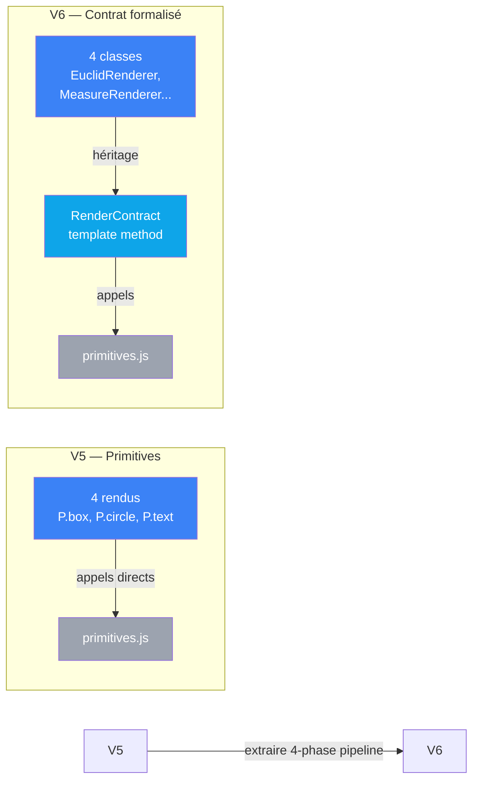

# Proposition V6 : consolidation et pipeline formalisé

> Ce document propose d'améliorer V5 en formalisant le pipeline 4-phases
> des rendus et en extraire une classe abstraite `RenderContract`.
> Cette consolidation offre une meilleure séparation entre la structure
> commune et les implémentations spécifiques.

## Diagnostic de V5

### Le problème en une phrase

V5 a isolé p5.js via primitives.js, mais les 4 rendus cachent une
**structure logique identique** (layout → géométrie → annotation)
qui reste implicite et dupliquée dans le code.

### Anatomie du sens commun

En analysant les 4 rendus de V5, on observe une **séquence invariante** :

```
1. PARSE INPUT
   const { x, y, w, h } = rect
   const { a, b, c } = tri

2. CALCULATE LAYOUT
   paddings, scale factor, centering

3. DRAW GEOMETRY
   P.box(), P.circle(), P.polygon()
   (chaque rendu sa géométrie)

4. DRAW ANNOTATION
   P.text(formule) au bas
```

Cette **4-phase pipeline** est identique pour les 4 rendus.
Seule la phase 3 diffère (géométrie euclidienne vs mesure vs vecteurs vs diagramme).

### Contraintes identifiées

| Contrainte | Où | Conséquence |
|------------|-----|-------------|
| **Pipeline implicite** | dans chaque rendu.js | impossible de voir qu'il y a une structure commune |
| **Layout dupliqué** | 4 rendus calculent indépendamment paddings et scale | duplication du calcul, difficile à modifier globalement |
| **Pas de polymorphisme** | rendus = fonctions procédurales | impossible de spécialiser que la géométrie |
| **Pas de hooks** | structure figée | ajouter une phase → refactorer 4 rendus |

### En termes VPA

| | V5 actuel |
|---|---|
| **Sens** | dans le rendu (axiomes → formes géométriques) |
| **Contrat** | 3 couches (rendus ↔ primitives ↔ p5.js) mais pipeline implicite |
| **Câblage** | p5.js isolé, mais structure des rendus dupliquée |

---

## Architecture proposée

### Principe

Extraire la **4-phase pipeline** dans une classe abstraite `RenderContract`.
Les 4 rendus héritent de cette classe et surchargeant uniquement :
- `getPadding()`, `getVerticalPadding()`, `calculateScale()` — customisation du layout
- `drawGeometry(layout)` — la géométrie spécifique

### Couches

```
Niveau 4 — Métier (sens)
   ↓ héritage
RenderContract (orchestration)
   ↓ appels
Primitives (Niveau 2 — Contrat graphique)
   ↓ appels
p5.js (Niveau 1 — Implémentation)
```

### Circuit des appels

```
draw(ctx, rect, tri, color)
  → calculateLayout()        [template method]
      → getVerticalPadding() [hook surchargeable]
      → calculateScale()     [hook surchargeable]
  → drawGeometry(layout)     [abstract, à implémenter]
  → drawAnnotation(layout)   [template method]
      → P.text(...)
```

Un seul site de modification pour la structure globale.

---

## Primitives de RenderContract

### Méthodes communes (template method pattern)

```js
draw(ctx, rect, tri, color) {
  const layout = this.calculateLayout(rect, tri);
  this.drawGeometry(ctx, layout, tri, color);
  this.drawAnnotation(ctx, layout, tri, color);
}

calculateLayout(rect, tri) {
  const { x, y, w, h } = rect;
  const padH = this.getPadding();
  const availW = w - padH * 2;
  const availH = h - this.getVerticalPadding();
  const sc = this.calculateScale(availW, availH, tri);
  const cx = x + w / 2;
  const cy = y + h / 2;
  return { x, y, w, h, padH, availW, availH, sc, cx, cy };
}

drawAnnotation(ctx, layout, tri, color) {
  // Identique pour tous : formule au bas
  const { x, y, h } = layout;
  const formula = this.getFormula(tri);
  P.text(ctx, formula, x + w/2, y + h - 18, {
    size: 13, color
  });
}
```

### Méthodes abstraites (à surcharger)

```js
abstract drawGeometry(ctx, layout, tri, color) {
  // chaque rendu implémente sa géométrie
}

getPadding() { return 24; }  // peut être surchargé
getVerticalPadding() { return 20; }
calculateScale(availW, availH, tri) {
  // logique standard, peut être surchargée
}
getFormula(tri) {
  // retourne la formule (défaut: a² + b² = c²)
}
```

---

## Transformations

### 1. Créer `render-contract.js`

```js
// js/render-contract.js
'use strict';

import { Primitives as P } from './primitives.js';

export class RenderContract {
  draw(ctx, rect, tri, color) {
    const layout = this.calculateLayout(rect, tri);
    this.drawGeometry(ctx, layout, tri, color);
    this.drawAnnotation(ctx, layout, tri, color);
  }

  calculateLayout(rect, tri) {
    const { x, y, w, h } = rect;
    const padH = this.getPadding();
    const availW = w - padH * 2;
    const availH = h - this.getVerticalPadding();
    const sc = this.calculateScale(availW, availH, tri);
    const cx = x + w / 2;
    const cy = y + h / 2;
    return { x, y, w, h, padH, availW, availH, sc, cx, cy };
  }

  drawGeometry(ctx, layout, tri, color) {
    throw new Error('drawGeometry must be implemented');
  }

  drawAnnotation(ctx, layout, tri, color) {
    const { x, y, h, w } = layout;
    const formula = this.getFormula(tri);
    P.text(ctx, formula, x + w/2, y + h - 18, {
      size: 13, color
    });
  }

  getPadding() { return 24; }
  getVerticalPadding() { return 20; }

  calculateScale(availW, availH, tri) {
    const { a, b, c } = tri;
    return Math.min(availW, availH) / (a + b + c);
  }

  getFormula(tri) {
    return "a² + b² = c²";
  }
}
```

### 2. Transformer `euclid/rendu.js`

**Avant :**
```js
export function draw(ctx, rect, tri, color) {
  const { x, y, w, h } = rect;
  const { a, b, c } = tri;
  // ... calcul layout local
  const padH = 24;
  const availW = w - padH * 2;
  // ... etc
  P.box(ctx, cx, cy, side, side, { stroke: color, fill: ... });
  // ...
  P.text(ctx, "a² + b² = c²", x + w/2, y + h - 18, {...});
}
```

**Après :**
```js
import { RenderContract } from '../../render-contract.js';
import { Primitives as P } from '../../primitives.js';

export class EuclidRenderer extends RenderContract {
  drawGeometry(ctx, layout, tri, color) {
    const { a, b, c } = tri;
    const { cx, cy, sc } = layout;
    // Juste la géométrie euclidienne
    const side = (a + b) * sc;
    P.box(ctx, cx - side/2, cy - side/2, side, side, {
      stroke: color,
      fill: P.tint(color, '10')
    });
    // ...
  }
}
```

Gain : **zéro duplication de structure** ; seule la géométrie.

### 3. Idem pour measure, hilbert, parseval

Tous les rendus deviennent :
```js
export class MeasureRenderer extends RenderContract {
  drawGeometry(ctx, layout, tri, color) {
    // Implémentation géométrie Mesure uniquement
  }
}
```

---

## Comparaison V5 → V6



| | V5 | V6 |
|---|---|---|
| **Couplage p5.js** | encapsulé dans primitives.js | inchangé |
| **Structure commune** | implicite (code dupliqué) | **explicite (RenderContract)** |
| **Polymorphisme** | non | **oui (héritage + abstract methods)** |
| **Testabilité** | testable avec mock ctx.p | **meilleure (RenderContract injectable)** |
| **Layout dupliqué** | 4 fois | **centralisé** |
| **Fichiers JS** | 17 | **18** (+render-contract.js) |

---

## En termes VPA

| Dimension | V5 | V6 |
|-----------|-----|-----|
| **Sens** | dans le rendu (axiomes → formes) | **inchangé** — axiomes → formes |
| **Contrat** | 3 couches (rendus ↔ primitives ↔ p5.js) | **4 couches** : rendus → RenderContract → primitives → p5.js |
| **Câblage** | 4 rendus procéduraux | **4 classes héritant de RenderContract** |

### Bénéfice principal

La 4-phase pipeline devient un objet de première classe : la classe `RenderContract`.
Elle encapsule l'orchestration, permet des hooks pour customisation,
et rend explicite le sens commun des 4 rendus.

Ajouter une phase commune → ajouter 1 méthode dans RenderContract (auto-héritée par les 4).

---

## Cas d'usage futurs

Une fois V6 en place, il devient facile de :

1. **Ajouter un 5ème rendu** — créer `class CustomRenderer extends RenderContract` et implémenter `drawGeometry()`
2. **Modifier le layout globalement** — changer 1 méthode dans RenderContract
3. **Tester les rendus isolément** — mocker `RenderContract.prototype.calculateLayout()`
4. **Extraire un contrat CablageContract** (V7) — observer que les 4 classes `EuclidRenderer`, etc. partagent une structure identique

