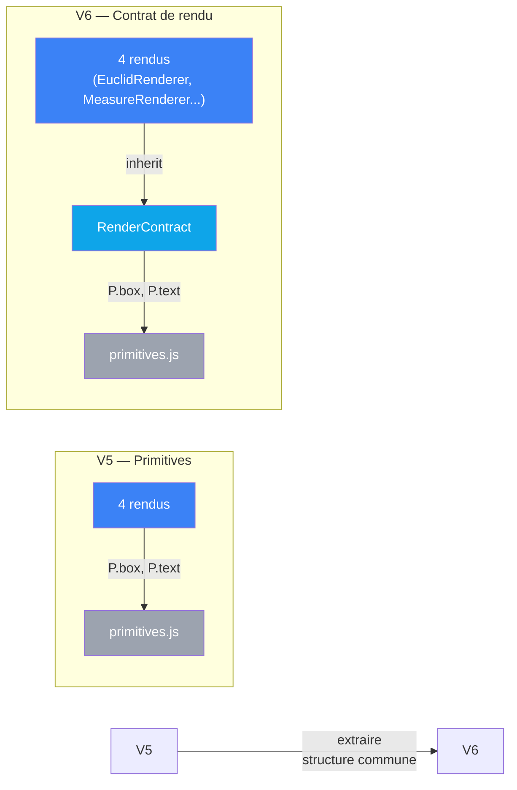

# Proposition V6 : contrat de rendu émergent

> Ce document propose d'analyser le sens commun des 4 rendus
> pour en faire émerger un contrat explicite. Les 4 câblages
> partagent une structure visuelle identique — on la rend explicite.

## Diagnostic de V5

### Le problème en une phrase

Les 4 rendus ne redupliquent plus p5.js (grâce à primitives.js),
mais ils dupliquent une **structure logique identique** :
calcul de layout → dessin géométrique → annotations.
Cette structure est implicite dans chaque rendu.

### Anatomie du sens commun

En analysant les 4 rendus, on observe une **séquence invariante** :

```
┌─────────────────────────────────────────┐
│ 1. PARSE INPUT                          │
│    const { x, y, w, h } = rect          │
│    const { a, b, c } = tri              │
└─────────────────────────────────────────┘
         ↓
┌─────────────────────────────────────────┐
│ 2. CALCULATE LAYOUT                     │
│    padH, padTop, padBot = constantes    │
│    availW = w - padH * 2                │
│    sc = Math.min(...) / ...  (scale)    │
│    cx, cy = centering                   │
└─────────────────────────────────────────┘
         ↓
┌─────────────────────────────────────────┐
│ 3. DRAW GEOMETRY                        │
│    P.box(), P.circle(), P.polygon()     │
│    avec color + teintes                 │
│    (chaque câblage a sa géométrie)      │
└─────────────────────────────────────────┘
         ↓
┌─────────────────────────────────────────┐
│ 4. DRAW ANNOTATION                      │
│    P.text(formula, x, y + h - offset)   │
│    toujours au bas (y + h - Y)          │
│    avec la formule du câblage           │
└─────────────────────────────────────────┘
```

Cette **4-phase pipeline** est identique pour les 4 rendus.
Seule la **phase 3** diffère (géométrie euclidienne vs mesure vs vecteurs vs diagramme).

### Patterns identifiés

#### Pattern 1 : Layout spatial

Tous les rendus font :
```js
const padH = 24;           // ou 32
const availW = w - padH * 2;
const availH = h - 20;
const sc = Math.min(availW, availH) / (a + b + c);  // ou autre dénominateur
const centerX = x + w / 2;
const centerY = y + h / 2;
```

**Invariant** : chaque rendu calcule un `scale factor` (sc) et un `center point` (cx, cy).

#### Pattern 2 : Géométrie colorée

Tous les rendus utilisent :
```js
P.box(ctx, ..., { stroke: color, fill: P.tint(color, '10') })
P.circle(ctx, ..., { stroke: color, fill: P.tint(color, '40') })
```

**Invariant** : `color` + teintes (`'10'`, `'40'`, `'50'`, `'60'`) → toujours une palette cohérente.

#### Pattern 3 : Annotation au bas

Tous les rendus terminent par :
```js
P.text(ctx, formule, x + w / 2, y + h - 18, { size: 13, color })
```

**Invariant** : texte centré horizontalement, toujours vers le bas (y + h - constant).

#### Pattern 4 : Accessibilité de `ctx.p`

Tous les rendus utilisent `ctx.p` ou indirectement pour certaines opérations.
Hilbert et Parseval importent `drawArrow(ctx, ...)`.

**Invariant** : `ctx` contient `p` (p5) et les primitives l'isolent.

---

## Architecture proposée

### Principe

Créer une **classe `RenderContract`** qui encapsule les 4 phases et
rend explicite ce qui est commun vs. ce qui est spécifique à chaque câblage.

### 3 niveaux

```
┌────────────────────────────────────────────┐
│ Niveau 3 — Métier (Sens du câblage)       │
│ ┌──────────────────────────────────────┐  │
│ │ euclid/rendu.js                      │  │
│ │ - structure: { padH, sc, cx, cy }    │  │
│ │ - geometry: drawSquares()            │  │
│ │ (polymorphe sur RenderContract)      │  │
│ └──────────────────────────────────────┘  │
└────────────────────────────────────────────┘
         ↓
┌────────────────────────────────────────────┐
│ Niveau 2 — Contrat (RenderContract)       │
│ ┌──────────────────────────────────────┐  │
│ │ RenderContract                       │  │
│ │ - layout() → { sc, cx, cy, ... }    │  │
│ │ - geometry() → (implémentation)      │  │
│ │ - annotate(formula) → void           │  │
│ └──────────────────────────────────────┘  │
└────────────────────────────────────────────┘
         ↓
┌────────────────────────────────────────────┐
│ Niveau 1 — Primitives (Implémentation)    │
│ ┌──────────────────────────────────────┐  │
│ │ primitives.js                        │  │
│ │ P.box(), P.circle(), P.text(), ...   │  │
│ └──────────────────────────────────────┘  │
└────────────────────────────────────────────┘
```

### Pseudo-code

```js
// js/render-contract.js
export class RenderContract {
  constructor(ctx, rect, tri, color) {
    this.ctx = ctx;
    this.rect = rect;
    this.tri = tri;
    this.color = color;
  }

  // Phase 1 : Parse (déjà fait par constructeur)

  // Phase 2 : Layout (extracted)
  calculateLayout() {
    const { x, y, w, h } = this.rect;
    const { a, b, c } = this.tri;

    const padH = this.getPadding();
    const availW = w - padH * 2;
    const availH = h - this.getVerticalPadding();

    const sc = this.calculateScale(availW, availH);
    const cx = x + Primitives.center(w, ...);
    const cy = y + availH / 2;

    return { padH, availW, availH, sc, cx, cy };
  }

  // À surcharger par chaque câblage
  getPadding() { return 24; }
  getVerticalPadding() { return 40; }
  calculateScale(availW, availH) { /* ... */ }

  // Phase 3 : Geometry (polymorphe)
  abstract drawGeometry(layout) {
    // Euclide : drawSquares(layout)
    // Mesure : drawBars(layout)
    // Hilbert : drawVectors(layout)
    // Parseval : drawDiagram(layout)
  }

  // Phase 4 : Annotation (commune)
  drawAnnotation(formula, layout) {
    const { x, y, w, h } = this.rect;
    Primitives.text(ctx, formula, x + w / 2, y + h - 18, {
      size: 13,
      color: this.color,
      align: [ctx.p.CENTER, ctx.p.BOTTOM]
    });
  }

  // Orchestration (template method pattern)
  draw() {
    const layout = this.calculateLayout();
    this.drawGeometry(layout);
    this.drawAnnotation(this.tri.formula, layout);
  }
}

// js/cablages/euclid/rendu.js
import { RenderContract } from '../../render-contract.js';

class EuclidRenderer extends RenderContract {
  getPadding() { return 24; }
  calculateScale(availW, availH) {
    return Math.min(availW, availH) / (this.tri.a + this.tri.b);
  }

  drawGeometry(layout) {
    // Logique spécifique Euclide
    const { sc, cx, cy } = layout;
    const { a, b, c } = this.tri;
    // ...
  }
}

export function draw(ctx, rect, tri, color) {
  const renderer = new EuclidRenderer(ctx, rect, tri, color);
  renderer.draw();
}
```

### Bénéfices

| Aspect | V5 | V6 |
|--------|-----|-----|
| **Structure visible** | implicite (code) | **explicite** (RenderContract classe) |
| **Réutilisabilité** | copie-colle layout | **hérité** (calculateLayout) |
| **Extension** | ajouter phase → refactorer 4 rendus | **1 endroit** (RenderContract) |
| **Testabilité** | P.text(...) éparpillé | **annotate()** isolé et testable |
| **Documentation** | lire 4 fichiers | **lire la classe** |

---

## Sens commun émergent

En implémentant V6, on rend visible une **vérité mathématique** :

> **Les 4 preuves sont 4 façons différentes d'exprimer la même transformation**
> `(a, b) → c`. Visuellement, elles suivent la même orchestration :
> **calculer le contexte spatial, exposer la géométrie, annoter l'invariant**.

La classe `RenderContract` IS cette vérité rendue explicite dans le code.

---

## Comparaison V5 vs V6



| | V5 | V6 |
|---|---|---|
| **Dépendances rendus** | tous → primitives.js | tous → RenderContract → primitives.js |
| **Modèle** | procédural | **orienté objet** (héritage) |
| **Sens commun** | implicite | **explicite** (classe) |
| **Modules testables** | 9 | **13** (+4 rendus comme classes) |
| **Fichiers** | 17 | **18** (+render-contract.js) |

---

## Cas d'usage V6

### Ajouter une phase

V5 : modifier 4 rendus + calculateLayout
V6 : ajouter 1 méthode dans RenderContract

```js
// Exemple : ajouter une légende colorée
class RenderContract {
  drawColorLegend(layout) {
    // Code une fois pour tous
  }

  draw() {
    const layout = this.calculateLayout();
    this.drawGeometry(layout);
    this.drawColorLegend(layout);    // ← Automatiquement pour tous
    this.drawAnnotation(...);
  }
}
```

### Ajouter un rendu pour une 5ème preuve

V5 : copier 1 rendu complet
V6 : créer 1 classe qui hérite de RenderContract

```js
class FrontierRenderer extends RenderContract {
  getPadding() { return 16; }
  calculateScale(availW, availH) { /* ... */ }
  drawGeometry(layout) { /* ... */ }
}
```

---

## Analyse VPA

| Dimension | V5 | V6 |
|-----------|-----|-----|
| **Sens** | axiomes → formes (implicite) | axiomes → formes **via contrat explicite** |
| **Contrat** | 3 couches (rendus ↔ primitives ↔ p5) | **4 couches** (rendus → contrat → primitives → p5) |
| **Câblage** | p5.js encapsulé | **structure de rendu encapsulée** |

### Le saut conceptuel

V5 sépare **implémentation graphique** (p5.js) de **sémantique** (axiomes).

V6 sépare en plus la **structure de rendu** (layout → geometry → annotation)
de la **spécificité du câblage** (quelle géométrie dessiner).

**Résultat** : on fait émerger que les 4 preuves ne diffèrent QUE par
la géométrie centrale — tout le reste (layout, annotation, orchestration)
est identique et partagé.

---

## Fichiers à créer / modifier

```
app/6_contrats/
  js/
    render-contract.js                ← NOUVEAU (classe abstraite)
    primitives.js                     (copie V5)
    cablages/
      euclid/
        rendu.js                      ← Refactoriser en classe
      measure/
        rendu.js                      ← Refactoriser en classe
      hilbert/
        rendu.js                      ← Refactoriser en classe
      parseval/
        rendu.js                      ← Refactoriser en classe
      (axiomes.js, index.js inchangés)
    (classifier, structure, scene, main inchangés)
```

