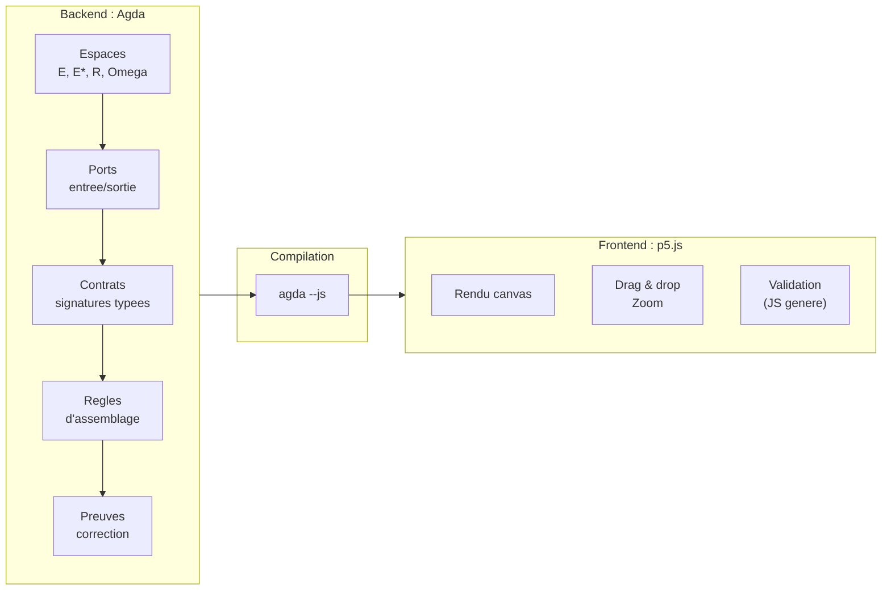
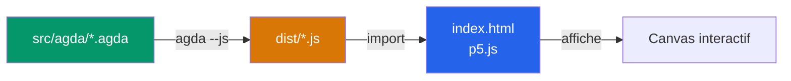

# Architecture

> [Retour au sommaire](../README.md)

## Sommaire

- [Vue d'ensemble](#vue-densemble)
- [Backend : Agda](#backend--agda)
- [Frontend : p5.js](#frontend--p5js)
- [Pipeline de build](#pipeline-de-build)

---

## Vue d'ensemble



---

## Backend : Agda

Agda est le coeur du projet. Tout le modele formel est ecrit en Agda.

**Pourquoi Agda :**
- Les contrats des [objets mathematiques](objets.md) **sont** des types dependants
- L'incompatibilite `E != E*` est un refus de typage, pas un check runtime
- Une preuve qui compile est une preuve correcte -- pas de tests a ecrire
- Le JS genere peut etre appele depuis le frontend pour evaluer / verifier

**Ce qu'Agda gere :**
- Definition des [espaces](objets.md#espaces-et-incompatibilites) (`E`, `E*`, `R`, `Omega`)
- Types des ports (entree/sortie, espace associe)
- [Contrats](concepts.md#triple-distinction) des objets (signature typee)
- Regles d'assemblage (unification de ports)
- Preuves d'incompatibilite et de correction

---

## Frontend : p5.js

- **p5.js** -- rendu canvas, interactions visuelles (drag & drop, zoom)
- Consomme le JS genere par Agda pour la logique de validation
- Aucune logique metier dans le frontend : il affiche et transmet
- Les [trois vues](concepts.md#trois-vues) sont pilotees par le frontend

---

## Pipeline de build



```
src/agda/*.agda  --agda --js-->  dist/*.js  <--import--  index.html
```
