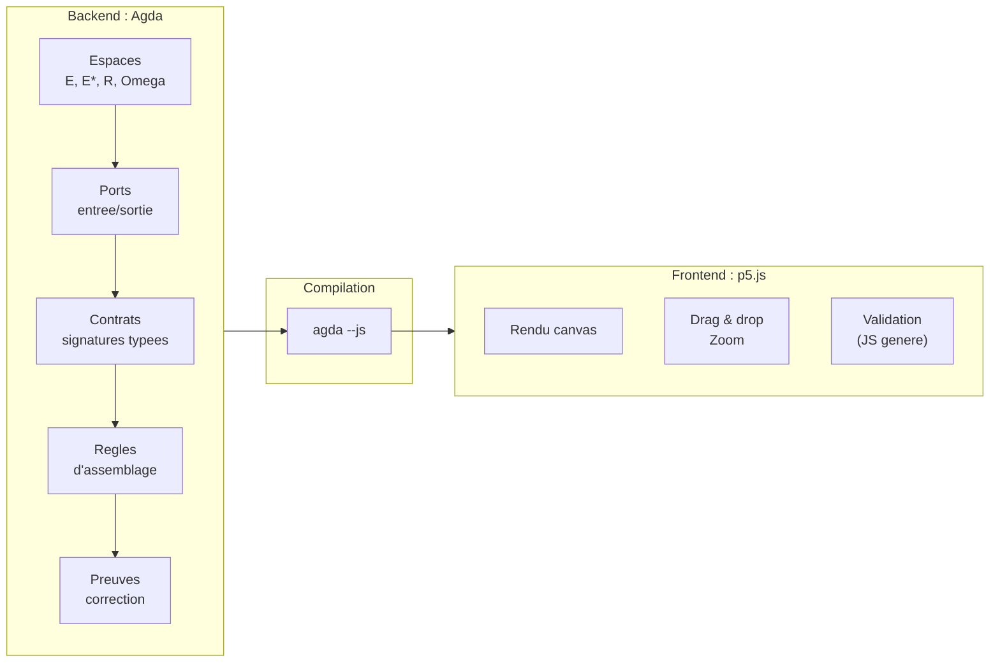
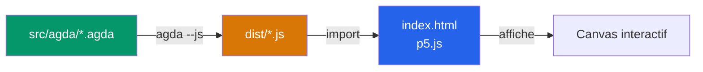

# Architecture

> [Retour au sommaire](../README.md)

## Sommaire

- [Vue d'ensemble](#vue-densemble)
- [Backend : Agda](#backend--agda)
- [Frontend : p5.js](#frontend--p5js)
- [Pipeline de build](#pipeline-de-build)

---

## Vue d'ensemble



---

## Backend : Agda

Agda est le coeur du projet. Tout le modele formel est ecrit en Agda.

**Pourquoi Agda :**
- Les contrats des [objets mathematiques](sens/) **sont** des types dependants
- L'incompatibilite `E != E*` est un refus de typage, pas un check runtime
- Une preuve qui compile est une preuve correcte -- pas de tests a ecrire
- Le JS genere peut etre appele depuis le frontend pour evaluer / verifier

**Ce qu'Agda gere :**
- Definition des [espaces](sens/espaces.md) (`E`, `E*`, `R`, `Omega`)
- Types des ports (entree/sortie, espace associe)
- [Contrats](vocabulaire/triple-distinction.md) des objets (signature typee)
- Regles d'assemblage (unification de ports)
- Preuves d'incompatibilite et de correction

**Organisation :**

| Couche | Role | Exemples |
|--------|------|----------|
| **[Sens](sens/)** | blocs atomiques, un seul contrat chacun | aligner, observer, ponderer, attirer, deplacer, concentrer |
| **[Cablages](cablages/)** | circuits qui assemblent plusieurs sens | [projeter](cablages/projeter.md), [ecouter](cablages/ecouter.md), [concentration](cablages/concentration.md) |
| **[Meta-objets](meta-objets/)** | operent sur les objets eux-memes | [Godel](meta-objets/README.md), [currying](meta-objets/currying.md) |
| **[Espaces](sens/espaces.md)** | espaces et regles de typage | `E`, `E*`, `R`, `Omega` |

Un cablage ne definit rien de nouveau — il montre comment les sens se connectent.

---

## Frontend : p5.js

- **p5.js** -- rendu canvas, interactions visuelles (drag & drop, zoom)
- Consomme le JS genere par Agda pour la logique de validation
- Aucune logique metier dans le frontend : il affiche et transmet
- Les [trois vues](vocabulaire/trois-vues.md) sont pilotees par le frontend

---

## Pipeline de build



```
src/agda/*.agda  --agda --js-->  dist/*.js  <--import--  index.html
```
