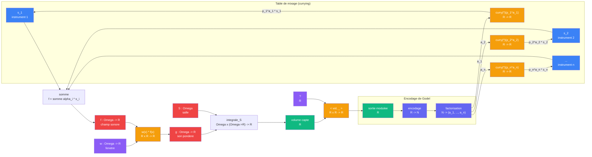

# Exemple : ecouter

> [Retour aux cablages](README.md) | [Concentration](concentration.md) | [Godel](../meta-objets/)

## Le probleme

Un micro est pose dans une salle de concert. Plusieurs instruments jouent en meme temps. Qu'entend le micro ?

Ca depend de deux choses :
1. Sa **sensibilite spatiale** -- une fenetre `w : Omega -> R` qui pese chaque point de la salle
2. Le **poids de chaque instrument** -- un coefficient `alpha_i` qui amplifie ou attenue la source `s_i`

Quand la fenetre retrecit, le micro **zoome** (concentration). Quand les poids changent, le micro **mixe** (table de mixage). Le circuit complet connecte les deux, et la boucle qui relie la sortie aux poids passe par les nombres premiers de [Godel](../meta-objets/encodage.md).

## Circuit complet



## Role de chaque bloc

| Etape | Bloc | Contrat | Sens |
|-------|------|---------|------|
| 1 | Sources sonores | `s_i : Omega -> R` | chaque instrument emet un champ sonore |
| 2 | Superposition | `(Omega -> R)^n -> (Omega -> R)` | les sons ponderes se melangent : `f = somme alpha_i * s_i` |
| 3 | Fenetre | `w : Omega -> R` | zone de sensibilite du micro |
| 4 | [Produit lineaire](../sens/ponderer.md) | `R x R -> R` | ponderation spatiale : `w(x) * f(x)` en chaque point |
| 5 | [Integration](projeter.md) sur `Omega` | `Omega x (Omega -> R) -> R` | somme ponderee sur la salle = volume capte |
| 6 | [Produit lineaire](../sens/ponderer.md) currie | `R -> (R -> R)` | `<vol, _>` : modulateur parametre par le volume capte |
| 7 | Encodage + factorisation | `R -> N -> (a_1, ..., a_n)` | la sortie devient un nombre de Godel, decompose en exposants |
| 8 | Table de mixage curriee | `curry(*)(p_i^{a_i}) : R -> R` par instrument | chaque exposant produit un amplificateur qui repondere une source |

---

## Phase 1 -- Concentration : la fenetre qui retrecit

La fenetre `w` est le levier de [concentration](../sens/concentrer.md). Quand `epsilon` retrecit, le micro zoome du global au local — voir la [fiche concentrer](../sens/concentrer.md) pour la construction et la limite delta de Dirac.

---

## Phase 2 -- Modulation : `<volume capte, .>`

Le circuit ne s'arrete pas au volume capte. Le scalaire `vol : R` devient la premiere entree d'un nouveau [produit lineaire](../sens/ponderer.md). Via [currying](../meta-objets/currying.md), fixer `vol` produit un **modulateur** :

```
<vol, _> : R -> R
```

Le slot `?` est ouvert -- on peut y brancher n'importe quelle grandeur de type `R` :

| Slot `?` | Sens de la sortie |
|----------|------------------|
| `1` | pas de modulation, on recupere `vol` tel quel |
| `1/d^2` | attenuation par la distance (comme dans [projeter](projeter.md)) |
| volume d'un **autre** micro | correlation entre deux positions |
| encodage du circuit lui-meme | le circuit se regarde -- c'est [Godel](../meta-objets/) |

Le dernier cas est le saut de niveau :

- Niveau 0 : `f(x) -> integrale -> vol` (le micro calcule)
- Niveau 1 : `circuit -> G` (Godel encode le micro)
- Croisement : `<vol, G>` -- le resultat du circuit rencontre la description du circuit

C'est la structure qui mene a l'auto-reference dans [Godel](../meta-objets/README.md) : un circuit dont une entree est son propre encodage.

---

## Phase 3 -- Retour par les premiers : currying de la table de mixage

La sortie modulee reboucle vers les sources. Le mecanisme passe par la [suite des nombres premiers](../meta-objets/encodage.md) et le [currying](../meta-objets/currying.md).

### Etape 1 : encodage et factorisation

La sortie `R` est encodee comme un nombre `N`, puis factorisee :

```
N = p_1^{a_1} * p_2^{a_2} * ... * p_n^{a_n}
```

Chaque exposant `a_i` correspond a un instrument. La factorisation est unique (theoreme fondamental de l'arithmetique), donc le decodage est sans perte.

### Etape 2 : currying du produit lineaire

Par [currying du produit lineaire](../sens/ponderer.md#currying-du-produit-lineaire), on fixe `p_i^{a_i}` comme premiere entree. Chaque `curry(*)(p_i^{a_i})` est un **amplificateur** `R -> R` qui multiplie un signal par `p_i^{a_i}`.

| Instrument | Amplificateur currie | Effet |
|------------|---------------------|-------|
| `s_1` (violon) | `curry(*)(2^{a_1}) = (2^{a_1} * _)` | monte ou baisse le violon |
| `s_2` (piano) | `curry(*)(3^{a_2}) = (3^{a_2} * _)` | monte ou baisse le piano |
| `s_n` (flute) | `curry(*)(p_n^{a_n}) = (p_n^{a_n} * _)` | monte ou baisse la flute |

### Etape 3 : application aux sources

Chaque amplificateur est branche sur sa source. Le champ sonore repondère devient :

```
f(x) = somme_i  curry(*)(p_i^{a_i})(s_i(x))
     = somme_i  p_i^{a_i} * s_i(x)
```

### Le meme bloc, deux sens differents

Sans currying, le retour serait un bloc opaque `N -> (Omega -> R)`. Avec currying, on voit que c'est **n produits lineaires partiellement appliques** -- le meme bloc qu'a l'etape 4, reutilise avec un sens different :

| Ou dans le circuit | Produit lineaire | Entree fixee | Sens |
|-------------------|-----------------|-------------|------|
| Etape 4 (ponderation) | `w(x) * f(x)` | fenetre `w(x)` | sensibilite spatiale du micro |
| Etape 6 (modulation) | `vol * ?` | volume capte `vol` | modulateur de la sortie |
| Etape 8 (mixage) | `p_i^{a_i} * s_i(x)` | poids premier `p_i^{a_i}` | volume de l'instrument `i` |

Le **meme contrat** `R x R -> R` apparait trois fois dans le circuit, currie differemment a chaque fois. C'est la [triple distinction](../vocabulaire/triple-distinction.md) en action : meme contrat, trois sens, trois cablages.

---

## La boucle complete

Le circuit forme une boucle :

```
sources  -->  superposition  -->  fenetre  -->  integration  -->  volume
   ^                                                                |
   |                                                            modulation
   |                                                                |
   +----  table de mixage  <----  factorisation  <----  encodage  <-+
              (currying)              (Godel)
```

A chaque tour :
1. Les sources emettent, ponderees par les amplificateurs curries `(p_i^{a_i} * _)`
2. La fenetre concentre (du global au local)
3. L'integration produit un volume
4. Le modulateur `<vol, ?>` transforme le volume
5. L'encodage de Godel produit un nombre `N`
6. La factorisation de `N` donne les exposants `(a_1, ..., a_n)`
7. Le currying transforme chaque exposant en amplificateur `curry(*)(p_i^{a_i})`
8. Les amplificateurs reponderent les sources -- retour a l'etape 1

### Le double role des nombres premiers

| Role | Ce qu'ils font |
|------|---------------|
| [Encodage de Godel](../meta-objets/encodage.md) | identifient chaque instrument dans le nombre `N` (meta-niveau) |
| Poids curries | `curry(*)(p_i^{a_i})` amplifie l'instrument `i` (niveau 0) |

Le passage entre les deux niveaux est exactement le currying : `p_i^{a_i}` passe de "nombre qui encode" (fait arithmetique) a "premiere entree fixee d'un produit lineaire" (acte physique). Modifier les exposants `a_i` = modifier l'encodage = modifier les amplificateurs = modifier ce que le micro entend = modifier la sortie = modifier l'encodage. C'est la **boucle auto-referente**.

---

## Triple distinction du circuit

| Dimension | Le micro qui zoome |
|-----------|--------------------|
| **Sens** | volume sonore capte par le micro, du global au local, avec retour auto-referent sur les sources |
| **Contrat** | `(Omega -> R)^n x (Omega -> R) -> R`, boucle via `R -> N -> R^n` |
| **Cablage** | superposition + produit lineaire (ponderation) + integration + modulation + encodage Godel + factorisation + currying (table de mixage) |

### Objets reutilises

| Objet | Combien de fois | Roles dans ce circuit |
|-------|----------------|----------------------|
| [Produit lineaire](../sens/ponderer.md) `R x R -> R` | 3 | ponderation spatiale, modulation, amplificateur currie |
| [Produit de dualite](../sens/observer.md) `E* x E -> R` | 1 | limite de la concentration (`delta_{x_0}`) |
| [Currying](../meta-objets/currying.md) | 2 | `<vol, _>` (modulation) et `(p_i^{a_i} * _)` (mixage) |
| [Encodage de Godel](../meta-objets/encodage.md) | 1 | `R -> N`, pont entre niveau 0 et meta-niveau |
