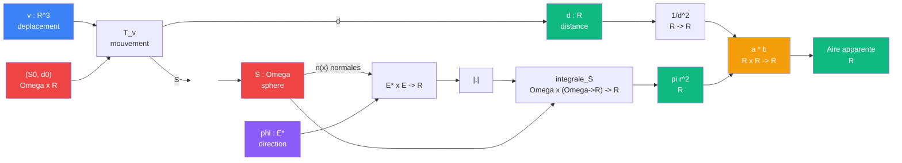

# Exemple : projeter => reduire ?

> [Retour aux cablages](README.md)

## Le probleme

On projette une sphere dans une direction `phi` pour obtenir son **ombre**. L'ombre n'est pas binaire : en chaque point `x` de la sphere, `|<phi|n(x)>|` donne l'**intensite** (0 = profil, 1 = face). L'integration somme ces intensites pour donner l'**aire**. Le produit lineaire avec `1/d^2` donne l'**intensite a distance**.

## Circuit complet

## Role de chaque bloc

| Etape | Bloc | Contrat | Sens dans ce contexte |
|-------|------|---------|----------------------|
| 0 | [Mouvement sphere](../sens/deplacer.md) | `R^3 x (Omega x R) -> (Omega x R)` | deplace la sphere, produit `S` et `d` |
| 1 | [Produit de dualite](../sens/observer.md) | `E* x E -> R` | intensite locale en `x` |
| 2 | Valeur absolue | `R -> R` | compte les deux faces |
| 3 | Integration sur `Omega` | `Omega x (Omega->R) -> R` | somme des intensites = aire |
| 4 | Inverse carre | `R -> R` | `d -> 1/d^2` |
| 5 | [Produit lineaire](../sens/ponderer.md) | `R x R -> R` | attenuation par la distance |

## Intensite locale vs aire totale

- **Intensite locale** : `|<phi|n(x)>|` en un point `x`. Vaut 0 quand la normale est perpendiculaire a `phi` (profil), 1 quand elle est alignee (face).
- **Aire totale** : `integrale_S |<phi|n(x)>| dx = pi r^2`. L'integration somme toutes les intensites locales sur la sphere.

L'integration ne "compte pas les points visibles" : elle **pese chaque point par son intensite**. C'est la difference entre une ombre nette (binaire) et une ombre avec penombre (continue).

## Effet de la distance

Sans `d`, l'aire est `pi r^2` (projection orthographique). Avec `d`, l'aire apparente est `pi r^2 / d^2` (projection perspective).

Le [ponderer](../sens/ponderer.md) est le bloc qui connecte la geometrie (`integrale`) a l'optique (`1/d^2`). Via [currying](../sens/ponderer.md#currying-du-produit-lineaire), fixer `1/d^2` produit un attenuateur `(1/d^2) * _` qui pondere n'importe quelle aire.

## Triple distinction du circuit

| Dimension | Projection de la sphere |
|-----------|--------------------------|
| **Sens** | taille apparente depuis `d` |
| **Contrat** | `Omega x E* x R -> R` |
| **Cablage** | produit de dualite + valeur absolue + integration + inverse carre + produit lineaire |
