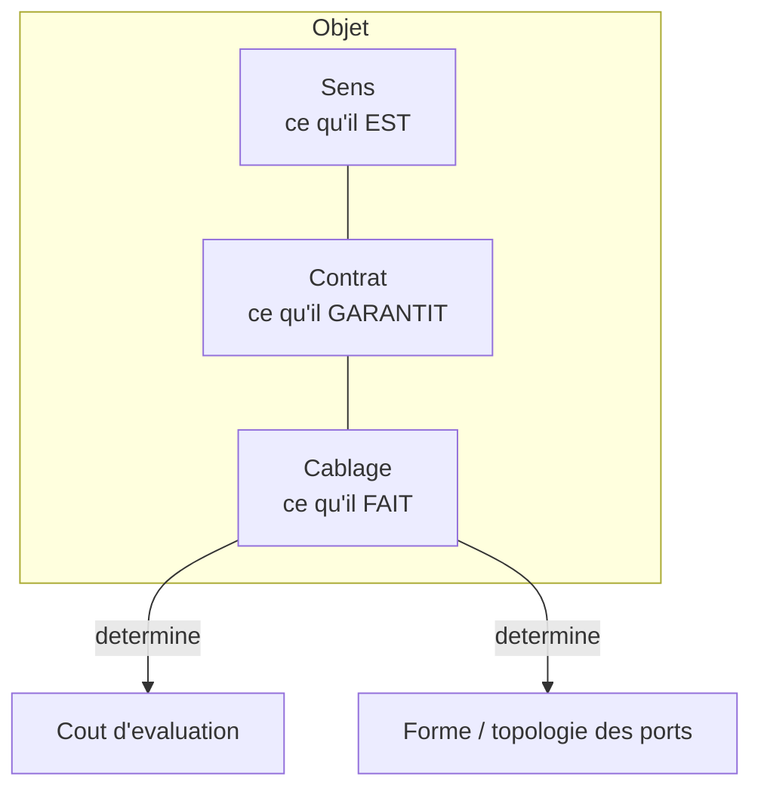
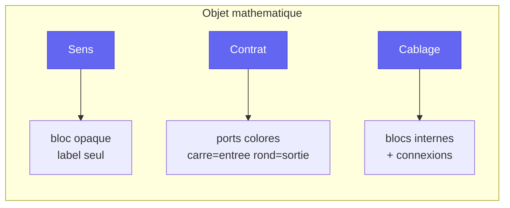
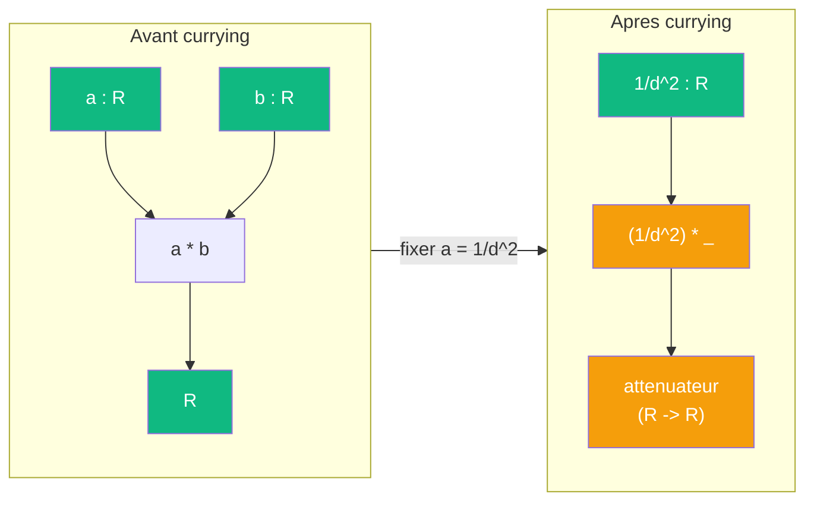
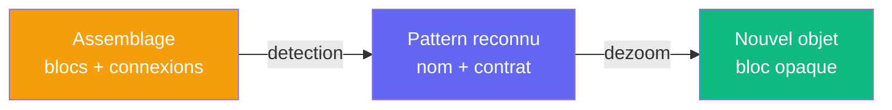

# Concepts

> [Retour au sommaire](../README.md) | [Architecture](architecture.md) | [Objets mathematiques](objets.md)

## Sommaire

- [Triple distinction](#triple-distinction)
- [Trois vues](#trois-vues)
- [Currying](#currying)
- [Reconnaissance de patterns](#reconnaissance-de-patterns)

---

## Triple distinction

Chaque [objet mathematique](objets.md) a trois dimensions :

| Dimension | Nature |
|-----------|--------|
| Ce qu'il **EST** | son sens |
| Ce qu'il **GARANTIT** | ses contrats |
| Ce qu'il **FAIT** | son cablage interne |

Le cablage interne determine simultanement le **cout** d'evaluation et la **forme** (topologie des ports).

Modifier un cablage modifie l'objet, pas la structure.

### Application : le circuit de la sphere

| Dimension | Circuit de la [sphere](objets.md#exemple--ombre-et-intensite-dune-sphere) |
|-----------|---------------------------------------------------------------------------|
| **Sens** | ombre et intensite de la sphere |
| **Contrat** | `Omega x E* x R -> R` |
| **Cablage** | produit de dualite + valeur absolue + integration + inverse carre + produit lineaire |

Le sens dit **quoi** (l'ombre), le contrat dit **quels types** entrent et sortent, le cablage dit **comment** les blocs sont connectes.

---

## Trois vues

Chaque objet propose **trois boutons** accessibles en permanence :

Pas de navigation sequentielle : les trois vues coexistent, l'utilisateur choisit librement.

### Application : le circuit de la sphere

| Vue | Ce qu'on voit |
|-----|---------------|
| **Sens** | un bloc "ombre de la sphere" |
| **Contrat** | trois ports d'entree (`Omega`, `E*`, `R`) et un port de sortie (`R`) |
| **Cablage** | les cinq blocs internes et leurs connexions |

---

## Currying

Une entree peut devenir une sortie par reecriture :

Dans la [projection de la sphere](objets.md#exemple--ombre-et-intensite-dune-sphere), fixer `a = 1/d^2` dans le [produit lineaire](objets.md#produit-lineaire) produit un attenuateur `(1/d^2) * _` qui pondere n'importe quelle aire par la distance.

Changer le cablage change le **cout** ET la **topologie** des ports.

---

## Reconnaissance de patterns

Quand l'utilisateur assemble des objets, le systeme peut **reconnaitre** des structures mathematiques connues dans l'assemblage. C'est l'operation inverse du dezoom : au lieu de cacher la complexite, on la **nomme**.

### Exemple : contraction dans la sphere

Dans la [projection de la sphere](objets.md#exemple--ombre-et-intensite-dune-sphere), la sphere fournit ses normales `n(x)` au produit de dualite et son domaine a l'integration. Ce partage revele une **contraction tensorielle** : la variable `n(x)` est produite et consommee par le meme objet (la sphere).

| Signal | Pattern | Dans la sphere |
|--------|---------|----------------|
| Port partage entre deux blocs | Contraction tensorielle | `n(x)` entre dualite et integration |
| Variable fixee | Fonctionnelle | `phi` fixe donne `Omega -> R` |

En [Agda](architecture.md#backend--agda), un pattern est un **type** : reconnaitre un pattern, c'est construire un terme de ce type a partir de l'assemblage. Si la construction type-checke, le pattern est valide. Phase [P3](roadmap.md#phases) de la feuille de route.
