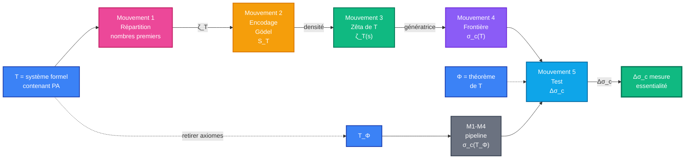

# Expérience 1 — Cablage des mouvements

> [Retour à l'expérience](README.md) | [Triple distinction](../../vocabulaire/triple-distinction.md)

## Sens

La décompression de la phrase "solidité via zêta arithmétique" s'articule autour d'un **circuit de 5 mouvements** qui transforment progressivement une intuition philosophique en diagnostic mathématique rigoureux.

Chaque mouvement **prend ce que le précédent produit** et l'élève d'un niveau : des nombres premiers à la densité, de la densité à l'encodage, de l'encodage à la fonction génératrice, etc.

## Contrat

```
(T, Φ) ∈ (Système formel, Théorème)  →  Δσ_c ∈ ℝ  (mesure de solidité)
```

**Entrée** : Un système formel T et un théorème Φ qu'on veut tester

**Sortie** : Une valeur Δσ_c quantifiant l'essentialité informationnelle de Φ dans T

## Circuit



## Rôle de chaque mouvement

| Mouvement | Entrée | Sortie | Rôle | Sens |
|-----------|--------|--------|------|------|
| **M1** | T (système formel) | ζ_T paramétrée | Transformer la notion classique de distribution | Les nombres premiers sont des objets pour coder T |
| **M2** | ζ_T + comprendre T | S_T ⊂ ℕ | Encoder les formules valides de T comme entiers | Gödel numérote, on numérote la richesse |
| **M3** | S_T (ensemble d'entiers) | ζ_T(s) (série) | Construire une fonction génératrice de la densité | La densité des entiers révèle la richesse de T |
| **M4** | ζ_T(s) | σ_c(T) (scalaire) | Mesurer où la série cesse d'être dense | L'abscisse de convergence est le seuil structurel |
| **M5** | σ_c(T) + σ_c(T_Φ) | Δσ_c | Comparer avant/après retrait du théorème | La chute mesure l'essentialité de Φ |

## Axiomes mobilisés

| Code | Rôle | Type |
|------|------|------|
| **G1** | Encodage de Gödel (existence et unicité) | structurel |
| **G2** | Densité des formules gödeliennes dans ℕ | structurel |
| **Z1** | Zêta de Riemann classique (référence) | analytique |
| **Z2** | Existence d'une zêta généalisée ζ_T(s) | analytique |
| **C1** | Abscisse de convergence (propriété analytique) | analytique |
| **D1** | Perturbation = retrait d'axiomes de Φ | différentiel |
| **D2** | Δσ_c mesure la contribution structurelle | différentiel |

## Topologie des ports

### Entrées

| Port | Type | Sens |
|------|------|------|
| **T** | Système formel | Structure à analyser |
| **Φ** | Théorème de T | Composant à tester |

### Sorties

| Port | Type | Sens |
|------|------|------|
| **Δσ_c** | ℝ (scalaire) | Mesure d'essentialité |

### Ports intermédiaires (M1 → M2 → M3 → M4)

| Port | Fournisseur | Consommateur | Type |
|------|-------------|--------------|------|
| **ζ_T(s)** | M1 | M2, M3 | Fonction génératrice |
| **S_T** | M2 | M3 | Ensemble d'entiers |
| **Densité(S_T)** | M3 | M4 | Propriété analytique |
| **σ_c(T)** | M4 | M5 | Abscisse de convergence |

## Triple distinction

| Dimension | Contenu |
|-----------|---------|
| **Sens** | Décomposer l'intuition "essentialité = densité arithmétique" en 5 étapes qui élèvent progressivement le niveau d'abstraction |
| **Contrat** | (T, Φ) → Δσ_c : entrées système + théorème, sortie scalaire mesurant l'impact structurel |
| **Cablage** | Nombres premiers → Gödel → zêta → abscisse de convergence → test différentiel |

## Flots d'information

### Flux principal (M1 → M2 → M3 → M4 → M5)

```
T  ────→  M1 (paramétriser ζ)
            ↓
         M2 (Gödel → S_T)
            ↓
         M3 (S_T → ζ_T(s))
            ↓
         M4 (ζ_T → σ_c(T))
            ↓
         M5 (σ_c(T) vs σ_c(T_Φ) → Δσ_c)
            ↓
         Δσ_c (résultat)
```

### Flux de perturbation (comparaison avant/après)

```
T  ──→  σ_c(T)        ┐
                       ├→  Δσ_c = σ_c(T) - σ_c(T_Φ)
T_Φ ──→  σ_c(T_Φ)     ┘
```

## Coûts d'évaluation

| Mouvement | Opération principale | Coût théorique | Coût pratique |
|-----------|----------------------|---|---|
| **M1** | Paramétriser ζ par T | O(1) | Tractable |
| **M2** | Énumérer formules de T | O(?) | Indécidable en général |
| **M3** | Construire ζ_T(s) | O(1) | Analytique, bien posé |
| **M4** | Calculer σ_c(T) | O(?) | Numérique, approchable |
| **M5** | Soustraire σ_c(T_Φ) | O(1) | Trivial |

**Goulot** : M2 (énumération des formules de T) — ce qui rend le cablage effectif dépend de la décidabilité de T.

## Invariants du circuit

| Invariant | Formule | Sens |
|-----------|---------|------|
| **Densité totale** | Densité(S_T) | S_T ne peut jamais être trop épars (sinon T n'encode rien) |
| **Monotonie** | σ_c(T) ≥ σ_c(T_Φ) | Retirer des axiomes ne peut qu'affaiblir T |
| **Finitude de Δσ_c** | Δσ_c ∈ [0, 1) | L'essentialité est bornée (aucune contribution n'écrase les autres) |

## Variantes et extensions

### Variante 1 : Retirer plusieurs axiomes

```
T  ──→  σ_c(T)
T - {Φ₁, Φ₂, ...}  ──→  σ_c(T - {Φ₁, Φ₂, ...})
                    ↓
                Δσ_c multi
```

Mesure l'interaction entre plusieurs théorèmes.

### Variante 2 : Ajouter un nouvel axiome

```
T  ──→  σ_c(T)
T ∪ {ψ}  ──→  σ_c(T ∪ {ψ})
              ↓
          Δσ_c gain
```

Mesure la portée d'une nouvelle hypothèse.

### Variante 3 : Chaîner les mouvements sur plusieurs systèmes

```
T₁ ──→ M1-5 ──→ Δσ_c₁
T₂ ──→ M1-5 ──→ Δσ_c₂
...
Tₙ ──→ M1-5 ──→ Δσ_cₙ
```

Comparer l'essentialité de Φ dans différents contextes formels.

---

[← Retour à l'expérience](README.md)
