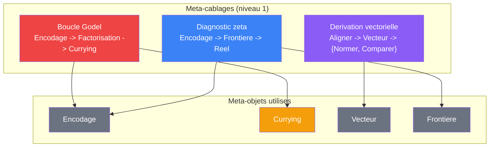

# Meta-cablages

> [Retour au sommaire](../../README.md) | [Sens](../sens/) | [Meta-objets](../meta-objets/) | [Meta-sens](../meta-sens/)

Un cablage assemble des **sens** (niveau 0). Un meta-cablage assemble des **meta-objets** (niveau 1) : il opere sur la structure des circuits, pas sur des valeurs.

## Catalogue

| Meta-cablage | Meta-objets enchaines | Ce qu'il produit |
|--------------|----------------------|-----------------|
| [Boucle Godel](boucle-godel.md) | Encodage + Factorisation + Currying | auto-reference -- la sortie devient les parametres |
| [Derivation vectorielle](derivation-vectorielle.md) | Vecteur (auto-application + quotient) | sens derives (Normer, Comparer) depuis Aligner |
| [Diagnostic zeta](diagnostic-zeta.md) | Encodage + Frontiere + Reel | verdict sur les conditions de possibilite du calcul |

## Distinction avec les cablages

| | Cablage | Meta-cablage |
|---|---|---|
| **Assemble** | des sens (niveau 0) | des meta-objets (niveau 1) |
| **Entree** | valeurs (`R`, `E`, `Omega`...) | objets, circuits, encodages |
| **Produit** | une valeur | une propriete du circuit ou un circuit transforme |

---

[<- Sens](../sens/)
