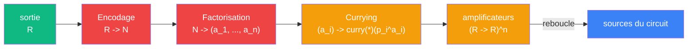

# Boucle Godel

> [Retour aux meta-cablages](README.md)

## Triple distinction

| Dimension | Boucle Godel |
|-----------|-------------|
| **Sens** | la sortie d'un circuit devient ses propres parametres via les nombres premiers |
| **Contrat** | `R -> N -> (a_1, ..., a_n) -> (R -> R)^n` |
| **Cablage** | Encodage + Factorisation + Currying en serie |

## Comment ca marche

Trois meta-objets s'enchainent :



| Etape | Meta-objet | Entree | Sortie | Ce qui se passe |
|-------|-----------|--------|--------|-----------------|
| 1 | [Encodage](../meta-objets/encodage.md) | `R` | `N` | la sortie devient un nombre de Godel |
| 2 | Factorisation | `N` | `(a_1, ..., a_n)` | les exposants des premiers sont extraits |
| 3 | [Currying](../meta-objets/currying.md) | `a_i` | `curry(*)(p_i^{a_i}) : R -> R` | chaque exposant fixe l'entree d'un [produit lineaire](../sens/ponderer/) |

## Le double role des nombres premiers

| Role | Niveau | Ce qu'ils font |
|------|--------|---------------|
| Encodage | meta (niveau 1) | `p_i` identifie l'instrument `i` dans le nombre `N` |
| Poids curries | calcul (niveau 0) | `p_i^{a_i}` amplifie la source `i` |

Le currying est le pont entre les deux niveaux : `p_i^{a_i}` passe de "exposant dans une factorisation" (fait arithmetique) a "entree fixee d'un produit lineaire" (acte physique).

## Pourquoi c'est auto-referent

La boucle se ferme :

```
sources --> calcul --> sortie --> encodage --> factorisation --> currying --> sources
```

Modifier les exposants `a_i` = modifier l'encodage = modifier les amplificateurs = modifier ce que le circuit calcule = modifier la sortie = modifier les exposants. Le circuit se regarde et se modifie.

## Ou ce meta-cablage apparait

| Circuit | Ce que la boucle Godel y fait |
|---------|------------------------------|
| [Ecouter](../sens/concentrer/ecouter.md) | les exposants reponderent les instruments (table de mixage) |

---

[<- Meta-cablages](README.md) | [Derivation vectorielle ->](derivation-vectorielle.md)
