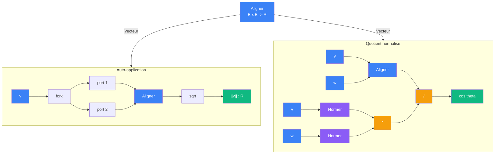

# Derivation vectorielle

> [Retour aux meta-cablages](README.md)

## Triple distinction

| Dimension | Derivation vectorielle |
|-----------|----------------------|
| **Sens** | engendrer des sens derives en reorganisant les connexions d'un bloc, sans fixer d'entree |
| **Contrat** | `(E x E -> R) -> {(E -> R), (E x E -> R)}` |
| **Cablage** | auto-application pour Normer, quotient normalise pour Comparer |

## Comment ca marche

Le meta-objet [Vecteur](../meta-objets/vecteur.md) prend [Aligner](../sens/aligner/) et engendre deux sens par restructuration :

| Derivation | Sens produit | Contrat | Mecanisme |
|------------|-------------|---------|-----------|
| Auto-application | [Normer](../sens/normer/) | `E -> R` | brancher la meme valeur sur les deux ports + sqrt |
| Quotient normalise | [Comparer](../sens/comparer/) | `E x E -> R` | diviser Aligner par le produit des normes |

## Difference avec le currying

| | Currying | Derivation vectorielle |
|---|---|---|
| **Action** | fixe une entree a une constante | reorganise les connexions internes |
| **Ports** | reduit le nombre de ports | peut garder le meme nombre de ports |
| **Entree** | une valeur concrete est branchee | aucune valeur n'est fixee |
| **Exemple** | `Ponderer(3, _) : R -> R` | `Aligner(v, v) -> sqrt : E -> R` |

Le currying **specialise**. La derivation vectorielle **restructure**.

## Ou ce meta-cablage apparait

| Circuit | Ce que la derivation y fait |
|---------|----------------------------|
| [Normer](../sens/normer/auto-aligner.md) | fork + Aligner + sqrt |
| [Comparer](../sens/comparer/quotient-normalise.md) | Aligner / (Normer x Normer) |
| [Rencontrer](../sens/aligner/rencontrer.md) | Aligner → Normer → Comparer en cascade |
| [Viser](../sens/equilibrer/viser.md) | idem, avec Accelerer en plus |

---

[<- Boucle Godel](boucle-godel.md) | [Diagnostic zeta ->](diagnostic-zeta.md)
