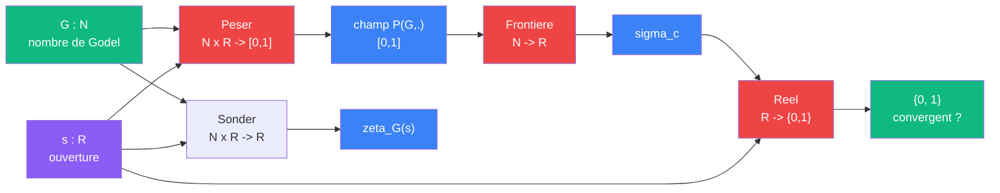

# Diagnostic zeta

> [Retour aux meta-cablages](README.md)

## Triple distinction

| Dimension | Diagnostic zeta |
|-----------|----------------|
| **Sens** | determiner si un circuit encode admet un calcul convergent |
| **Contrat** | `N -> R -> {0, 1}` |
| **Cablage** | Encodage + Peser + Frontiere + Reel en serie |

## Comment ca marche

Trois moments s'enchainent sur un nombre de Godel :



| Moment | Bloc | Niveau | Ce qu'il fait |
|--------|------|--------|---------------|
| 1. Champ | [Peser](../meta-sens/peser.md) | meta | produit le champ de probabilite `P(G, s)` |
| 2. Seuil | [Frontiere](../meta-sens/frontiere.md) | meta | lit le champ, trouve `sigma_c` |
| 3. Calcul | [Sonder](../sens/sonder/) | 0 | evalue le produit d'Euler partiel `zeta_G(s)` |
| 4. Verdict | [Reel](../sens/reel/) | 0 | juge si `s > sigma_c` -- convergent ou pas |

## Les deux zones

```
    regime constructif          seuil             regime limite
  |-----------------------------|------------------------------>
         Sonder                 Frontiere              Reel
    produit partiel             sigma_c            convergence ?
    (calcul fini)           (ou ca bascule)       (passage a la limite)
```

- **En deca de `sigma_c`** : Sonder accumule des facteurs finis -- le calcul est toujours accessible
- **A `sigma_c`** : Frontiere marque le point ou le fini ne suffit plus
- **Au-dela de `sigma_c`** : Reel tranche -- le produit infini converge-t-il ?

## Pourquoi c'est un meta-cablage

Le diagnostic zeta ne calcule pas une valeur mathematique ordinaire. Il repond a une question sur le **circuit lui-meme** : "pour cet encodage `G`, le regime constructif tient-il jusqu'a `s` ?"

C'est le seul meta-cablage qui porte sur les **conditions de possibilite** du calcul. La [boucle Godel](boucle-godel.md) transforme la structure, la [derivation vectorielle](derivation-vectorielle.md) engendre des sens -- le diagnostic zeta **juge**.

## Lien avec l'objectivite constructive

Salanskis distingue une objectivite constructive (finitude, verification effective) et une objectivite par passage a la limite. Le diagnostic zeta articule les deux regimes pour un circuit donne : Frontiere dit "jusqu'ou", Reel dit "au-dela, ca tient ou pas".

> Voir [Reflexion sur l'objectivite (Salanskis)](../reflexion-objectivite-salanskis.md)

## Parallele avec Concentrer

Meme structure : `epsilon -> 0` (concentration) correspond a `s -> sigma_c` (diagnostic zeta). Dans les deux cas, un parametre approche une frontiere ou le comportement change qualitativement.

---

[<- Derivation vectorielle](derivation-vectorielle.md) | [Meta-cablages](README.md)
