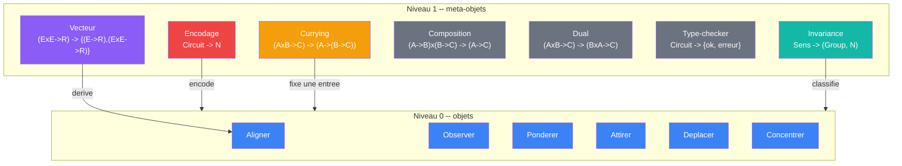

# Meta-objets

> [Retour au sommaire](../../README.md) | [Sens](../sens/) | [Meta-sens](../meta-sens/) | [Meta-cablages](../meta-cablages/)

Un meta-objet ne transforme pas des **valeurs** (nombres, vecteurs, spheres). Il transforme des **objets** ou des **circuits**. Son entree est un contrat, pas une valeur.

## Catalogue

| Meta-objet | Contrat | Ce qu'il fait | Fiche |
|------------|---------|---------------|-------|
| Encodage | `Circuit -> N` | encode un circuit comme un nombre de Godel | [encodage.md](encodage.md) |
| Currying | `(A x B -> C) -> (A -> (B -> C))` | fixe une entree, produit un sens currie | [currying.md](currying.md) |
| Vecteur | `(E x E -> R) -> {(E -> R), (E x E -> R)}` | derive Normer et Comparer depuis Aligner | [vecteur.md](vecteur.md) |
| Composition | `(A -> B) x (B -> C) -> (A -> C)` | connecte deux objets en serie | -- |
| Dual | `(A x B -> C) -> (B x A -> C)` | echange les entrees | -- |
| Type-checker | `Circuit -> {ok, erreur}` | verifie les incompatibilites de typage | -- |
| Invariance | `Sens -> (Group, N)` | classifie un sens par son groupe d'invariance | [invariance.md](invariance.md) |

## Deux niveaux

| Niveau | Entree | Sortie | Exemple |
|--------|--------|--------|---------|
| 0 -- objet | valeur | valeur | `<phi\|v>` prend un vecteur, rend un scalaire |
| 1 -- meta-objet | objet ou circuit | valeur ou objet | Godel prend un circuit, rend un nombre |

## Ce que ca ouvre

- **Auto-reference** : un circuit peut prendre son propre nombre de Godel comme entree
- **Incompletude** : il existe des proprietes de circuits qu'aucun circuit ne peut decider
- **Quine** : un circuit dont la sortie est son propre encodage