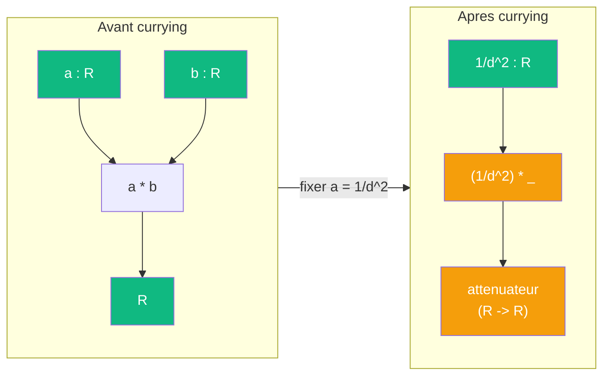

# Currying

> [Retour aux meta-objets](README.md) | [Sens](../sens/)

Une entree peut devenir une sortie par reecriture :

Dans la [projection de la sphere](../cablages/projeter.md), fixer `a = 1/d^2` dans le [produit lineaire](../sens/ponderer.md) produit un attenuateur `(1/d^2) * _` qui pondere n'importe quelle aire par la distance.

Changer le cablage change le **cout** ET la **topologie** des ports.
