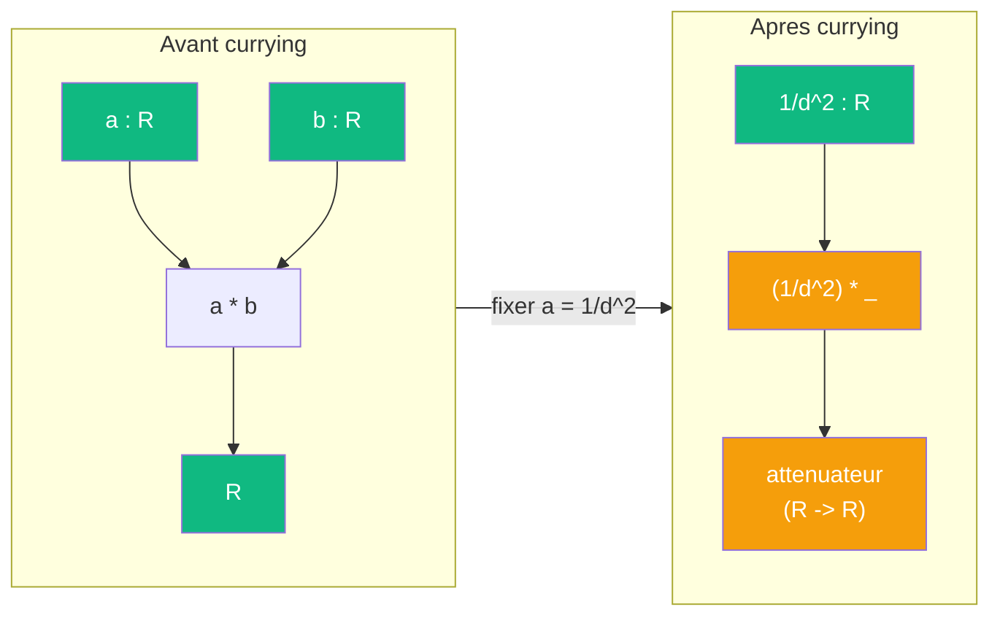

# Currying

> [Retour aux meta-objets](README.md) | [Sens](../sens/)

## Triple distinction

| Dimension | Currying |
|-----------|---------|
| **Sens** | fixer une entree pour produire un objet specialise |
| **Contrat** | `(A x B -> C) -> (A -> (B -> C))` |
| **Cablage** | choisir un port, y brancher une constante, replier le circuit |

## Comment ca marche

Une entree peut devenir une sortie par reecriture :

Dans la [projection de la sphere](../sens/observer/projeter.md), fixer `a = 1/d^2` dans le [produit lineaire](../sens/ponderer/) produit un attenuateur `(1/d^2) * _` qui pondere n'importe quelle aire par la distance.

Changer le cablage change le **cout** ET la **topologie** des ports.

## Table des curryings

| Source | Entree fixee | Sens currie | Contrat currie |
|--------|-------------|-------------|----------------|
| [Ponderer](../sens/ponderer/) | `a` | [Amplifier](../sens/amplifier/) | `R -> R` |
| [Attirer](../sens/attirer/) | `x` | [Champ](../sens/champ/) | `E -> R` |
| [Deplacer](../sens/deplacer/) | `v` | [Translater](../sens/translater/) | `(Omega x R) -> (Omega x R)` |
| [Concentrer](../sens/concentrer/) | `epsilon, x_0` | [Lire](../sens/lire/) | `(X -> R) -> R` |
| [Observer](../sens/observer/) | `phi` | [Mesurer](../sens/mesurer/) | `E -> R` |
| [Sonder](../sens/sonder/) | `G` | sonde parametree | `R -> R` |
| [Aligner](../sens/aligner/) | `f` | covecteur via Riesz | `E -> R` (cablage, pas sens autonome) |

> **Note** : [Normer](../sens/normer/) et [Comparer](../sens/comparer/) ne sont pas des curryings d'Aligner. Normer duplique l'entree (auto-application), Comparer divise par le produit des normes (quotient normalise). Ce sont des **derivations** via le meta-objet [Vecteur](vecteur.md).
