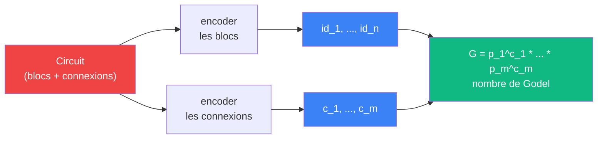

# Numerotation de Godel -- encodage

> [Retour aux meta-objets](README.md) | [Sens](../sens/)

## Triple distinction

| Dimension | Encodage |
|-----------|----------|
| **Sens** | encoder un circuit comme un nombre, pour pouvoir raisonner *sur* les circuits |
| **Contrat** | `Circuit -> N` |
| **Cablage** | chaque bloc -> un code, chaque connexion -> une puissance de premier, le circuit entier -> un produit |



## Principe

Chaque element du projet (type, objet, connexion) recoit un **code**. Un circuit entier devient un produit de puissances de nombres premiers. Le nombre obtenu est unique (theoreme fondamental de l'arithmetique) et decodable.

## Etape 1 -- encoder les types

Les [espaces](../vocabulaire/espaces.md) sont les atomes. On leur attribue les premiers nombres premiers :

| Type | Code |
|------|------|
| `R` | 2 |
| `E` | 3 |
| `E*` | 5 |
| `Omega` | 7 |

Les constructeurs de types composent les codes :

| Constructeur | Encodage | Exemple |
|-------------|----------|---------|
| `A x B` | `<A, B>` = paire | `E x E` = `<3, 3>` |
| `A -> B` | `<A, B>` + marqueur fleche | `R -> R` = `<2, 2>` avec fleche |

Pour distinguer `x` de `->`, on utilise un prefixe :
- produit `x` : code **1** en tete
- fleche `->` : code **2** en tete

Donc `E x E -> R` s'encode comme : `<2, <1, 3, 3>, 2>` = fleche de (produit E E) vers R.

## Etape 2 -- encoder les objets

Chaque objet a un contrat. On l'encode comme une paire `(identifiant, contrat_encode)` :

| Objet | Id | Contrat | Encodage du contrat |
|-------|-----|---------|-------------------|
| Aligner | 1 | `E x E -> R` | `<2, <1, 3, 3>, 2>` |
| Observer | 2 | `E* x E -> R` | `<2, <1, 5, 3>, 2>` |
| Ponderer | 3 | `R x R -> R` | `<2, <1, 2, 2>, 2>` |
| Deplacer | 4 | `R^3 x (Omega x R) -> (Omega x R)` | `<2, <1, 2, <1, 7, 2>>, <1, 7, 2>>` |
| Valeur absolue | 5 | `R -> R` | `<2, 2, 2>` |
| Inverse carre | 6 | `R -> R` | `<2, 2, 2>` |
| Integration | 7 | `Omega x (Omega -> R) -> R` | `<2, <1, 7, <2, 7, 2>>, 2>` |
| Attirer | 8 | `E x E -> R` | `<2, <1, 3, 3>, 2>` |

Remarque : attirer et aligner ont le **meme encodage de contrat** (`<2, <1, 3, 3>, 2>`). Deuxieme paire d'objets avec le meme encodage, apres `abs` / `inv_carre`. Le contrat seul ne distingue pas le sens -- confirmation supplementaire que la [triple distinction](../vocabulaire/triple-distinction.md) n'est pas redondante.

Remarque : valeur absolue et inverse carre ont le **meme encodage de contrat** (`R -> R`). Le contrat seul ne distingue pas le sens -- c'est l'identifiant qui les separe. Premier signe que le contrat ne capture pas tout.

## Etape 3 -- encoder un circuit

Un circuit est une liste ordonnee de *connexions*. Chaque connexion est un triplet `(source, port_sortie, destination, port_entree)`.

Le circuit [projeter](../sens/observer/projeter.md) :

```
connexions = [
  (4, 0, 2, 1),   -- mouvement.S'     -> dualite.v
  (4, 1, 6, 0),   -- mouvement.d'     -> inv_carre.entree
  (phi, 0, 2, 0), -- phi              -> dualite.phi
  (2, 0, 5, 0),   -- dualite.sortie   -> abs.entree
  (5, 0, 7, 1),   -- abs.sortie       -> integration.f
  (4, 0, 7, 0),   -- mouvement.S'     -> integration.domaine
  (7, 0, 3, 0),   -- integration.aire -> lineaire.a
  (6, 0, 3, 1),   -- inv_carre.sortie -> lineaire.b
]
```

Nombre de Godel du circuit :

```
G = p_1^c_1 * p_2^c_2 * ... * p_8^c_8
```

ou `p_i` est le i-eme nombre premier et `c_i` est l'encodage du i-eme triplet de connexion.

## Deuxieme circuit : teleportation

Le circuit complet de teleportation -- `n` destinations attirent la sphere, les premiers controlent les poids, la boucle passe par Godel -- est developpe dans [deplacer](../sens/deplacer/#circuit-complet--teleportation). C'est le deuxieme exemple (apres [ecouter](../sens/concentrer/ecouter.md)) du pattern "boucle auto-referente via Godel".

## Ce que l'encodage revele

**Meme contrat, sens different** : `abs` et `inv_carre` ont le meme type `R -> R` mais pas le meme role. L'encodage de Godel du contrat seul ne les distingue pas. Il faut l'identifiant (ou le cablage) pour les separer. Ca confirme que la [triple distinction](../vocabulaire/triple-distinction.md) n'est pas redondante -- le contrat seul ne suffit pas.

**Le circuit est un nombre** : une fois encode, on peut poser des questions arithmetiques qui sont en realite des questions sur le circuit. "Est-ce que `p_3` divise `G` ?" = "est-ce que la 3e connexion existe ?".

**Decodage** : factoriser `G` en nombres premiers reconstitue exactement le circuit. Aucune information n'est perdue.

## Lien avec zeta

Le nombre de Godel `G` est un produit de puissances de premiers : `G = p_1^{a_1} * ... * p_n^{a_n}`. La fonction zeta de Riemann, via son produit d'Euler, opere sur ces memes premiers.

- [Sonder](../sens/sonder/) calcule `zeta_G(s) = PI 1/(1 - p_i^{-s})` -- le produit d'Euler partiel sur les premiers de `G`
- [Frontiere](../meta-sens/frontiere.md) trouve `sigma_c`, le `s` critique ou la convergence bascule

Le parametre `s` controle l'ouverture : plus `s` est grand, plus les grands premiers sont ecrases. La factorisation de `G` -- deja utilisee pour decoder le circuit -- devient l'entree du produit d'Euler.
