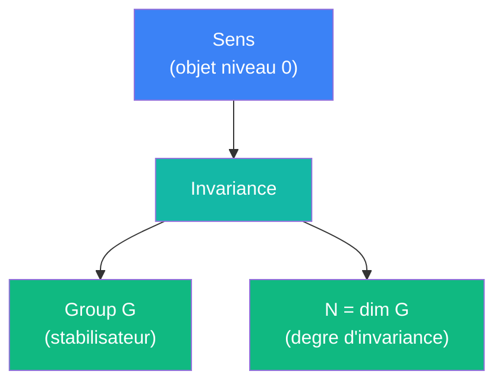

# Invariance

> [Retour aux meta-objets](README.md) | [Sens](../sens/)

## Triple distinction

| Dimension | Invariance |
|-----------|------------|
| **Sens** | identifier ce qui ne change pas quand on transforme l'objet |
| **Contrat** | `Sens -> (Group, N)` |
| **Cablage** | pour chaque sens, identifier le stabilisateur G, calculer dim G |

## Comment ca marche

Le programme d'Erlangen de Klein : une geometrie est definie par son **groupe de symetries**. Deux figures sont "les memes" si une transformation du groupe envoie l'une sur l'autre.

Invariance applique ce principe au VPA : chaque sens possede un groupe de transformations qui le preserve. Plus le groupe est grand (dim G elevee), plus le sens est "robuste" -- il survit a davantage de deformations.

## Table des invariances

| Sens | Groupe G | dim G | Interpretation |
|------|----------|-------|----------------|
| [Aligner](../sens/aligner/) | SO(n) | n(n-1)/2 | invariant par rotation simultanee |
| [Concentrer](../sens/concentrer/) | Translations de x_0 | dim X | invariant par deplacement du centre |
| [Ponderer](../sens/ponderer/) | {id} | 0 | aucune invariance non-triviale |
| [Attirer](../sens/attirer/) | Translations simultanees | dim E | invariant par translation globale |
| [Observer](../sens/observer/) | GL(E) contragredient | (dim E)^2 | invariant par changement de base |
| [Deplacer](../sens/deplacer/) | Galileen | 4 | invariant par ref. galileen |

## Classes d'equivalence

Deux sens avec la meme signature `(Group, N)` sont equivalents au sens de Klein : ils voient les memes symetries, donc mesurent la meme geometrie.

Par exemple, Aligner et Attirer partagent une invariance par un groupe continu de dimension non-triviale, mais leurs groupes sont differents (rotations vs translations). Ils ne sont donc pas equivalents.

## Lien avec Currying

Le [currying](currying.md) **restreint** le groupe d'invariance : fixer une entree brise des symetries. Le groupe du sens currie est un **sous-groupe** du stabilisateur original.

Exemple : [Attirer](../sens/attirer/) est invariant par translations simultanees (dim E). Fixer `x` pour obtenir [Champ](../sens/champ/) brise cette invariance -- le groupe tombe a {id}.

## Difference avec Encodage

[Encodage](encodage.md) est **syntaxique** : il numerote les circuits sans se soucier de leur comportement. Invariance est **semantique** : elle classifie les sens par ce qu'ils preservent sous transformation. Un meme encodage peut correspondre a des invariances differentes, et vice versa.

## Godel

Il existe des invariances non-calculables depuis l'interieur : un circuit ne peut pas toujours determiner son propre groupe de symetries. C'est une consequence du theoreme de Rice applique aux proprietes semantiques des programmes.
