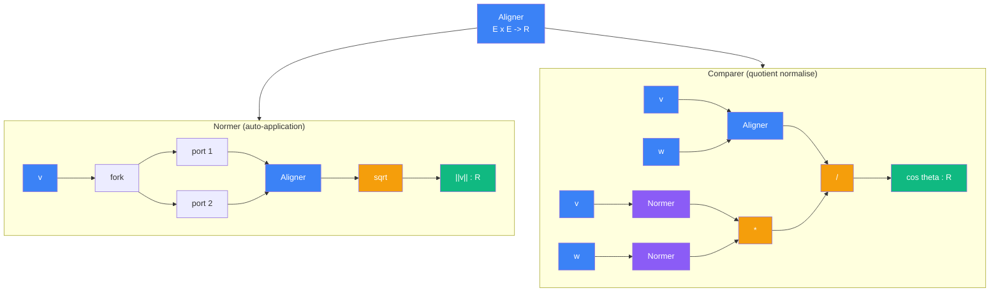

# Vecteur

> [Retour aux meta-objets](README.md) | [Sens](../sens/)

Le meta-objet Vecteur prend [Aligner](../sens/aligner/) (`E x E -> R`) et engendre deux sens derives par **auto-application** et **quotient normalise**.

## Triple distinction

| Dimension | Vecteur |
|-----------|---------|
| **Sens** | extraire la taille et l'angle a partir de l'alignement |
| **Contrat** | `(E x E -> R) -> {(E -> R), (E x E -> R)}` |
| **Cablage** | auto-application pour Normer, quotient normalise pour Comparer |

## Difference avec le currying

Le [currying](currying.md) **fixe une entree** : `(A x B -> C) -> (A -> (B -> C))`. L'entree `A` est figee, il reste `B -> C`.

La derivation vectorielle est differente :

- **Normer** : on branche la **meme** valeur sur les deux ports → `<v,v>` → `sqrt`. C'est une **auto-application**, pas une entree fixee.
- **Comparer** : on divise par le produit des normes → `<v,w> / (||v|| * ||w||)`. C'est un **quotient normalise**, pas une restriction.

Dans les deux cas, Aligner reste a deux entrees — on ne fixe rien, on **reorganise le circuit autour de lui**.

## Derivation

## Sens engendres

| Sens | Contrat | Derivation |
|------|---------|------------|
| [Normer](../sens/normer/) | `E -> R` | auto-application de Aligner + sqrt |
| [Comparer](../sens/comparer/) | `E x E -> R` | quotient Aligner / (Normer x Normer) |
