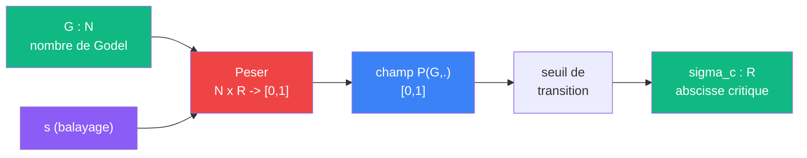

# Frontiere

> [Retour aux meta-sens](README.md) | [Sens](../sens/README.md)

`sigma_c(G) = abscisse de convergence du produit zeta_G`

- **Sens** -- trouver ou s'arrete l'acces constructif a un circuit encode
- **Contrat** -- `N -> R` (nombre de Godel -> s critique)
- **Ports** -- `G in N` en entree ; `R` en sortie
- **Cablage** -- `G -> Peser(G, .) -> seuil de transition -> sigma_c` ([detail](frontiere/lecture-champ.md))

## Comment ca marche

Frontiere est la **limite d'ouverture du port**. Pour un [encodage de Godel](../meta-objets/encodage.md) donne, il trouve le `s` critique en dessous duquel le produit d'Euler diverge.

Frontiere s'appuie sur [Peser](peser.md) qui produit le champ de probabilite `P(G, .) : R -> [0,1]`. Frontiere lit ce champ et cherche le point de transition :
- Pour la zeta classique (tous les premiers) : `sigma_c = 1`
- Pour un produit partiel fini : `sigma_c` peut etre plus bas



## Pourquoi un sens separe

Frontiere n'est pas un sens comme les autres. Les sens ordinaires (Aligner, Ponderer, Normer...) calculent des **valeurs dans R** a partir d'un circuit donne. Frontiere calcule une propriete **du circuit lui-meme** : ou bascule-t-il du regime fini au regime infini ?

C'est un sens **meta** : il ne porte pas sur le resultat du calcul, mais sur les **conditions de possibilite** du calcul. Quand on branche Frontiere sur un encodage `G`, on ne demande pas "quelle valeur ?", on demande "jusqu'ou peut-on calculer ?".

Cette distinction est cruciale. Un produit d'Euler partiel (fini) se calcule directement -- c'est de l'arithmetique. Mais le passage au produit infini exige un saut : il faut garantir la convergence, et c'est exactement ce que `sigma_c` delimite.

## Le trio Sonder / Frontiere / Reel

Les trois sens forment une articulation en trois moments :

| Moment | Sens | Regime | Ce qu'il fait |
|--------|------|--------|---------------|
| 1. Calcul fini | [Sonder](../sens/sonder/) | constructif | Evalue le produit d'Euler partiel pour `N` premiers |
| 2. Seuil | **Frontiere** | transition | Trouve `sigma_c`, la frontiere entre fini suffisant et fini insuffisant |
| 3. Verdict | [Reel](../sens/reel/) | limite | Decide si le produit converge au-dela du seuil |

```
    regime constructif          seuil             regime limite
  |-----------------------------|------------------------------>
         Sonder                 Frontiere              Reel
    produit partiel             sigma_c            convergence ?
    (calcul fini)           (ou ca bascule)       (passage a la limite)
```

Sonder travaille **en deca** de `sigma_c` : il accumule des facteurs finis, et ses resultats sont toujours accessibles. Frontiere marque le point ou cette accumulation ne suffit plus. Reel tranche **au-dela** : le produit infini converge-t-il, oui ou non ?

## Lien avec l'objectivite constructive

Salanskis (« L'objectivite de l'objet mathematique », *Noesis* 2012) distingue une objectivite **constructive** -- fondee sur la finitude : clause recursive, nombre fini d'etapes, verification effective -- et une objectivite par **passage a la limite** qui exige un autre type d'acces a l'objet.

Frontiere est le sens qui articule ces deux regimes pour un circuit donne. En calculant `sigma_c`, il dit : "pour ce circuit encode par `G`, le regime constructif tient jusqu'ici". Au-dela, il faut un prolongement analytique, une sommation regularisee, ou un autre dispositif qui depasse le calcul fini.

C'est pourquoi Frontiere est indispensable au projet : sans lui, on ne sait pas **ou** s'arrete ce qu'on peut construire et **ou** commence ce qu'on doit postuler.

> Voir [Reflexion sur l'objectivite (Salanskis)](../reflexion-objectivite-salanskis.md) pour le detail de l'argument.

## Lien avec la concentration

Meme structure que [concentrer](../sens/concentrer/) : `epsilon -> 0` correspond a `s -> sigma_c`. Dans les deux cas, un parametre approche une frontiere ou le comportement change qualitativement.

---

[<- Reel](../sens/reel/) | [Espaces ->](../vocabulaire/espaces.md)
