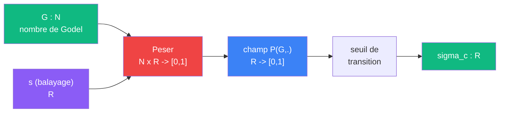

# Cablage : Frontiere

> [Retour au meta-sens Frontiere](../frontiere.md)

## Triple distinction

| Dimension | Frontiere |
|-----------|-----------|
| **Sens** | trouver ou s'arrete l'acces constructif a un circuit encode |
| **Contrat** | `N -> R` |
| **Cablage** | Peser + seuil de transition |

## Detail du cablage

### 1. Appel a Peser

Pour un `G` donne, Frontiere interroge [Peser](../peser.md) sur toute une plage de valeurs de `s`. Cela produit le champ de probabilite `P(G, .) : R -> [0,1]`.

### 2. Seuil de transition

Frontiere cherche le point `sigma_c` ou le champ passe de ~1 (convergence) a ~0 (divergence). C'est le point de transition du champ de probabilite.

Pour la zeta classique (tous les premiers) : `sigma_c = 1`. Pour un produit partiel fini, `sigma_c` peut etre plus bas.

## Avant / apres Peser

Avant Peser, Frontiere faisait tout en interne : factorisation, analyse de convergence, extraction de `sigma_c`. Maintenant le travail est decoupe :

| Etape | Avant | Apres |
|-------|-------|-------|
| Factorisation | Frontiere | Peser |
| Evaluation du produit | Frontiere | Peser |
| Jugement de convergence | Frontiere | Peser (normalisation) |
| Extraction du seuil | Frontiere | Frontiere (lit le champ) |

Frontiere ne fait plus que la derniere etape : **lire le champ** produit par Peser et en extraire `sigma_c`.

---

[<- Frontiere](../frontiere.md)
