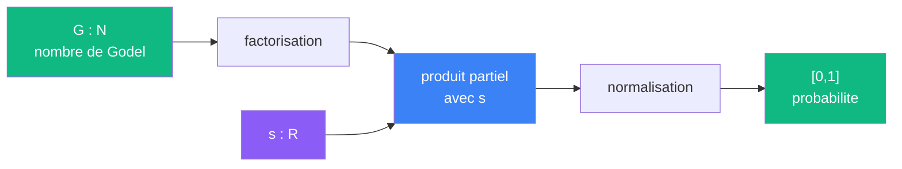

# Peser

> [Retour aux meta-sens](README.md) | [Sens](../sens/README.md)

`P(G, s) = probabilite de convergence du produit zeta_G au point s`

- **Sens** -- attribuer a chaque point `(G, s)` une probabilite de convergence
- **Contrat** -- `N x R -> [0,1]`
- **Ports** -- `G in N`, `s in R` (entrees) ; `[0,1]` (sortie)
- **Cablage** -- [cablage](peser/factorisation-normalisation.md)



## Champ de probabilite

Peser ne repond pas par oui/non. Il produit un **champ** : pour chaque valeur de `s`, il donne une probabilite de convergence. Ce champ est la matiere premiere que [Frontiere](frontiere.md) lit pour trouver le seuil de transition `sigma_c`.

La sortie est un nombre dans `[0,1]` :
- **Proche de 1** : le produit partiel converge bien a ce point
- **Proche de 0** : le produit partiel diverge a ce point
- **Zone de transition** : c'est la que se cache `sigma_c`

## Lien avec Sonder

[Sonder](../sens/sonder/) et Peser partagent les memes entrees (`G in N`, `s in R`), mais leurs sorties different :

| | Sonder | Peser |
|---|---|---|
| **Sortie** | `R` (valeur du produit) | `[0,1]` (probabilite de convergence) |
| **Question** | "combien vaut le produit ?" | "a quel point ca converge ?" |
| **Niveau** | sens ordinaire | meta-sens |

Sonder donne une **valeur**, Peser donne un **jugement gradue**.

## Lien avec Frontiere

Peser produit, Frontiere lit :

```
Peser(G, .) : R -> [0,1]     champ de probabilite
Frontiere(G) : N -> R         lit le champ, trouve sigma_c
```

Frontiere cherche le point ou le champ de Peser passe de ~1 a ~0. C'est le seuil de transition.

## Cablages

| Cablage | Sens primaire | Lien |
|---------|---------------|------|
| Factorisation-normalisation | peser (local) | [peser/factorisation-normalisation.md](peser/factorisation-normalisation.md) |
| Lecture-champ | frontiere | [frontiere/lecture-champ.md](frontiere/lecture-champ.md) |

---

[<- Frontiere](frontiere.md) | [Meta-sens](README.md)
