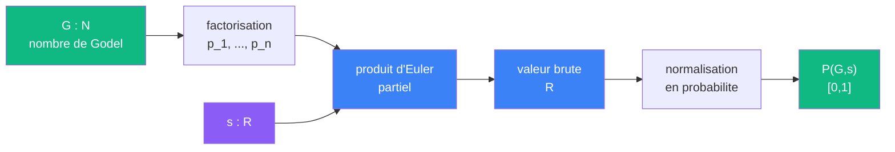

# Cablage : Peser

> [Retour au meta-sens Peser](../peser.md)

## Triple distinction

| Dimension | Peser |
|-----------|-------|
| **Sens** | attribuer une probabilite de convergence a chaque point `(G, s)` |
| **Contrat** | `N x R -> [0,1]` |
| **Cablage** | factorisation + produit d'Euler partiel + normalisation |

## Detail du cablage



### 1. Factorisation

`G` est un nombre de Godel. Sa factorisation donne les premiers `p_1, ..., p_n` qui encodent la structure du circuit.

### 2. Produit d'Euler partiel

Pour chaque `s`, on calcule le produit partiel :

```
Pi_N(s) = prod_{i=1}^{n} 1/(1 - p_i^{-s})
```

C'est le meme calcul que [Sonder](../../sens/sonder/), mais ici on s'interesse a son comportement en tant qu'indicateur de convergence, pas a sa valeur.

### 3. Normalisation en probabilite

Le produit partiel est transforme en probabilite dans `[0,1]`. La normalisation capture le **taux de convergence** : a quel point le produit se stabilise quand on ajoute des facteurs.

- Si le produit se stabilise rapidement : `P(G,s)` proche de 1
- Si le produit oscille ou croit : `P(G,s)` proche de 0

## Lien avec Sonder

Peser reutilise le produit d'Euler de [Sonder](../../sens/sonder/produit-euler.md) mais ajoute une couche de normalisation. La ou Sonder donne une valeur brute dans `R`, Peser la convertit en jugement gradue dans `[0,1]`.

---

[<- Peser](../peser.md)
