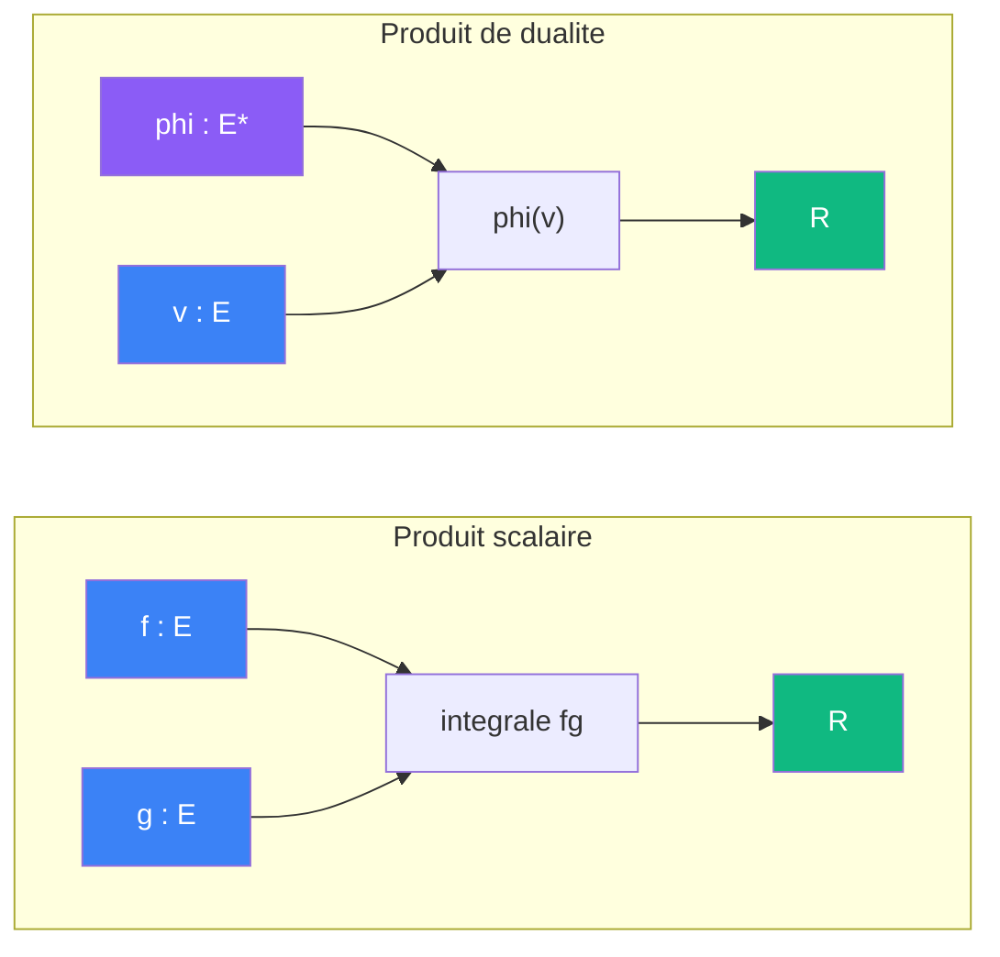
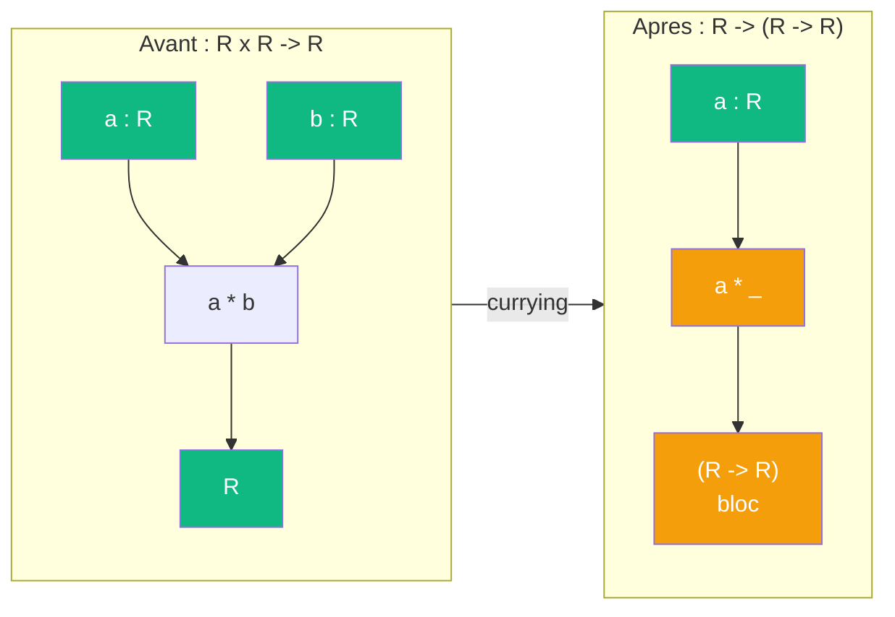
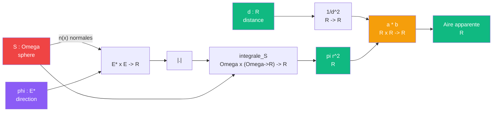
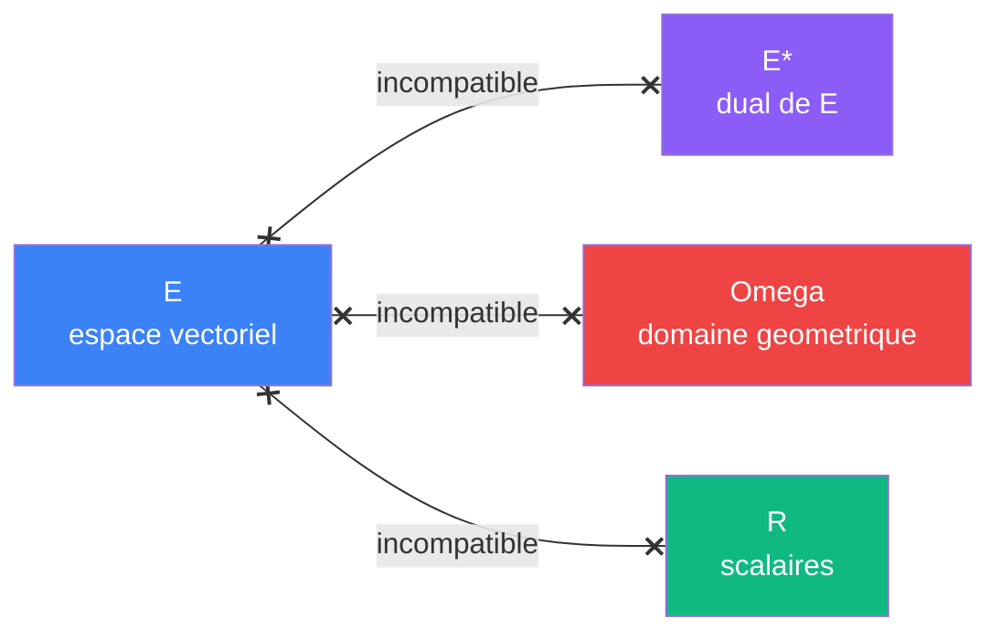

# Objets mathematiques

> [Retour au sommaire](../README.md) | [Concepts](concepts.md) | [Architecture](architecture.md)

## Sommaire

- [Objets implementes](#objets-implementes)
  - [Produit scalaire](#produit-scalaire)
  - [Produit de dualite](#produit-de-dualite)
  - [Produit lineaire](#produit-lineaire)
- [Exemple : ombre et intensite d'une sphere](#exemple--ombre-et-intensite-dune-sphere)
- [Espaces et incompatibilites](#espaces-et-incompatibilites)

---

## Objets implementes

| Objet              | Contrat       | Symetrie    |
|--------------------|---------------|-------------|
| Produit scalaire   | `E x E -> R`  | symetrique  |
| Produit de dualite | `E* x E -> R` | asymetrique |
| Produit lineaire   | `R x R -> R`  | symetrique  |

---

### Produit scalaire

`<f,g>`

- **[Sens](concepts.md#triple-distinction)** -- combien deux vecteurs s'alignent
- **Contrat** -- `E x E -> R` (symetrique)
- **Ports** -- `f in E`, `g in E` (entrees), `R` (sortie)
- **Cablage** -- `f -> integrale fg <- g -> R`

---

### Produit de dualite

`<phi|v>`

- **[Sens](concepts.md#triple-distinction)** -- combien phi voit v
- **Contrat** -- `E* x E -> R` (asymetrique)
- **Ports** -- `phi in E*`, `v in E` (entrees), `R` (sortie)
- **Cablage** -- `phi, v -> phi(v) -> R`

---

### Produit lineaire

`a * b`

- **[Sens](concepts.md#triple-distinction)** -- ponderer une grandeur par une autre
- **Contrat** -- `R x R -> R` (symetrique)
- **Ports** -- `a in R`, `b in R` (entrees), `R` (sortie)
- **Cablage** -- `a, b -> a*b -> R`

#### Currying du produit lineaire

Le [currying](concepts.md#currying) transforme le produit lineaire en un bloc qui **produit un scalaire** :

| | Avant | Apres |
|---|---|---|
| **Contrat** | `R x R -> R` | `R -> (R -> R)` |
| **Entrees** | `a : R`, `b : R` | `a : R` |
| **Sortie** | `R` | bloc `(R -> R)` |

Le bloc `a * _` est une **forme lineaire sur R** : il attend un scalaire et en produit un.

Dans l'[exemple de la sphere](#exemple--ombre-et-intensite-dune-sphere), fixer `a = 1/d^2` donne le bloc `(1/d^2) * _` -- un attenuateur qui pondere l'aire geometrique par la distance.

---

## Exemple : ombre et intensite d'une sphere

### Le probleme

On projette une sphere dans une direction `phi` pour obtenir son **ombre**. L'ombre n'est pas binaire : en chaque point `x` de la sphere, `|<phi|n(x)>|` donne l'**intensite** (0 = profil, 1 = face). L'integration somme ces intensites pour donner l'**aire**. Le produit lineaire avec `1/d^2` donne l'**intensite a distance**.

### Circuit complet

### Role de chaque bloc

| Etape | Bloc | Contrat | Sens dans ce contexte |
|-------|------|---------|----------------------|
| 1 | [Produit de dualite](#produit-de-dualite) | `E* x E -> R` | intensite locale en `x` |
| 2 | Valeur absolue | `R -> R` | compte les deux faces |
| 3 | Integration sur `Omega` | `Omega x (Omega->R) -> R` | somme des intensites = aire |
| 4 | Inverse carre | `R -> R` | `d -> 1/d^2` |
| 5 | [Produit lineaire](#produit-lineaire) | `R x R -> R` | attenuation par la distance |

### Intensite locale vs aire totale

- **Intensite locale** : `|<phi|n(x)>|` en un point `x`. Vaut 0 quand la normale est perpendiculaire a `phi` (profil), 1 quand elle est alignee (face).
- **Aire totale** : `integrale_S |<phi|n(x)>| dx = pi r^2`. L'integration somme toutes les intensites locales sur la sphere.

L'integration ne "compte pas les points visibles" : elle **pese chaque point par son intensite**. C'est la difference entre une ombre nette (binaire) et une ombre avec penombre (continue).

### Effet de la distance

Sans `d`, l'aire est `pi r^2` (projection orthographique). Avec `d`, l'aire apparente est `pi r^2 / d^2` (projection perspective).

Le [produit lineaire](#produit-lineaire) est le bloc qui connecte la geometrie (`integrale`) a l'optique (`1/d^2`). Via [currying](#currying-du-produit-lineaire), fixer `1/d^2` produit un attenuateur `(1/d^2) * _` qui pondere n'importe quelle aire.

### Triple distinction du circuit

| Dimension | Projection de la sphere |
|-----------|--------------------------|
| **Sens** | taille apparente depuis `d` |
| **Contrat** | `Omega x E* x R -> R` |
| **Cablage** | produit de dualite + valeur absolue + integration + inverse carre + produit lineaire |

---

## Espaces et incompatibilites

| Espace  | Couleur          | Role                |
|---------|------------------|---------------------|
| `E`     | bleu `#3B82F6`   | espace vectoriel    |
| `E*`    | violet `#8B5CF6` | dual de E           |
| `R`     | vert `#10B981`   | scalaires           |
| `Omega` | rouge `#EF4444`  | domaine geometrique |

Deux ports se connectent seulement si leurs espaces sont identiques. L'incompatibilite est un **refus de typage** en [Agda](architecture.md#backend--agda), pas un check runtime.
