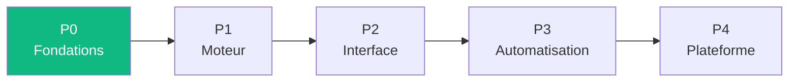

# Feuille de route

> [Retour au sommaire](../README.md)

## Sommaire

- [Phases](#phases)
- [References](#references)

---

## Phases

| Phase | Objectif | Details |
|-------|----------|---------|
| **P0** | Fondations | [Agda](architecture.md#backend--agda), categories, string diagrams |
| **P1** | Moteur de contrats | Algorithme d'unification des [ports](vocabulaire/espaces.md) |
| **P2** | Interface visuelle | Drag & drop, connexions, [trois vues](vocabulaire/trois-vues.md) |
| **P3** | Dezoom automatique | Reconnaissance de patterns, generation Agda |
| **P4** | Plateforme ouverte | Publication, extensibilite |

---

## References

- **GEB** -- Hofstadter, *Godel Escher Bach* (strange loops, zoom / dezoom)
- **PLFA** -- *Programming Language Foundations in Agda*
- **Currying** -- https://en.wikipedia.org/wiki/Currying
- **Riemann zeta** -- fonction zeta, produit d'Euler, frontiere reel/irreel
