# Feuille de route

> [Retour au sommaire](../README.md)

## Sommaire

- [Phases](#phases)
- [References](#references)

---

## Phases

```mermaid
gantt
    title Phases du projet
    dateFormat X
    axisFormat %s

    section Fondations
    P0 - Agda, categories, string diagrams : p0, 0, 1

    section Moteur
    P1 - Contrats, unification : p1, 1, 2

    section Interface
    P2 - Drag & drop, connexions : p2, 2, 3

    section Automatisation
    P3 - Dezoom, patterns, generation Agda : p3, 3, 4

    section Plateforme
    P4 - Ouverture : p4, 4, 5
```

| Phase | Objectif | Details |
|-------|----------|---------|
| **P0** | Fondations | [Agda](architecture.md#backend--agda), categories, string diagrams |
| **P1** | Moteur de contrats | Algorithme d'unification des [ports](objets.md#espaces-et-incompatibilites) |
| **P2** | Interface visuelle | Drag & drop, connexions, [trois vues](concepts.md#trois-vues) |
| **P3** | Dezoom automatique | Reconnaissance de patterns, generation Agda |
| **P4** | Plateforme ouverte | Publication, extensibilite |

---

## References

- **GEB** -- Hofstadter, *Godel Escher Bach* (strange loops, zoom / dezoom)
- **PLFA** -- *Programming Language Foundations in Agda*
- **Currying** -- https://en.wikipedia.org/wiki/Currying
