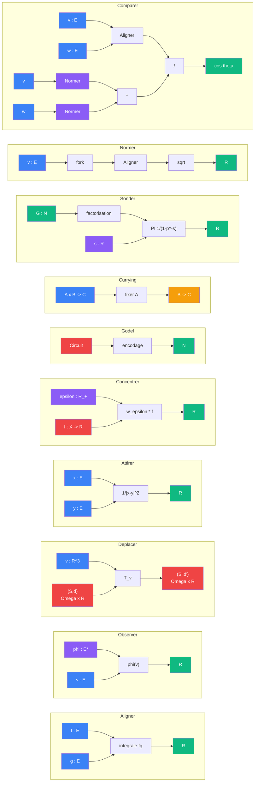

# Sens

> [Retour au sommaire](../../README.md) | [Vocabulaire](../vocabulaire/) | [Architecture](../architecture.md)

## Blocs atomiques

| Objet | Contrat | Symetrie |
|-------|---------|----------|
| [Aligner](aligner/) | `E x E -> R` | symetrique |
| [Observer](observer/) | `E* x E -> R` | asymetrique |
| [Ponderer](ponderer/) | `R x R -> R` | symetrique |
| [Attirer](attirer/) | `E x E -> R` | symetrique |
| [Deplacer](deplacer/) | `R^3 x (Omega x R) -> (Omega x R)` | asymetrique |
| [Concentrer](concentrer/) | `R_+ x X x (X -> R) -> R` | asymetrique |

## Sens derives

Produits par derivation interne (auto-application, quotient) via le meta-objet [Vecteur](../meta-objets/vecteur.md).

| Sens | Contrat | Derivation |
|------|---------|------------|
| [Normer](normer/) | `E -> R` | auto-application de Aligner |
| [Comparer](comparer/) | `E x E -> R` | quotient Aligner / (Normer x Normer) |
| [Accelerer](accelerer/) | `R x R -> R` | composition de Ponderer x3 |
| [Equilibrer](equilibrer/) | `R^4 -> R` | resolution cubique (vitesse radiale nulle) |

## Sens curries

Produits par [currying](../meta-objets/currying.md) d'un bloc atomique.

| Sens | Contrat | Source |
|------|---------|--------|
| [Amplifier](amplifier/) | `R -> R` | ponderer, fixer `a` |
| [Champ](champ/) | `E -> R` | attirer, fixer `x` |
| [Translater](translater/) | `(Omega x R) -> (Omega x R)` | deplacer, fixer `v` |
| [Lire](lire/) | `(X -> R) -> R` | concentrer, fixer `epsilon, x_0` |
| [Mesurer](mesurer/) | `E -> R` | observer, fixer `phi` |

## Sonde zeta

Operent sur les [encodages de Godel](../meta-objets/encodage.md) via le produit d'Euler.

| Sens | Contrat | Symetrie |
|------|---------|----------|
| [Sonder](sonder/) | `N x R -> R` | asymetrique |
| [Reel](reel/) | `R -> R` | -- |

## Meta-sens

Operent sur les **conditions de possibilite** du calcul, pas sur des valeurs. Voir [meta-sens](../meta-sens/README.md).

| Meta-sens | Contrat | Role |
|-----------|---------|------|
| [Peser](../meta-sens/peser.md) | `N x R -> [0,1]` | champ de probabilite de convergence |
| [Frontiere](../meta-sens/frontiere.md) | `N -> R` | limite du regime constructif |

## Espaces

| | |
|---|---|
| [Espaces](../vocabulaire/espaces.md) | `E`, `E*`, `R`, `Omega` et regles de typage |

## Meta-objets

Operent sur les objets eux-memes, pas sur des valeurs.

| Meta-objet | Contrat |
|------------|---------|
| [Godel](../meta-objets/README.md) | `Circuit -> N` |
| [Currying](../meta-objets/currying.md) | `(A x B -> C) -> (A -> (B -> C))` |
| [Encodage](../meta-objets/encodage.md) | types, objets et circuits comme nombres |
| [Vecteur](../meta-objets/vecteur.md) | `(E x E -> R) -> {(E -> R), (E x E -> R)}` |
| [Invariance](../meta-objets/invariance.md) | `Sens -> (Group, N)` |

## Cablages

Les cablages assemblent plusieurs sens en un circuit complet. Ils ne definissent rien de nouveau — ils montrent comment les sens se connectent. Les [meta-cablages](../meta-cablages/) font de meme au niveau des meta-objets.

| Cablage | Sens assembles |
|---------|---------------|
| [Projeter](observer/projeter.md) | observer + ponderer + deplacer |
| [Ecouter](concentrer/ecouter.md) | concentrer + ponderer + observer |
| [Concentration](concentrer/exemples.md) | 5 exemples concrets de concentrer |
| [Rencontrer](aligner/rencontrer.md) | ponderer + normer + comparer + aligner |
| [Rencontrer Accelere](equilibrer/rencontrer-accelere.md) | aligner + accelerer + ponderer + normer + equilibrer |
| [Viser](equilibrer/viser.md) | aligner + accelerer + ponderer + normer + equilibrer |
| [Normer](normer/auto-aligner.md) | fork + aligner + sqrt |
| [Comparer](comparer/quotient-normalise.md) | aligner + normer + ponderer |
| [Accelerer](accelerer/triple-ponderation.md) | ponderer x3 |
| [Equilibrer](equilibrer/resolution-cubique.md) | resolution cubique (aligner + ponderer) |
| [Sonder](sonder/produit-euler.md) | factorisation + produit d'Euler (ponderer) |
