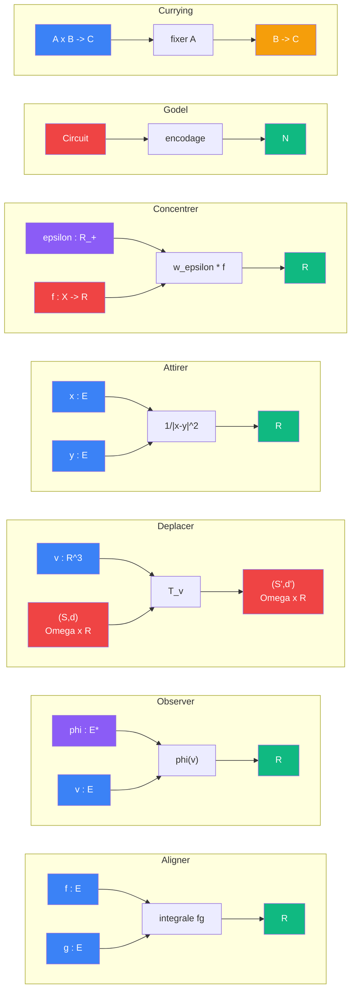

# Sens

> [Retour au sommaire](../../README.md) | [Vocabulaire](../vocabulaire/) | [Architecture](../architecture.md)

## Blocs atomiques

| Objet | Contrat | Symetrie |
|-------|---------|----------|
| [Aligner](aligner.md) | `E x E -> R` | symetrique |
| [Observer](observer.md) | `E* x E -> R` | asymetrique |
| [Ponderer](ponderer.md) | `R x R -> R` | symetrique |
| [Attirer](attirer.md) | `E x E -> R` | symetrique |
| [Deplacer](deplacer.md) | `R^3 x (Omega x R) -> (Omega x R)` | asymetrique |
| [Concentrer](concentrer.md) | `R_+ x X x (X -> R) -> R` | asymetrique |

## Espaces

| | |
|---|---|
| [Espaces](espaces.md) | `E`, `E*`, `R`, `Omega` et regles de typage |

## Meta-objets

Operent sur les objets eux-memes, pas sur des valeurs.

| Meta-objet | Contrat |
|------------|---------|
| [Godel](../meta-objets/README.md) | `Circuit -> N` |
| [Currying](../meta-objets/currying.md) | `(A x B -> C) -> (A -> (B -> C))` |
| [Encodage](../meta-objets/encodage.md) | types, objets et circuits comme nombres |

## Cablages

Les cablages assemblent plusieurs sens en un circuit complet. Ils ne definissent rien de nouveau — ils montrent comment les sens se connectent.

| Cablage | Sens assembles |
|---------|---------------|
| [Projeter](../cablages/projeter.md) | observer + ponderer + deplacer |
| [Ecouter](../cablages/ecouter.md) | concentrer + ponderer + observer |
| [Concentration](../cablages/concentration.md) | 5 exemples concrets de concentrer |
