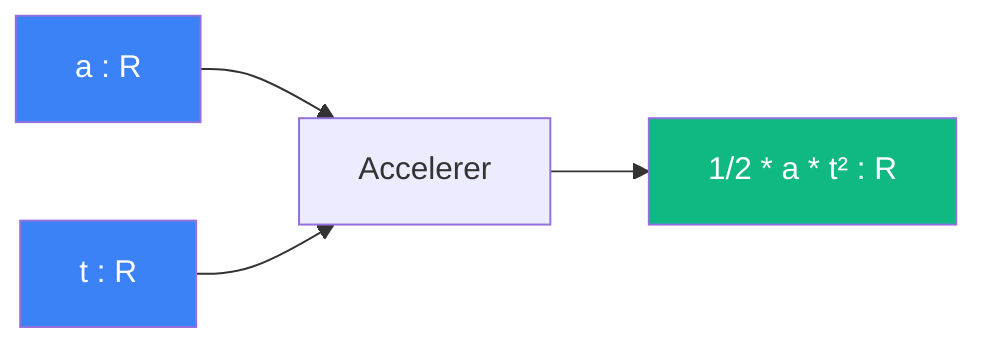

# Accelerer

> [Retour aux sens](../README.md)

`1/2 * a * t^2`

- **Sens** -- avancement quadratique d'un objet sous acceleration constante
- **Contrat** -- `R x R -> R` (asymetrique : `a` est l'acceleration, `t` est le temps)
- **Ports** -- `a in R`, `t in R` (entrees), `R` (sortie)

## Comment ca marche

## Cablages

### Triple ponderation
[accelerer/triple-ponderation.md](triple-ponderation.md)

- `a=acceleration, t=temps` → `1/2*a*t²`

### Rencontrer Accelere
[equilibrer/rencontrer-accelere.md](../equilibrer/rencontrer-accelere.md)

- acceleration dans les trajectoires

### Viser
[equilibrer/viser.md](../equilibrer/viser.md)

- acceleration balistique

---

[<- Normer](../normer/) | [Comparer ->](../comparer/)
