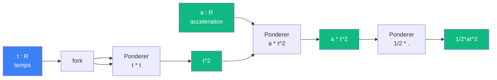

# Accelerer -- cablage

> [Retour au sens Accelerer](README.md)

## Comment ca marche

L'acceleration constante produit un deplacement quadratique en `t`. Le circuit decompose `1/2*a*t^2` en trois applications successives de [Ponderer](../ponderer/) :

1. **Fork** `t` puis `Ponderer(t, t)` -> `t^2`
2. `Ponderer(a, t^2)` -> `at^2`
3. `Ponderer(1/2, at^2)` -> `1/2*at^2`

## Blocs reutilises

| Bloc | Occurrences | Role |
|------|-------------|------|
| [Ponderer](../ponderer/) | x3 | `t*t`, `a*t^2`, `1/2*at^2` |

## Triple distinction

| Dimension | Accelerer |
|-----------|-----------|
| **Sens** | avancement quadratique sous acceleration constante |
| **Contrat** | `R x R -> R` |
| **Cablage** | fork -> Ponderer(t,t) -> Ponderer(a,.) -> Ponderer(1/2,.) |
