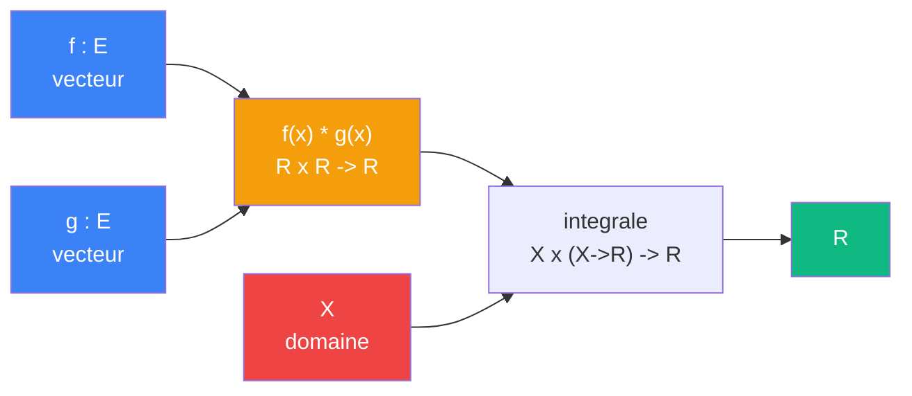

# Aligner

> [Retour aux sens](README.md)

`<f,g>`

- **Sens** -- combien deux vecteurs s'alignent
- **Contrat** -- `E x E -> R` (symetrique)
- **Ports** -- `f in E`, `g in E` (entrees), `R` (sortie)
- **Cablage** -- `f -> integrale fg <- g -> R`

## Comment ca marche

L'alignement est une **integration du produit ponctuel** : en chaque point `x` du domaine, le [produit lineaire](ponderer.md) pese la coincidence `f(x)*g(x)`, puis l'integration somme ces contributions sur tout le domaine. Si `f` et `g` pointent dans la meme direction partout, la somme est grande ; s'ils se contredisent, les contributions s'annulent.

## Blocs reutilises

| Bloc | Contrat | Role |
|------|---------|------|
| [Produit lineaire](ponderer.md) | `R x R -> R` | coincidence `f(x)*g(x)` en chaque point |
| Integration | `X x (X -> R) -> R` | somme des coincidences sur le domaine |

## Currying + Godel

TODO -- fixer un vecteur produit une forme lineaire ; encodage Godel du bloc currie.

---

[Observer →](observer.md)
