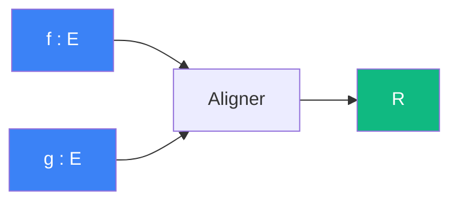

# Aligner

> [Retour aux sens](../README.md)

`<f,g>`

- **Sens** -- combien deux vecteurs s'alignent
- **Contrat** -- `E x E -> R` (symetrique)
- **Ports** -- `f in E`, `g in E` (entrees), `R` (sortie)

## Comment ca marche

L'alignement est une **integration du produit ponctuel** : en chaque point `x` du domaine, le [produit lineaire](../ponderer/) pese la coincidence `f(x)*g(x)`, puis l'integration somme ces contributions sur tout le domaine. Si `f` et `g` pointent dans la meme direction partout, la somme est grande ; s'ils se contredisent, les contributions s'annulent.

## Cablages

### Rencontrer
[aligner/rencontrer.md](rencontrer.md)

- `f=v_rel, g=delta(0)` → taux de rapprochement
- `f=v_rel, g=v_rel` → norme carree (auto-application)

### Quotient normalise
[comparer/quotient-normalise.md](../comparer/quotient-normalise.md)

- `f=v, g=w` → numerateur du cos theta

### Resolution cubique
[equilibrer/resolution-cubique.md](../equilibrer/resolution-cubique.md)

- produit scalaire dans le polynome

### Rencontrer Accelere
[equilibrer/rencontrer-accelere.md](../equilibrer/rencontrer-accelere.md)

- memes roles que Rencontrer + termes d'acceleration

### Viser
[equilibrer/viser.md](../equilibrer/viser.md)

- alignement dans le probleme balistique

### Auto-aligner
[normer/auto-aligner.md](../normer/auto-aligner.md)

- `f=v, g=v` → `<v,v>` auto-application

---

[← Sommaire](../README.md) | [Observer →](../observer/)
