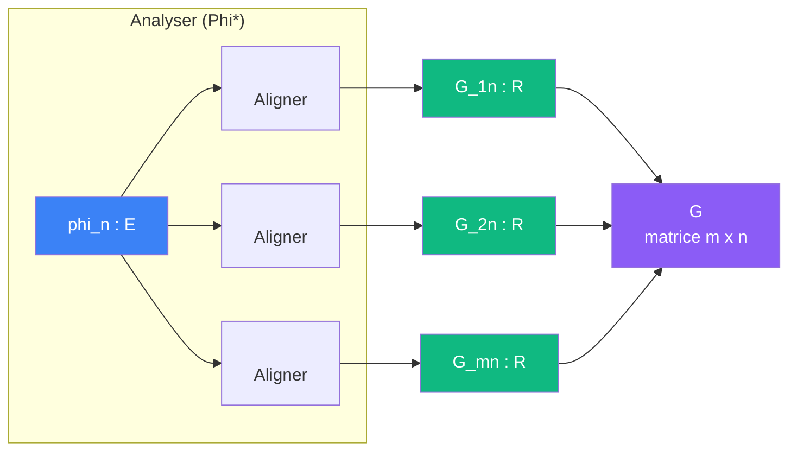

# Cablage : matrice de Gram

> [Retour au sens Aligner](README.md) | [Analyser](../observer/analyser.md) | [Projeter sur V](../observer/projeter-v.md)

## Le probleme

On a un frame `{phi_k}`. Avant de reconstruire quoi que ce soit, on doit savoir comment les elements du frame s'alignent entre eux. La matrice de Gram mesure toutes les paires : `<phi_m|phi_n>` pour chaque `(m,n)`.

Si la Gram est l'identite, le frame est orthonormal. Sinon, il faut la corriger pour obtenir une base duale.

## Circuit



Le circuit complet applique cela pour **chaque** `phi_n` : on [Analyse](../observer/analyser.md) chaque element du frame par le frame lui-meme.

## Role de chaque bloc

| Etape | Bloc | Contrat | Sens |
|-------|------|---------|------|
| 1 | [Aligner](README.md) | `E x E -> R` | produit interieur `<phi_m, phi_n>` |
| 2 | Assembler | `R^(m x n) -> matrice` | collecter en matrice |

## Notation du papier

```
G_Phi := Phi* Phi = [ <phi_m|phi_n> ]_{m,n in I}
```

La Gram est le cablage [Analyser](../observer/analyser.md) compose avec [Synthetiser](../observer/synthetiser.md) dans l'espace des coefficients : `ell^2(I) -> E -> ell^2(I)`.

## Trois cas

| Cas | Gram | Consequence |
|-----|------|-------------|
| Base orthonormale | `G = I` | pas de correction, Phi* suffit |
| Base non orthogonale | `G` inversible, pas diagonale | il faut `G^{-1}` pour la base duale |
| Frame redondant | `G` pas inversible | pas de base duale unique, mais pseudo-inverse possible |

## Base duale

Quand `G` est inversible, la **base duale** (biorthogonale) est :

```
Phi~ = Phi G^{-1}
```

Ce qui garantit `Phi~* Phi = I` : les [Mesurer](../mesurer/) de la base duale extraient exactement les bons coefficients pour [Synthetiser](../observer/synthetiser.md) avec le frame original.

## Triple distinction

| Dimension | Gram |
|-----------|------|
| **Sens** | matrice des alignements mutuels d'un frame |
| **Contrat** | `E^n -> R^(n x n)` |
| **Cablage** | n^2 [Aligner](README.md) en parallele + assembler |

## Lien avec la resolution de l'identite

- Si `G = I` (orthonormal) alors `Phi* Phi = I` et le frame est auto-dual
- Le [projecteur](../observer/projeter-v.md) `Phi Phi* = P_V` est toujours valide, que le frame soit orthonormal ou non

---

[<- Aligner](README.md) | [Projeter sur V ->](../observer/projeter-v.md)
