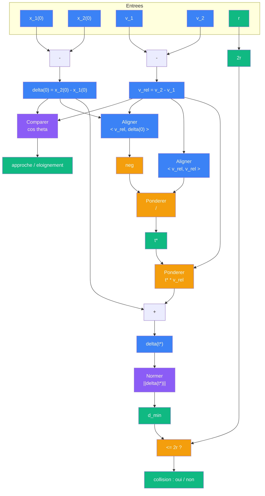
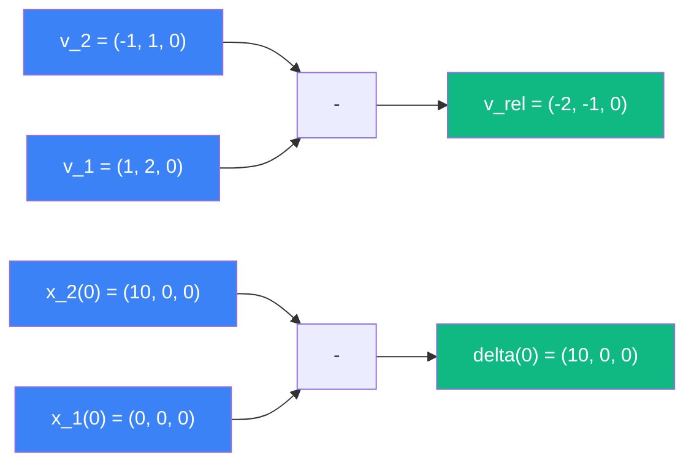
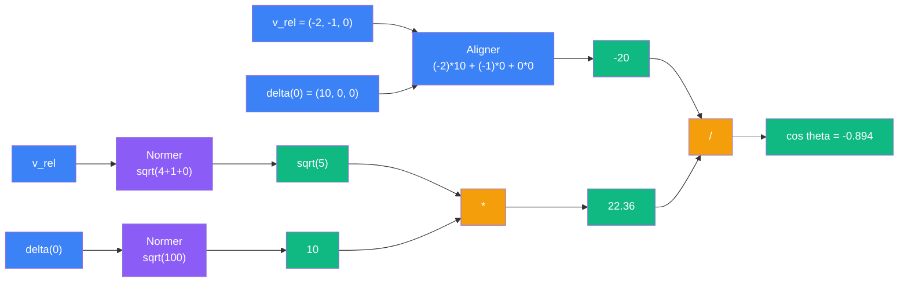
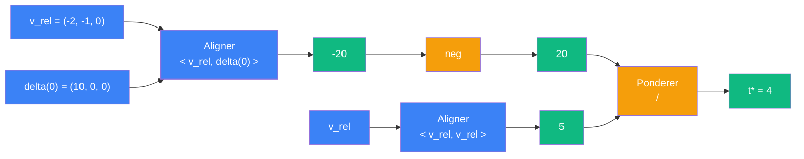
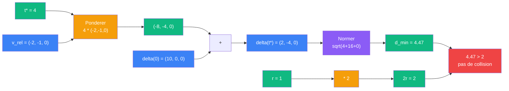
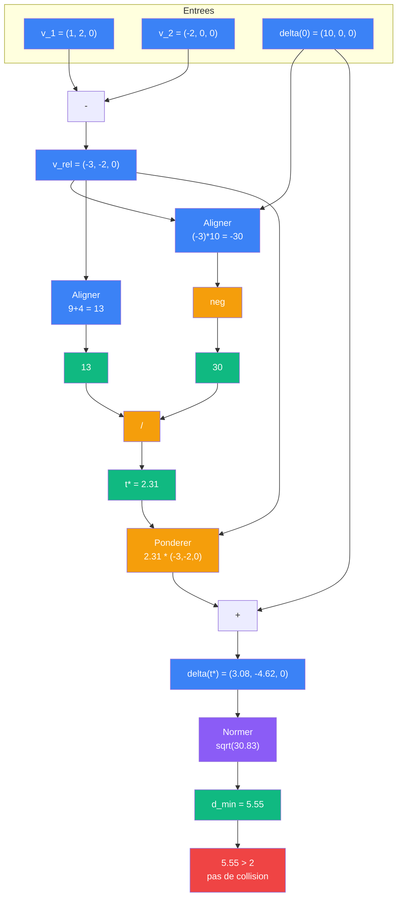
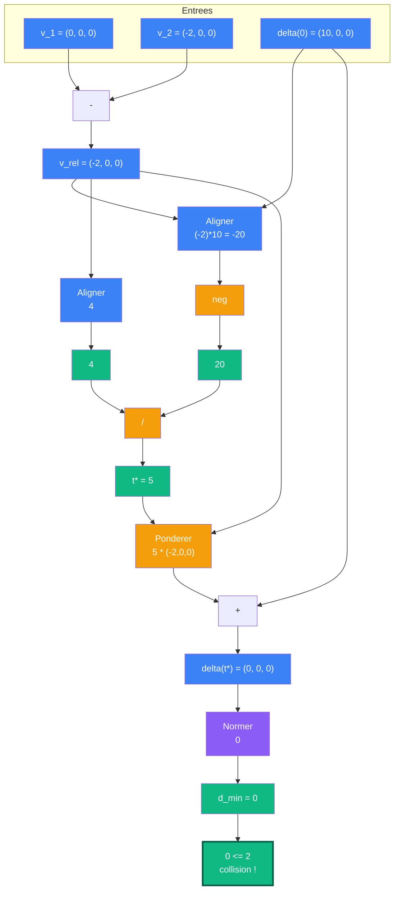

# Rencontrer

> [Retour au sens Aligner](README.md)

## Le probleme

Deux spheres de rayon `r`, positions initiales `x_1(0)` et `x_2(0)`, vitesses constantes `v_1` et `v_2`. Trajectoires lineaires :

```
x_i(t) = x_i(0) + t * v_i
```

Questions :
1. Se rapprochent-elles ?
2. A quel instant sont-elles le plus proches ?
3. Y a-t-il collision ?

## Phases du circuit

| Phase | Bloc | Contrat | Sens |
|-------|------|---------|------|
| 1 - Trajectoires | [Ponderer](../ponderer/) x2 | `R x R -> R` | `t * v_i` avancement |
| 2 - Separation | Soustraction + [Normer](../normer/) | `E -> R` | `d(t) = \|\|delta(t)\|\|` |
| 3 - Diagnostic | [Comparer](../comparer/) | `E x E -> R` | approche ou eloignement |
| 4 - Taux | [Aligner](README.md) | `E x E -> R` | `<v_rel, delta>` signe |
| 5 - Instant critique | [Aligner](README.md) + [Ponderer](../ponderer/) | | `t* = -<v_rel, delta(0)> / <v_rel, v_rel>` |
| 6 - Collision | [Normer](../normer/) + test | | `\|\|delta(t*)\|\| <= 2r` |

## Detail des phases

### Phase 1 — Trajectoires

Chaque position evolue lineairement. [Ponderer](../ponderer/) fait le produit `t * v_i`, puis on ajoute a la position initiale.

### Phase 2 — Separation

Le vecteur de separation `delta(t) = x_2(t) - x_1(t)` est lui-meme lineaire :

```
delta(t) = delta(0) + t * v_rel    ou    v_rel = v_2 - v_1
```

[Normer](../normer/) donne la distance `d(t) = ||delta(t)||`.

### Phase 3 — Diagnostic

[Comparer](../comparer/) entre `v_rel` et `delta(0)` :
- `cos theta < 0` → les spheres se rapprochent (la vitesse relative va vers la separation)
- `cos theta > 0` → elles s'eloignent
- `cos theta = 0` → mouvement perpendiculaire a la separation

### Phase 4 — Taux

[Aligner](README.md) donne le produit scalaire `<v_rel, delta(0)>`. Son signe confirme le diagnostic. Sa valeur donne le taux de rapprochement.

### Phase 5 — Instant critique

L'instant ou la distance est minimale :

```
t* = -<v_rel, delta(0)> / <v_rel, v_rel>
```

Cet instant est le quotient de deux produits scalaires : un [Aligner](README.md) au numerateur, un autre au denominateur (auto-application de `v_rel`, c'est-a-dire [Normer](../normer/) au carre). [Ponderer](../ponderer/) fait la division.

### Phase 6 — Collision

On injecte `t*` dans `delta(t)`, puis [Normer](../normer/) donne la distance minimale. Si `||delta(t*)|| <= 2r`, collision.

## Diagramme



## Exemple concret

Deux spheres de rayon `r = 1`, en 3D :

```
Sphere A : x_1(0) = (0, 0, 0),   v_1 = (1, 2, 0)
Sphere B : x_2(0) = (10, 0, 0),  v_2 = (-1, 1, 0)
```

### Phase 2 — Separation et vitesse relative



```
v_rel   = v_2 - v_1         = (-2, -1, 0)
delta(0) = x_2(0) - x_1(0)  = (10, 0, 0)
```

### Phase 3 — Diagnostic



```
Comparer(v_rel, delta(0)) :

  Aligner(v_rel, delta(0)) = (-2)*10 + (-1)*0 + 0*0 = -20
  Normer(v_rel)   = sqrt(4 + 1 + 0)   = sqrt(5)
  Normer(delta(0)) = sqrt(100 + 0 + 0) = 10

  cos theta = -20 / (sqrt(5) * 10) = -20 / 22.36 ≈ -0.894
```

`cos theta < 0` → les spheres se rapprochent.

### Phase 5 — Instant critique



```
Aligner(v_rel, delta(0)) = -20
Aligner(v_rel, v_rel)    = (-2)^2 + (-1)^2 + 0^2 = 5

t* = -(-20) / 5 = 4
```

Les spheres sont au plus proche a `t* = 4`.

### Phase 6 — Collision



```
delta(t*) = delta(0) + t* * v_rel
          = (10, 0, 0) + 4 * (-2, -1, 0)
          = (10 - 8, 0 - 4, 0)
          = (2, -4, 0)

Normer(delta(t*)) = sqrt(4 + 16 + 0) = sqrt(20) ≈ 4.47

2r = 2

4.47 > 2 → pas de collision
```

### Variante 1 — Tir oblique (pas de collision)

Memes donnees, mais `v_2 = (-2, 0, 0)` (frontale) :



```
v_rel    = (-3, -2, 0)
delta(0) = (10, 0, 0)

Aligner(v_rel, delta(0)) = -30
Aligner(v_rel, v_rel)    = 9 + 4 = 13

t* = 30 / 13 ≈ 2.31

delta(t*) = (10, 0, 0) + 2.31 * (-3, -2, 0)
          = (10 - 6.92, -4.62, 0)
          = (3.08, -4.62, 0)

Normer(delta(t*)) = sqrt(9.49 + 21.34) = sqrt(30.83) ≈ 5.55

5.55 > 2 → toujours pas de collision
```

### Variante 2 — Collision frontale

Pour une vraie collision, il faut un tir plus direct. Avec `v_2 = (-2, 0, 0)` et `v_1 = (0, 0, 0)` (sphere A immobile) :



```
v_rel    = (-2, 0, 0)
delta(0) = (10, 0, 0)

Aligner(v_rel, delta(0)) = -20
Aligner(v_rel, v_rel)    = 4

t* = 20 / 4 = 5

delta(t*) = (10, 0, 0) + 5 * (-2, 0, 0) = (0, 0, 0)

Normer(delta(t*)) = 0

0 <= 2 → collision a t* = 5 (frontale parfaite)
```

## Triple distinction

| Dimension | Rencontrer |
|-----------|------------|
| **Sens** | deux spheres se rencontrent-elles ? |
| **Contrat** | `(E x E x E x E x R) -> {oui, non}` (positions, vitesses, rayon → verdict) |
| **Cablage** | 6 phases : trajectoires, separation, diagnostic, taux, instant critique, collision |

## Extension

Pour le cas avec acceleration constante, voir [Rencontrer Accelere](../equilibrer/rencontrer-accelere.md). L'instant critique `t*` passe d'une division simple a une equation cubique.

## Objets reutilises

| Bloc | Occurrences | Role |
|------|-------------|------|
| [Ponderer](../ponderer/) | x4+ | `t * v_i`, division, `2r` |
| [Aligner](README.md) | x2 | `<v_rel, delta>`, `<v_rel, v_rel>` |
| [Normer](../normer/) | x2 | `\|\|delta(0)\|\|`, `\|\|delta(t*)\|\|` |
| [Comparer](../comparer/) | x1 | diagnostic approche/eloignement |
