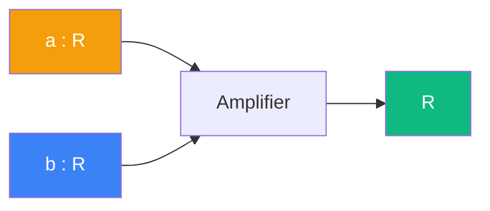

# Amplifier

> [Retour aux sens](../README.md)

`a * _`

- **Sens** -- peser toute grandeur par un facteur fixe
- **Contrat** -- `R -> R`
- **Ports** -- `b in R` en entree ; `R` en sortie
- **Origine** -- [currying](../../meta-objets/currying.md) de [ponderer](../ponderer/), entree `a` fixee

## Comment ca marche

Le bloc `a * _` est une **forme lineaire sur R** : il attend un scalaire et en produit un. C'est le resultat du [currying](../../meta-objets/currying.md) de [ponderer](../ponderer/) quand on fixe le premier facteur `a`.

Dans l'[exemple de la sphere](../observer/projeter.md), fixer `a = 1/d^2` donne un attenuateur qui pondere l'aire geometrique par la distance.

| | Ponderer | Amplifier |
|---|---|---|
| **Contrat** | `R x R -> R` | `R -> R` |
| **Entrees** | `a : R`, `b : R` | `b : R` |
| **Sortie** | `R` | `R` |

---

[← Ponderer](../ponderer/) | [Champ →](../champ/)
